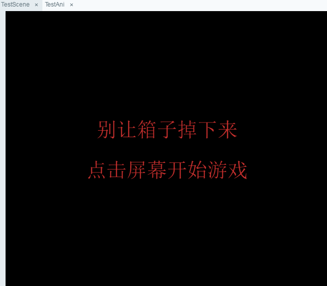

#Overview of Design Pattern Interface

LayaAirIDE is composed of design mode, coding mode and other modules. In this chapter, we will introduce the common layout and functional areas of design patterns, and quickly browse the names and functions of each panel.

​ 
(Fig. 1)

###1. Mode Navigation Bar:

The mode conversion button function can be easily switched between the interface mode and the code editing mode.

​ 

(Figure 2)

###2. Menu bar:

The menu bar includes program operation set, interface operation, control operation command and tool set. For more information, please read the introduction section of the menu bar.

​ 
(Figure 3)

 

###3. Toolbar:

The toolbar includes file manipulation, control manipulation and scene manipulation buttons. For more information, please read the toolbar introduction section.
​ 
(Figure 4)

###Project Manager:

The project manager displays all the established pages (Pages) in the project, which are displayed in a tree structure. You can double-click in the project manager to open the page you want to edit. For more information, please read the Project Manager section.

​ 
(Fig. 5)

 

###Resource Manager:

All resources in the project resources folder (assets) are displayed in the resource manager. The resource content in the folder is displayed in a tree structure. You can use the right-click to open the folder where you are located to add resources. Read the Resources Manager section for details.

​ 

(Fig. 6)

 

###6. Scene Editor:

Scene Editor is a working area for displaying and editing visual content in UI or animated scenes. Scenario construction depends on the display of scene editor. Read the Scene Editor section for details.

​ 
(Figure 7)

  

###7. Attribute Setter:

The property setter is the area where we view and edit the properties of the currently selected node and component. This panel will display and edit the property data of the selected control in the most appropriate form. Read the Property Setters section for details.

​ 
(Figure 8)

###8. Hierarchical Manager:

Hierarchical Manager displays all nodes and their hierarchical relationships in the scene in the form of a tree list. All the content seen in the scene editor can find the corresponding node entries in the hierarchical manager. When editing the scene, the contents of the two panels will be displayed synchronously. Generally, we also use the two panels to build the scene at the same time. Read the Hierarchy Manager section for details.

​ 
(Figure 9)

###9. Time-axis Animation Editor:

The timeline animation editor is used to create timeline animation in the page. The frame attribute panel is used to display the frame details on the set timeline. Read the Timeline Animation Editor section for more details.

​ 

(Fig. 10)

###X. Particle Editor:

The particle editor is used to create particle animation on the page. The particle properties panel is used to display the details of setting the properties of the particle. Read the Particle Editor section for more details.

​ 
(Fig. 11)