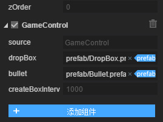

#LayaAir script parameter description

Starting with LayaAir 2.0, it supports custom scripts to editors to facilitate the expansion of existing component functions.


If you want to display script-defined attributes in the editor, you can use special annotations to do so.

For example, the following script class:


The following is shown in the IDE:



This allows you to design display parameters in scripts, enter parameters in IDE, and then use them in scripts.

This tag supports AS, JS, TS languages at the same time, and even can be written only tags. The script itself is not specifically implemented (used when inheriting attributes).


A complete label consists of the following parts:

- Type IDE attribute type, which refers to the IDE attribute type, not the real attribute type, but mostly the same

- Property names displayed in name IDE

- The mouse prompt in tips IDE is displayed after the mouse passes over the attribute name, and if not, the name is used (optional).

- Default values displayed in the default input box (optional)

​


By default, IDE provides many types for scripts to use. The main parameter types are as follows:


| Property Name | Description|
|:-----------------------------------------------------------------------------------------------------------------------------------------------------------------|
| The name | attribute displays the name, which must be consistent with the variable name|
| tips | Mouse past the display label|
|Type | type: int, number, snumber, string, bool, option, editoption, check, color, colorarray, node, nodes, prefab, sizegrid, VEC, vector, ease|
|The associated property of accept string. Accept: res is the receiving resource address.|
| AceptTypes | Node and accept's associated attributes, receiving types, such as using RevoluteJoint, Prismatic Joint, RigidBody with nodes, and accept: res using jpg, png, txt to restrict suffixes|
| option | Option and editOption's associated attribute option: Optional lists such as aaa, bbb, ccc|
| min | Number and sNumber minimum|
| Maximum Max | Number and sNumber|
|Label | the associated attribute of nodes. If the displayed attribute name is optional, the length is determined according to the labels. If not, the length input box is displayed.|
| Type | Nodes Association attribute, type of each element (optional)|
| xCount | Nodes Association properties, how many are displayed horizontally|
| sType | Nodes Association properties, types of individual elements|
| default | default value|


```

		/** @prop {name:resType,tips:"abc",type:string,accept:res}*/
		public var resType:String = "";
		/** @prop {name:int1,tips:"11",type:Int}*/
		public var int1:int;

		/** @prop {name:number1,tips:"11.11",type:Number}*/
		public var number1:Number;

		/** @prop {name:String,tips:"abc",type:string}*/
        public var string1:String;

		/** @prop {name:bool,tips:"1,0",type:Bool}*/
		public var bool1:Boolean;

		/** @prop {name:Option,tips:"opt",type:Option,option:"aaa,bbb,ccc"}*/
		// 返回字符串
		public var opt:String;

		/** @prop {name:editOption,tips:"editopt",type:EditOption,option:"aaa,bbb,ccc"}*/
		// 返回字符串
		public var editopt:String;

				/** @prop {name:check,tips:"ch11eck",type:Check}*/
		// 返回bool 
		public var check:Boolean;

		/** @prop {name:color1,tips:"opt",type:Color}*/
		// 返回颜色值
		public var  color1:Color;

		/** @prop {name:snumber1,type:sNumber,min:10,max:100}*/
		
		public var 	snumber1:int = 11;
        
		/** @prop {name:node1,type:Node}*/

		public var node1:Node;

        /** @prop {name:sizegrid1,type:SizeGrid}*/
		public var sizegrid1:*;

		/** @prop {name:colorarray,type:ColorArray}*/
		public var colorarray:*;

		/** @prop {name:vec1,type:Vec}*/   
		public var vec1:*;

		/** @prop {name:vector1,type:Vector,labes:abc,types:"Node,String,Number,Boolean",xCount:2,sType:Number}*/
		public var vector1:*;

        // /** @prop {name:nodes2,type:Nodes}*/  这一条必须选中组件上赋值才有效，在场景选择会失效
		// public var nodes2:*;

		/** @prop {name:ease1,type:Ease}*/
		public var sase1:*;
```


Part of the display effect is as follows:

