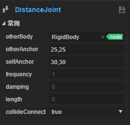
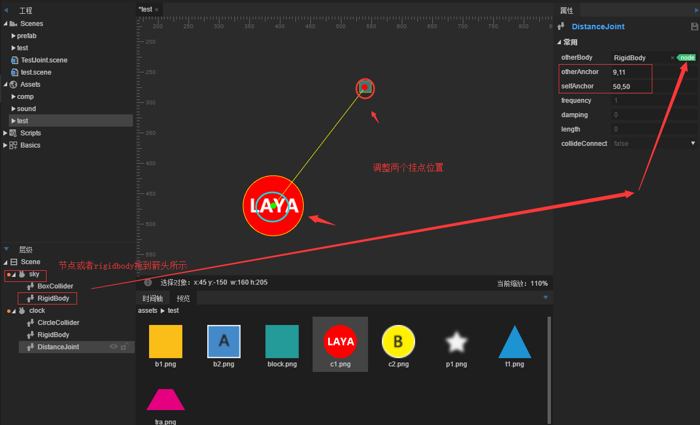
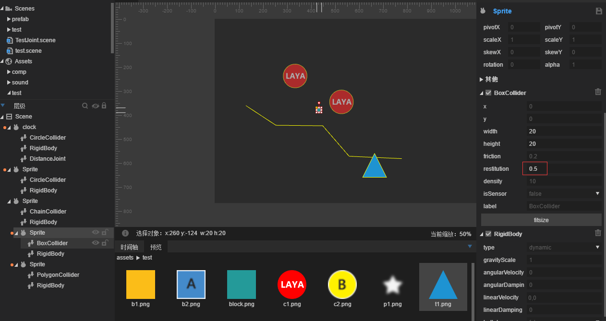
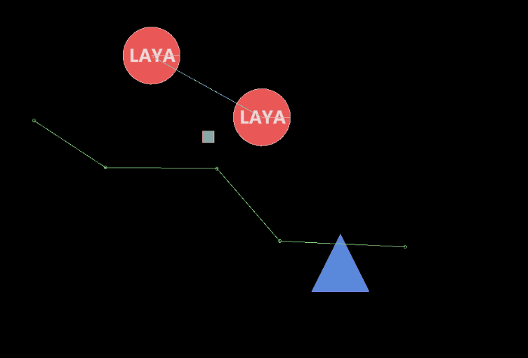

#2D Joint System

###1. 2D joint

In the development of physical games, if you want complex systems to improve playability, you need to impose various constraints on objects. Box2D provides joint systems. Joints can impose a constraint on two or more objects.

**Box2D-supported joints include**:

Distance joint`DistanceJoint`There is one point on each object, and the distance between the two points is fixed.

Gear joint`GearJoint`To simulate the constraint relationship between two gears, there are two ways to output the momentum generated when the gear rotates, one is the angular speed of the gear itself, the other is the linear speed of the gear surface.

Motor joint`MotorJoint`

Mouse joint`MouseJoint`Used for mouse control object. It tries to drag the object to the current mouse cursor position. There are no restrictions on rotation.

prismatic joint`PrismaticJoint`Moving joints allow two objects to move relative along a specified axis, which prevents relative rotation.

Pulley joint`PulleyJoint`It ground two objects and connect them. When one object rises, the other object falls.

Revolving joint`RevoluteJiont`Force two objects to share an anchor point and rotate relative to each other.

Rope joint`RopeJoint`Limit the maximum distance between two points. Even under heavy loads, it prevents tension between connected objects.

Welded joint`WeldJoint`The relative position and angle of the two rigid bodies remain unchanged as a whole.

Wheel joint`WheelJoint`Rotating around the node, including the elastic properties, makes the rigid body elastic offset at the node position.

All joints are inherited from Component.

###2. Introduction of Joint Components

####2.1 Distance Joint

 

The distance between the joint constraints and the two nodes remains unchanged. It is used for the same constraints as the stick, the skeleton and the spring.

#####Attribute specification

#####OtherBody

The connection rigid body of the joint can not be set. The default is the empty rigid body in the upper left corner.

#####OtherAnchor

[First set valid] Link Rigid Link Point is offset from the upper left corner of the other Body.

#####SelfAnchor

For the first time, the link point of the rigid body is offset from the upper left corner of the rigid body.

#####Frequency

Vibration frequency of spring system can be regarded as elastic coefficient of spring.

#####Damping

The damping of rigid body in the process of returning to joints is suggested to be 0-1.

#####Length

Restricted target stationary length.

#####CollideConnect

[First set valid] Whether two rigid bodies can collide by default is false. (The screenshot is true. Be careful not to confuse)

#####Example drill

We first use the distance joint.`DistanceJoint`Make a pendulum effect:

Create a new 2D sample project named test and expand the test folder in the Assets directory. You can see the reserved graphics for the test physics engine.

In editing mode, press F9 to check the display or non-display of physical auxiliary lines. As shown in the picture:

After clicking OK, drag in a block. PNG and a c1. PNG in the scene. The effect is as follows:

Then we will add components to these two sprites. After selecting the box, click the Add Components button in the right property panel to add components.`BoxCollider`Components, IDEs automatically add rigid bodies as well`RigidBody`As follows:

In the same way, add the ball`CircleCollider`And the join menu`DistanceJoint`IDE will be added automatically`RigidBody`The final effect is as follows:

Press CTRL + S to save, run, and you will see the following effect:

There is no pendulum effect, because the rigid body type of the square is`dynamic`Dynamic, we're going to set it up for him.`kinematic`The type of motion, so that it is not affected by gravity, fixed at a point. Select the box object, in the drop-down menu of the type attribute, select`kinematic`As shown in the picture:

After saving and running, we can see that the effect of the pendulum is made:

Next, we want to make a slightly richer physical effect.

In the scene, drag in two circles and add a circular Collider`CircleCollider`To add a distance joint to one of the circles`DistanceJoint`And bind the rigid body of another circle, set two anchors in the center of the circle, add a sprite and a linear collider by right-clicking in the "Hierarchy" panel at the bottom left of the IDE`ChainCollider`Click`ChainCollider`Lengthen the distance between the two points and add a break point to the line. Repeat the steps mentioned above to make a trapezoidal collision body, and then make the rigid body of the fold line.`RigidBody`Of`type`Property set to`static`Static type (we don't need him to move physically), then drag a box over the collider and add a rectangular Collider`BoxCollider`Take him.`restitution`The friction property is set to 0.5 to give it elasticity. Make a hillside at the bottom of the ladder, drag in a triangle, and add a polygon collider.`PolygonCollider`And the triangular`RigidBody`Rigid body type is set to`Kinematic`The type of movement, so that it is not affected by force. The final effect and hierarchical structure are shown as follows:

After completing the above steps and saving the run, we will see the following effect:

When this example is completed, we will understand and master the use of all types of collisions, three types of rigid bodies, elastic coefficients and distance joints.

Follow-up documentation will introduce all the effects shown in the following figure.

