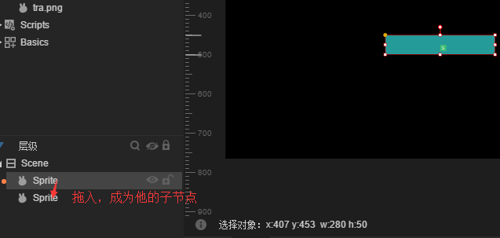
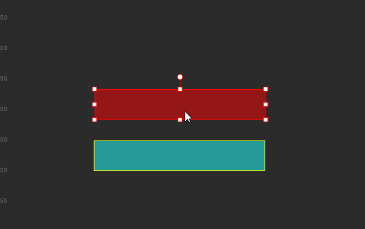
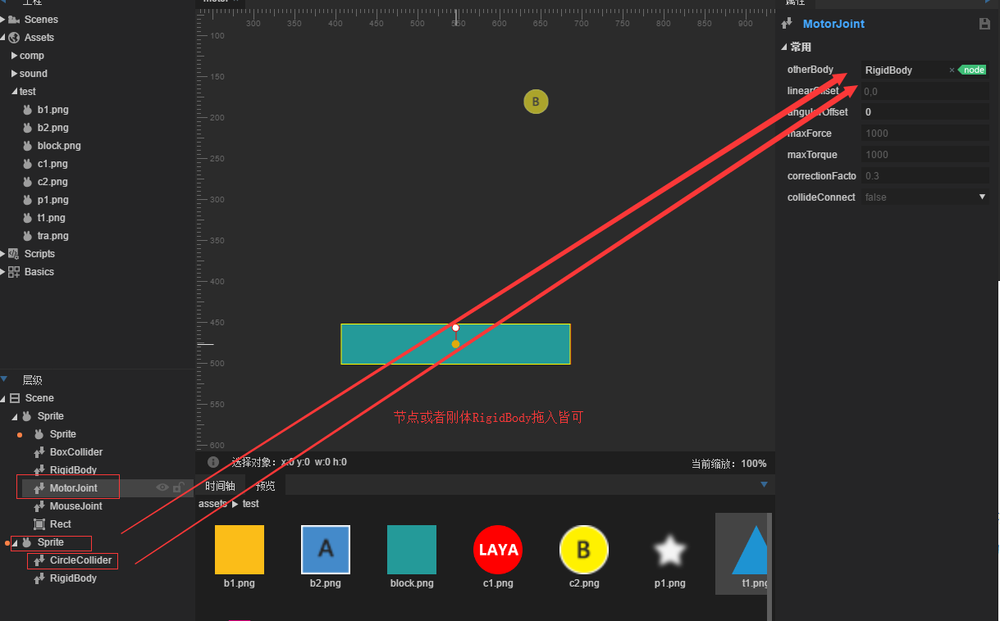
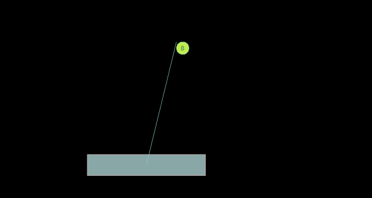
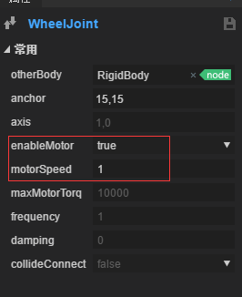
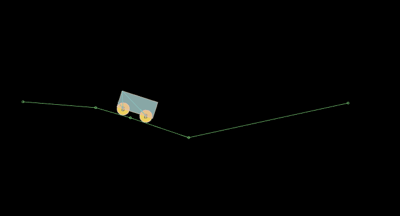
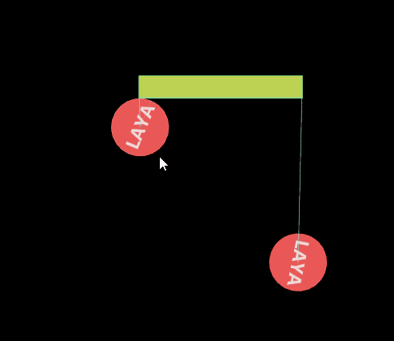

# 马达关节，轮子关节，滑轮关节

### 1. 马达关节

​        马达关节`MotorJoint` 用来限制两个刚体，使其相对位置和角度保持不变，

马达关节永远向目标点移动，并且保持特定的角度。

##### 属性说明

##### otherBody

[首次设置有效]关节的连接刚体。

##### linearOffset

基于otherBody坐标位置的偏移量，也是selfBody的目标位置。

##### angularOffset

基于otherBody的角度偏移量，也是selfBody的目标角度。

##### maxForce

当selfBody偏离目标位置时，为使其恢复到目标位置，马达关节所施加的最大作用力。

##### maxTorque

当selfBody角度与目标角度不同时，为使其达到目标角度，马达关节施加的最大扭力。

##### correctionFacto

selfBody向目标位置移动时的缓动因子，取值0~1，值越大速度越快

##### collideConnect

两个物体是否可以发生碰撞，默认为false。

#### 实例演练

 马达关节的介绍比较不好理解他的意思，我们来做一个简单的例子来更好理解马达关节，创建一个场景motor.scene，拖入一个方块拉伸成长条，并且在层级里鼠标右键创建一个sprite节点，并将节点的锚点（左上角）移动到长条的中心点（因为马达关节只作用于刚体上，刚体就在物体左上角，不能改，所以用这种套父节点的方式，图形sprite为渲染子节点）

然后将长条sprite拖入到空sprite节点上，使其成为空节点的子节点。如图:

给父节点添加一个矩形碰撞器 `BoxCollider` ，这时碰撞器大小并不是和长条图形一样大，而是和父节点sprite大小一致，我们需要把他调整好大小和位置，使其和长条图形大小和位置一致，如图:

 然后给父节点sprite添加马达关节(默认属性)，鼠标关节（用于拖拽，鼠标关节不设置锚点即点哪添加在哪，如果设置锚点就为固定位置）。给父节点sprite添加一个graphic矩形，把大小设置和图形一样大，并且将其renderType设置为hit,使这个图形作为鼠标点击判定区域。再给场景拖入一个圆形添加圆形碰撞体作为马达关节的目标点。

做好这一步之后，将矩形位置使其与长条图形重叠，如图:

然后把圆形节点或者刚体rigidbody拖入马达关节的otherbody中，如图:

到这步之后，就做好了，非常的简单，保存运行，就可以看到，马达关节的效果：

### 2.轮子关节

​     轮子关节`WheelJoint`：围绕节点旋转，包含弹性属性，使得刚体在节点位置发生弹性偏移。

用于制作物理车轮。

##### 属性说明

##### otherbody

[首次设置有效]关节的连接刚体。

##### anchor

[首次设置有效]关节的链接点，是相对于自身刚体的左上角位置偏移。

##### axis

[首次设置有效]一个向量值，描述运动方向，比如1,0是沿X轴向右。

##### enableMotor

是否开启马达，开启马达可使目标刚体运动。

##### motorSpeed

启用马达后，可以达到的最大旋转速度。

##### maxMotorTorque

启用马达后，可以施加的最大扭距，如果最大扭矩太小，会导致不旋转。

##### frequency

弹簧系统的震动频率，可以视为弹簧的弹性系数。

##### damping

刚体在回归到节点过程中受到的阻尼，取值0~1。

##### collideConnect

[首次设置有效]两个刚体是否可以发生碰撞，默认为false。

#### 示例演练

​    轮子节点顾名思义就是制作轮子，例子也非常的简单，不多赘述，按照下图摆出地面（刚体设置为静态类型）和一个小车的形状，把轮子关节的otherbody拖入要绑定的车身，按照下图设置好，并注意设置摩擦力防止打滑，然后运行，一个物理小车就做出来了。

运行效果如下：

​	我们看到，小车因为重力影响向下滚动，这是因为我们没有开启轮子的马达。

下面我们分别给两个轮子关节的enableMotor属性设置为true，motorSpeed 设置为3：如图：

这样小车就靠轮子自身的马达提供动力,保存运行：

有马达动力的轮子带动的小车就做好了。

### 滑轮关节

​        滑轮关节`PulleyJoint`：它将两个物体接地(ground)并彼此连接，当一个物体上升，另一个物体就会下降。就像超级玛丽中用绳子吊着的平台，踩下去另一个会上升。

##### 属性说明

##### otherBody

[首次设置有效]关节的连接刚体。

##### otherAnchor

[首次设置有效]链接刚体链接点，是相对于otherBody的左上角位置偏移。

##### otherGroundPoint

[首次设置有效]滑轮上与节点otherAnchor相连接的节点，是相对于otherBody的左上角位置偏移。

##### selfAnchor

[首次设置有效]自身刚体链接点，是相对于自身刚体的左上角位置偏移。

##### selfGroundPoint

[首次设置有效]滑轮上与节点selfAnchor相连接的节点，是相对于自身刚体的左上角位置偏移。

##### ratio

[首次设置有效]两刚体移动距离比率。

##### collideConnect

[首次设置有效]两个刚体是否可以发生碰撞，默认为false。

#### 示例演练

​      新建一个场景，然后，拖入一个方块作为木板， 两个圆形作为球，并且添加相应的碰撞体，给ball1添加鼠标关节和滑轮关节，把ball2拖入到滑轮关节中的otherbody上，设置好关节的4个锚点，如图所示：

只需要将两个圆形连接，木板是作为背景参照的，运行一下就看起来木板上两端有两个滑轮，并且可以用鼠标拖拽ball1，观察效果：

更多问题请访问社区http://ask.layabox.com