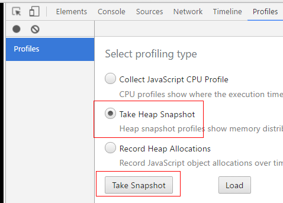

# 使用谷歌浏览器的性能分析器

### 

### **一、性能分析器（Profiles）**

​        性能分析器（Profiles）是 chrome 开发者工具的一部分，可以通过在页面右键选择审查元素或在谷歌浏览器页面按F12 打开 chrome 开发者工具。然后点击 Profiles 切换至性能分析器（Profiles）面板。

 

###  二、**CPU占用分析**

​         选中 Collect JavaScript CPU Profile，点击 Start 按钮（也可以点击左边黑色实心圆圈），这个时候Chrome 就会开始记录当前网页的方法的执行。结束这个监控需要点击Stop按钮（或左侧的红色实心圆圈）。结束监控后，在左侧 Profiles 下会列出一个监控结果文件，单击可以打开此监控结果文件。
​        监控结果是以数据表格形式展现的。在这个表格里记录了函数执行的时间、函数执行的顺序和包含关系以及CPU变化趋势。通过分析结果有针对性的优化函数。

​     
​    （图1）

​      
​    （图2）

​     
​    （图3）

 

### **三、内存占用分析**

​         选中 Take Heap Snapshot，点击 Take Snapshot 按钮（也可以点击左边黑色实心圆圈），此时会在左侧的 Profiles 栏目下生成一个当前网页的内存快照记录文件。
​        生成的内存快照文件是以数据表格的形式记录了，当前网页对象的个数、所占的内存大小等。
​        拍下一个内存快照后，操作页面，之后再拍下一个内存快照。单击选择第二个内存快照，可以选择 Comparison 模式对此第二个快照与第一个快照之间的变化。通过分析，对网页进行优化。

​      
​    （图4）

​     
​    （图5）

​     
​    （图6）