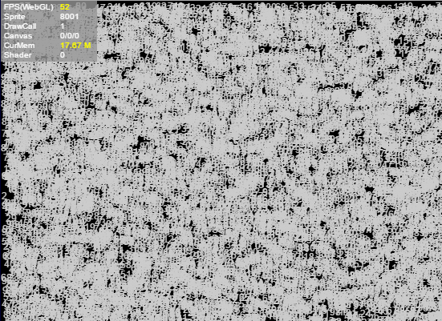

# 图形渲染性能

### **一、优化Sprite**

1. 尽量减少不必要的层次嵌套，减少Sprite数量。

2. 非可见区域的对象尽量从显示列表移除或者设置visible=false。

3. 对于容器内有大量静态内容或者不经常变化的内容（比如按钮），可以对整个容器设置cacheAs属性，能大量减少Sprite的数量，显著提高性能。如果有动态内容，最好和静态内容分开，以便只缓存静态内容。

4. Panel内，会针对panel区域外的直接子对象（子对象的子对象判断不了）进行不渲染处理，超出panel区域的子对象是不产生消耗的。

   ​

### **二、优化DrawCall**

1. 对复杂静态内容设置cacheAs，能大量减少DrawCall，使用好cacheAs是游戏优化的关键。

2. 尽量保证同图集的图片渲染顺序是挨着的，如果不同图集交叉渲染，会增加DrawCall数量。

3. 尽量保证同一个面板中的所有资源用一个图集，这样能减少提交批次。

   ​

### **三、优化Canvas**

 在对Canvas优化时，我们需要注意，在以下场合不要使用cacheAs：

1. 对象非常简单，比如一个字或者一个图片，设置cacheAs=”bitmap”不但不提高性能，反而会损失性能。
2. 容器内有经常变化的内容，比如容器内有一个动画或者倒计时，如果再对这个容器设置cacheAs=”bitmap”，会损失性能。

可以通过查看Canvas统计信息的第一个值，判断是否一直在刷新Canvas缓存。

### **四、关于cacheAs**

设置cacheAs可将显示对象缓存为静态图像，当cacheAs时，子对象发生变化，会自动重新缓存，同时也可以手动调用reCache方法更新缓存。 建议把不经常变化的复杂内容，缓存为静态图像，能极大提高渲染性能，cacheAs有”none”，”normal”和”bitmap”三个值可选。

1. 默认为”none”，不做任何缓存。
2. 当值为”normal”时，Canvas下进行画布缓存，webgl模式下进行命令缓存。
3. 当值为”bitmap”时，Canvas下进行依然是画布缓存，webGL模式下使用renderTarget缓存。这里需要注意的是，webGL下renderTarget缓存模式有2048大小限制，超出2048会额外增加内存开销。另外，不断重绘时开销也比较大，但是会减少drawcall，渲染性能最高。 webGL下命令缓存模式只会减少节点遍历及命令组织，不会减少drawcall，性能中等。

设置cacheAs后，还可以设置staticCache=true以阻止自动更新缓存，同时可以手动调用reCache方法更新缓存。

 cacheAs主要通过两方面提升性能。一是减少节点遍历和顶点计算；二是减少drawCall。善用cacheAs将是引擎优化性能的利器。

 下例绘制10000个文本(根据电脑性能而定，本例为10000)：

```javascript
Laya.init(550,400,Laya.WebGL);
Laya.Stat.show();
var textBox = new Laya.Sprite();
for(var i=0;i<10000;i++){
    txt=new Text();
    txt.text=(Math.random()*100).toFixed(0);
    txt.color="#CCCCCC";
    txt.x=Math.random()*550;
    txt.y=Math.random()*400;
    textBox.addChild(txt);
}
Laya.stage.addChild(textBox);
```

下面是笔者电脑上的运行时截图，FPS稳定于52上下。

</br>

（图1）

 当我们对文字所在的容器设置为cacheAs之后，如下面的例子所示，性能获得较大的提升，FPS达到到了60帧。

```javascript
//...省略其他代码...
var textBox=new Laya.Sprite();
textBox.cacheAs="bitmap";
//...省略其他代码...
```

</br>

（图2）

### **五、文字描边**

在运行时，设置了描边的文本比没有描边的文本多调用一次绘图指令。此时，文本对CPU的使用量和文本的数量成正比。因此，尽量使用替代方案来完成同样的需求。

· 对于几乎不变动的文本内容，可以使用cacheAs降低性能消耗，参见“图形渲染性能 - 关于cacheAs”。

· 对于内容经常变动，但是使用的字符数量较少的文本域，可以选择使用位图字体。

### **六、跳过文本排版，直接渲染**

大多数情况下，很多文本都不需要复杂的排版，仅仅简单地显示一行字。为了迎合这一需求，Text提供的名为changeText的方法可以直接跳过排版。

```javascript
var txt=new Laya.Text();
txt.text="text";
Laya.stage.addChild(txt);
//后面只是更新文字内容，使用changeText能提高性能
txt.changeText("text changed.");
```

Text.changeText会直接修改绘图指令中该文本绘制的最后一条指令，这种前面的绘图指令依旧存在的行为会导致changeText只使用于以下情况：

· 文本始终只有一行。

· 文本的样式始终不变（颜色、粗细、斜体、对齐等等）。

 即使如此，实际编程中依旧会经常使用到这样的需要。