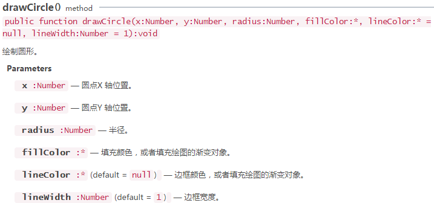
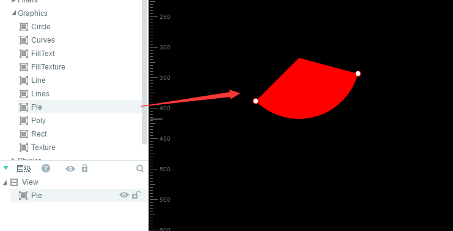
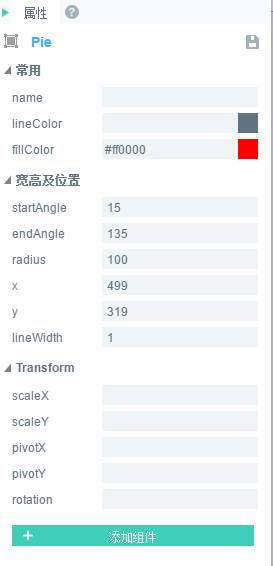
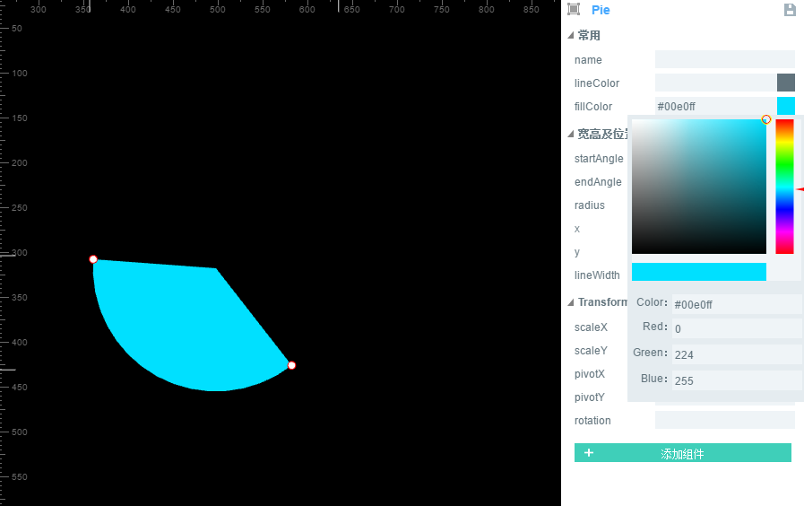

#Draw circles and sectors


###1. Draw a circle

The drawing of a circle is relatively simple to understand. Through the coordinates and radius of the center point of the circle, it can be easily realized by the "drawCircle ();" method of the API LayaAir engine laya. display. Graphics. A detailed description of the method is shown in the following figure:

​<br/>
(Fig. 1)

Next, we use the LayaAir engine to draw a circle. The sample code is as follows:


```javascript

(function()
{
    var Sprite = Laya.Sprite;
    var Stage  = Laya.Stage;
  
    (function()
    {
        //初始化舞台
        Laya.init(500, 300);
        drawSomething();
    })();
  
    function drawSomething()
    {
        var sp = new Sprite();
        Laya.stage.addChild(sp);
        //画圆
        sp.graphics.drawCircle(80,80,50,"#ff0000");
     }
})();
```


The code operation effect is shown in the following figure:


​	<br/>
(Figure 2)

Round drawing is relatively simple, and "80, 80" is the coordinate of the center point of a circle. 50 is the radius.#Ff0000 "is the color value of the circular filler.


###2. Drawing sector

Next, let's go on to introduce the sector drawing method "drawPie ()", which is slightly more complex than the circle.

​<br/>
(Figure 3)

Next, we use the layaair engine to draw a sector. The example code is as follows:


```javascript

(function()
{
    var Sprite = Laya.Sprite;
    var Stage  = Laya.Stage;
  
    (function()
    {
        //初始化舞台
        Laya.init(500, 300);
        drawSomething();
    })();
  
    function drawSomething()
    {
        var sp = new Sprite();
        Laya.stage.addChild(sp);
        //画圆
        sp.graphics.drawPie(80,80,50,90,180,"#ff0000");
     }
})();
```


The code runs as shown in the following figure:


​	<br/>
(Figure 4)
Drawing a sector is similar to a circle, and the first three parameters are used the same way, except that the angle of beginning and ending of drawing is increased. In order to let you better understand, the sector drawing code and parameters follow the example of circular code, except for the change of method name, only 90 and 180 angle parameters are added. You can adjust the parameters in the coding process, and further understand.


###3. Drawing a circle by dragging the control of LayaAirIDE

**Step one:**Open our LayaAirIDE, click Design Patterns, and create a new View page


​	<br/>
(Fig. 5)

**Step two:**Drag the curve component from the component onto the View page to automatically generate the default circle

​<br/>
(Fig. 6)

**Step three:**Modify (add/reduce) the values in Circle component properties, change the size, color, outline, etc. of the circle.

​<br/>
(Figure 7)

​<br/>
(Figure 8)


###4. Drawing Sector by Dragging Control of LayaAirIDE

**Step one:**Open our LayaAirIDE, click Design Patterns, and create a new View page

​<br/>
(Figure 9)

**Step two:**Drag the curve component from the component onto the View page and automatically generate the default sector

​<br/>
(Fig. 10)

**Step three:**Modify (add/reduce) the values in Pie component properties, change the angle, size, color, etc. of the sector.

​<br/>
(Fig. 11)

​<br/>
(Fig. 12)

So far, we have finished drawing circles and fans through the components of LayaAirIDE.