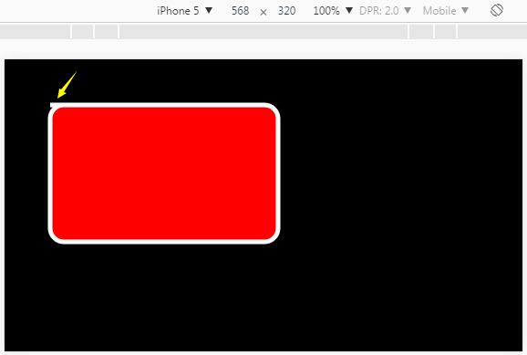
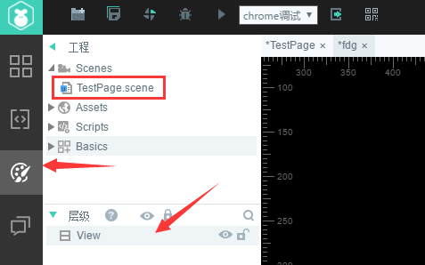
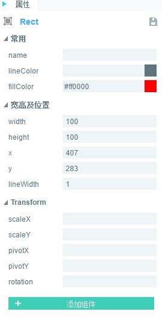

# 绘制矩形与圆角矩形


###Drawing Rectangles by DraRect Method

Search in API`laya.display.Graphics`Class to see the API's various vector drawing methods. The "drawRect ();" method is used to draw vector rectangle. A detailed description of the method is shown in the following figure:

​<br/>
(Fig. 1)

Next, we use the LayaAir engine to draw the vector rectangle. The example code is as follows:


```javascript

(function()
{
    var Sprite = Laya.Sprite;
    var Stage  = Laya.Stage;
  
    (function()
    {
        //初始化舞台
        Laya.init(500, 300);
        drawSomething();
    })();
  
    function drawSomething()
    {
        var sp = new Sprite();
        Laya.stage.addChild(sp);
        //画矩形
        sp.graphics.drawRect(20, 20, 100, 50, "#ffff00");
         
     }
})();
```


Code performance:


​	<br/>
(Figure 2)

In the example, "20, 20" is the coordinate of the rectangular starting point, 100 is the width to the right, and if it is negative, the width to the left. 50 is the downward height, if it is negative, it is the upward height. You can write code, adjust parameters to experience.


###Drawing Rectangles with DraPath

LayaAir Engine`laya.display.Graphics`DraPath () can draw vector graphics according to the path, including rectangle and rounded rectangle. The detailed description of this method is as follows:
​<br/>
(Figure 3)

The parameters of drawPath method are relatively complex. To facilitate your understanding, we first use "drawPath ()" to draw a rectangle and understand some parameters in the path.

The example code for drawing a rectangle by drawPath is as follows:


```javascript

(function()
{
    var Sprite = Laya.Sprite;
    var Stage  = Laya.Stage;
  
    (function()
    {
        //初始化舞台
        Laya.init(500, 300);
        drawSomething();
    })();
  
    function drawSomething()
    {
        var sp = new Sprite();
        Laya.stage.addChild(sp);
        //自定义路径
        var path =  [
            ["moveTo", 0, 0], //画笔移到A点
            ["lineTo", 100, 0],//画到B点
            ["lineTo", 100, 50],//再画到C点
            ["lineTo", 0, 50], //继续画到D点
            ["closePath"] //闭合路径
        ];
            //绘制矩形
        sp.graphics.drawPath(20, 20, path, {fillStyle: "#ff0000"});
         
     }
})();
```


Code performance:

​<br/>
(Figure 4)

DraPath's first and second coordinate points "20,20" are the starting positions for controlling the whole position, and the third is the path parameters. The description information "MoveTo" is to move the brush to its initial position, but it does not start drawing at this time. "0,0" is relative to the starting position of "20,20", so point A is still at the origin of the starting position. Description information "lineto" is drawn to the coordinates of the path point, "100, 0" is drawn to the coordinates of point B. C and D points are analogous. Finally, the starting point of MoveTo is closed by describing the information "close Path", otherwise it will not be closed.

From the point of view of drawing rectangle, drawPath method is certainly more convenient than drawRect method. But you can use this example to understand the relevant parameter usage. As for other non rounded figures, you can code by yourself and experience by adjusting parameters.


###Drawing Rectangles with DraPath

####3.1 Usage Description

The drwaPath method of graphics can be used to draw rounded corners or arcs in LayaAir engine. The specific operation requires three steps to specify the starting point of the drawing path.`["moveTo", x, y]`Draw a horizontal line`["lineTo", x, y]`Drawing arcs`["arcTo", p1.x, p1.y, p2.x, p2.y, r]`。

**Parameter example**:


```java

["moveTo", 50, 50],
["lineTo", 150, 50],
["arcTo", 200, 50, 200, 100, 50],
```


The operation effect of the above parameters is shown in Figure 5-1.

<br/> (Fig. 5-1)

From Fig. 5-1, we can see that,`["moveTo", 50, 50]`Position the starting point of the brush at`"50,50"`This position.`["lineTo", 150, 50]`Draws a line from the starting point to the current endpoint（“`150, 50`") Line.`["arcTo", 200, 50, 200, 100, 50]`Draw a paragraph.`r`(Radius)`50`Arc.

**Principle of Arc Drawing**:

In making this arc, the arc actually uses the current endpoint.`"150, 50"`Endpoint 1`"200, 50"`Endpoint 2`"200, 100"`The angle formed by these three ends makes an arc on a circle with a radius of 50px and tangent to both sides.


If we have understood the principle of drawing an arc, we will also find that the core element of forming an arc is the vertex (endpoint 1 in the example above), the x-axis edge formed by endpoint 2 and endpoint 1 in Figure 5-1 is better understood. The current endpoint and endpoint 1 already constitute the y-axis edge. Is it possible to go at the beginning of the same Y-axis as the current endpoint? No, the fact is not. The starting point of the brush must exist, but the line to draw a straight line can be removed if`["lineTo", 150, 50],`When arcTo is commented out, it will regard the starting point as the current endpoint when drawing an arc. When arcTo cannot find the line drawn by lineTo, it will automatically add a line from the starting point to the starting point of the arc. Therefore, when drawing a rounded rectangle, lineTo can be omitted.


####3.2 Example of Drawing Rounded Rectangles

Next, we draw a rounded rectangle with a radius of 30 arcs. The example code is as follows:


```javascript

(function()
{
    var Sprite = Laya.Sprite;
    var Stage  = Laya.Stage;
  
    (function()
    {
        //初始化舞台
        Laya.init(1136, 640);
        drawSomething();
    })();
  
    function drawSomething()
    {
        var sp = new Sprite();
        Laya.stage.addChild(sp);
        //自定义路径
        var path =  [
				["moveTo", 0, 0], //画笔的起始点，
				["lineTo",400,0],
                ["arcTo", 500, 0, 500, 30, 30], //p1（500,0）为夹角B，（500,30）为端点p2
                ["lineTo",500,200],
                ["arcTo", 500, 300, 470, 300, 30],//p1（500,300）为夹角C，（470,300）为端点p2
                ["lineTo",30,300],
                ["arcTo", 0, 300, 0, 270, 30], //p1(0,300)为夹角D，（0,270）为端点p2
                ["lineTo",0,100],
				["arcTo", 0, 0, 30, 0, 30],//p1(0,0)为夹角A，（30,0）为端点p2
			];
            //绘制圆角矩形
        sp.graphics.drawPath(100, 100, path, {fillStyle: "#ff0000"});
     }
})();
```


Code performance:

​<br/>
(Fig. 5-2)

In the above code, it seems that there is no problem. Actually, the starting point of moveTo needs to be on the straight line between arcs. Next, we just need to add a border line when drawing Path to see the error clearly. The drawing method graphics.drawPath is modified to:


```java

//绘制圆角矩形
sp.graphics.drawPath(100, 100, path, {fillStyle: "#ff0000"},{"strokeStyle":"#ffffff","lineWidth":"10"});
```


The modified operation effect is shown in Fig. 5-3, because when drawing a line, it starts at the beginning of the brush.`0,0`It started, so it wasn't the result we wanted.

<br/> (Fig. 5-3)

Next, we modify the example to the correct code:


```javascript

(function()
{
    var Sprite = Laya.Sprite;
    var Stage  = Laya.Stage;
  
    (function()
    {
        //初始化舞台
        Laya.init(1136, 640);
        drawSomething();
    })();
  
    function drawSomething()
    {
        var sp = new Sprite();
        Laya.stage.addChild(sp);
        //自定义路径
        var path =  [
				["moveTo", 30, 0], //画笔的起始点，
				["lineTo",400,0],
                ["arcTo", 500, 0, 500, 30, 30], //p1（500,0）为夹角B，（500,30）为端点p2
                ["lineTo",500,200],
                ["arcTo", 500, 300, 470, 300, 30],//p1（500,300）为夹角C，（470,300）为端点p2
                ["lineTo",30,300],
                ["arcTo", 0, 300, 0, 270, 30], //p1(0,300)为夹角D，（0,270）为端点p2
                ["lineTo",0,100],
				["arcTo", 0, 0, 30, 0, 30],//p1(0,0)为夹角A，（30,0）为端点p2
			];
            //绘制圆角矩形
       sp.graphics.drawPath(100, 100, path, {fillStyle: "#ff0000"},{"strokeStyle":"#ffffff","lineWidth":"10"});
})();
```


The operation effect is shown in Fig. 5-4.

(Fig. 5-4)


###Drawing Rectangles with LayaAirIDE Drag Controls

​**Step one**Open our LayaAirIDE, click Design Patterns, and create a new View page

​<br/>
(Fig. 6)

**Step two**Drag the curve component from the component onto the View page and automatically generate the default curve

​<br/>
(Figure 7)

**Step three**Modify (add/reduce) the values in Rect component properties, change the size, color, rotation angle of the rectangle, and so on.

​<br/>
(Figure 8)

​<br/>
(Figure 9)

So far, we have finished drawing rectangles through components in LayaAirIDE.
