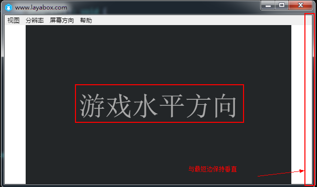

#Automatic Horizontal Screen and Horizontal Screen Game

Before we talk about the engine's automatic horizontal screen, let's talk about some people's misunderstandings about the horizontal screen game.

Until now, some people still say that if you play H5 games, you must play vertical screen games. In fact, if you have a deeper understanding of these words, a large part of them came into the H5 game industry in 2015 or earlier, and some of them were influenced by those who played H5 games earlier. Why do they always have such a misunderstanding? So what are the reasons for supporting the vertical screen game theory? After communicating with a large number of people who hold this view, there are three main points to sum up.

####First, horizontal screen games consume more performance?

In view of this point of view, there is this possibility, but it can be completely avoided. Because of the performance problems, one is that some engines may not handle the screen rotation properly. Second, the project itself did not make a good screen adaptation after the screen rotation, resulting in an increase in rendering. Some people will say that the vertical screen does not need to be rotated, and increasing the rotation operation will certainly increase the performance consumption of the game. Apparently reasonable, in fact, the rotation is usually only once, and the consumption of this performance can be neglected. So horizontal screen games consume more performance, if not their own project is not well written. The LayaAir engine won't have this problem.

####Second, the conversion rate of game users in horizontal screen games will be lower?

This view was established in the early H5 games. For H5 games which do not support automatic horizontal screen or have no engine, it is impossible to achieve automatic horizontal screen. Transverse screen operation is usually limited by the system's transverse screen locking switch. If users need to add operations, it may indeed lead to the loss of some users. But the Layabox engine does not have this problem. LayaAir engine's automatic horizontal screen mode is based on the browser's display ratio. The horizontal direction of the game is always perpendicular to the shorter side of the browser's screen, and is not affected by the system. So there will be no additional loss of users due to additional operations.

####Third, the game experience of vertical screen games is better than that of horizontal screen games?

First of all, there are many excellent games in the vertical screen game. But horizontal screen games, especially APP horizontal screen games, also have a lot of successful game cases. In addition to the technical differences between H5 mobile games and app mobile games, there is no natural difference between the hardware carrier of the game and the game experience. For the player, in fact, he doesn't care what technology you use to develop the game, and whether the quality of the game itself can attract him to play and pay. So whether horizontal or vertical screen games, as long as the production team is excellent, they can produce a masterpiece. It doesn't affect the game user experience because it's horizontal or vertical.


##How to Set up Automatic Horizontal Screen in LayaAir Engine

As mentioned above, the LayaAir engine will keep the horizontal direction of the game perpendicular to the shorter side of the browser screen after setting up the automatic horizontal screen. The example code of auto horizontal screen is as follows:


```javascript

(function()
{
    var Stage = Laya.Stage;
    var Text  = Laya.Text;
  
    (function()
    {
        //初始化舞台
        Laya.init(500, 300);
         
        //让舞台处于屏幕的垂直居中
        Laya.stage.alignH = "center";
         
  
        //保持原始高宽比的情况下，将舞台铺满屏幕，超出比例的部分会有黑边
        Laya.stage.scaleMode = "showall";
   
        //自动横屏，游戏的水平方向始终与浏览器屏幕较短边保持垂直
        Laya.stage.screenMode = "horizontal";
              
        //设置舞台背景色
        Laya.stage.bgColor = "#232628";
         
        showText();
    })();
  
    function showText()
    {
        var text = new Text();
        text.text = "游戏水平方向";
        text.color = "gray";
        text.fontSize = 50;
        text.x = Laya.stage.width - text.width >> 1;
        text.y = Laya.stage.height - text.height >> 1;
 
        Laya.stage.addChild(text);
     }
})();
```


**The code running effect in the vertical screen state is as follows:**


​	<br/>
Figure (1) Demonstration of the effect of setting a horizontal screen

**The effect of code running in horizontal screen state is as follows:**

​<br/>
Figure (2) Demonstration of the effect of changing the shortest edge


The code that handles the automatic horizontal screen is "Laya. stage. screenMode = Stage. SCREEN_HORIZONTAL;" as explained in the comments in the sample code. You can experience it in the coding process.