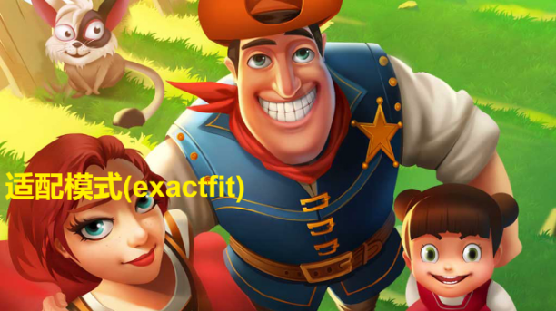
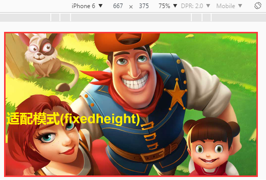
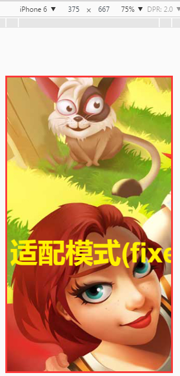
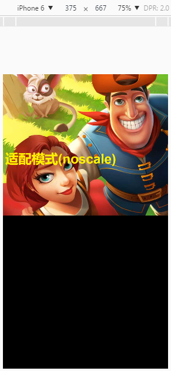
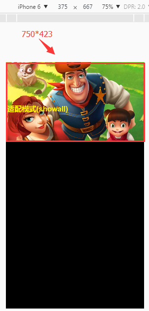
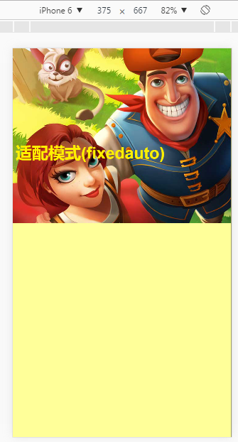

#Detailed explanation of zoom mode for screen adaptation


Scaling mode is the key content of screen adaptation. In this paper, from basic concepts to parameter descriptions, combined with code examples, we can help you understand the LayaAir engine's screen scaling mode. In the API document, we search laya. display. Stage. We can see that there are seven parameters for scaleMode, the method of scaleMode about scaling mode, to meet the scaling requirements of various screen adaptations. The parameters are illustrated in Figure 1.

​<br/>
(Figure 1) Parametric description of the LayaAir engine for scaleMode


**To give a brief overview of the parameter descriptions, let's first understand some of the basic concepts involved in this article:**

**1. Design width and height:** 

In the project code, the width and height defined in the initialization stage Laya.init() is the design width and height.

**2. Stage width and height:**

The width and height of stage is the actual size of the game stage.

**3. Adaptation width and height:**

In order to distinguish and understand the design width and height, we call the design width and height after the engine's adaptation mode is scaled to change the design width and height.

**4. Width and height of canvas:**

Canvas width refers to the width and height of canvas nodes in HTML5. All visible content in the game is in the canvas area.

**5. Screen width and height:**

Screen width and height refer to the width and height of the screen of mobile browser, such as the screen width and height of the iPhone 6 vertical screen.`375*667`。 LayaAir engine can obtain screen width and height through laya.utils.Browser.clientWidth and laya.utils.Browser.clientHeight.

**6. Physical width and height:**

With regard to the physical width and height of the device screen, we need to understand the concept of pixel density first. On a PC, a physical pixel is usually located at a single pixel. Today, with the rapid development of mobile devices, the screen of mobile phones usually has two or three pixels in one pixel position. For example, the physical width and height of the iPhone 6 vertical screen are 750*1334. The LayaAir engine can obtain the physical width and height of the device screen through laya. utils. Browser. width and laya. utils. Browser. height.


In this paper, the following figures are used:[loadingBg.jpg](http://ldc.layabox.com/uploadfile/file/20170223/1487816895380055.jpg)(Click Open or Save`1136×640`Pixel Background Map)

###Exctfit Model

Exctfit mode is a mode that fills the entire browser screen directly through unequal scaling without considering the original proportion of content. In this mode, the canvas width and stage width are equal to the design width and height, and will not change. However, when the physical width and design width are unequal, the unequal scaling mode may lead to obvious deformation of the original design. The effect is shown in Figures 2 and 3.

​<br/>
(Figure 2) the design width and height are`1136*640`The physical width and height are`1334*750`The effect of exactfix mode

​<br/>
(Figure 3) Design width and height`1136*640`The physical width and height are`750*1334`Operation effect of exactfit mode of


**Example code of exactfit mode:**


```javascript

(function()
{
    var Stage  = Laya.Stage;
    var Text   = Laya.Text;
    var Image  = Laya.Image;
 
        //适配模式
        var modes = "exactfit";
         
        //全局文本信息
        var txt;
 
    (function()
    {
        //初始化舞台大小
 
       Laya.init(1136,640);
         
        //设置适配模式
        Laya.stage.scaleMode = modes;
 
 
        //设置舞台背景色
        Laya.stage.bgColor  = "#ffff99";
 
 
        //实例一个背景
        var bg = new Image();
        bg.skin = "res/img/loadingBg.jpg";
        Laya.stage.addChild(bg);
 
 
 
        //实例一个文本
        txt = new Text();
        txt.text = "适配模式("+modes+") ";
        txt.bold = true;
        txt.pos(10, 350);
        txt.fontSize = 60;
        txt.color   = "#fff000";
        Laya.stage.addChild(txt);
    })();
 
})();
```


###2. Fixed height model

In fixedheight mode, the height of canvas and stage remains unchanged, and the width of canvas and stage equals the width of adaptation (adaptation width = design height * screen width-height ratio). Finally, the full-screen zoom and adaptation is made according to the screen width and height. This mode is one of the mainstream adaptation modes.

For example, when the screen of the iPhone 6 is horizontal, the width and height of the screen are as follows`667*375`, the design height is 640, so after using fixedheight mode,`适配宽度=(667/375)*640`The width of the canvas is 1138 after the calculation result of the fit width is rectified. The example stretch fit full screen effect is shown in Figure 4.

​<br/>
(Figure 4) the width and height of canvas are`1067*640`The physical width and height are`1334*750`The effect of fixedheight mode

Similarly, when the iPhone 6 screen is upright`适配宽度=(375/667)*640`The width of the canvas is 360 after the fitting width is calculated. If we are designed according to the horizontal screen, we need to set the automatic horizontal screen when using this mode, otherwise the part outside the canvas will not be displayed. Fixed height mode example stretches to fit the full screen effect as shown in Figure 5:

​<br/>
(Fig. 5) The width and height of the canvas are as follows`360*640`The physical width and height are`750*1334`The effect of fixedheight mode


**Fixed height pattern sample code:**


```javascript

(function()
{
    var Stage  = Laya.Stage;
    var Text   = Laya.Text;
    var Image  = Laya.Image;
 
        //适配模式
        var modes = "fixedheight";
         
        //全局文本信息
        var txt;
 
    (function()
    {
        //初始化舞台大小
 
       Laya.init(0, 640);
         
        //设置适配模式
        Laya.stage.scaleMode = modes;
 
 
        //设置舞台背景色
        Laya.stage.bgColor  = "#ffff99";
 
 
        //实例一个背景
        var bg = new Image();
        bg.skin = "res/img/loadingBg.jpg";
        Laya.stage.addChild(bg);
 
 
 
        //实例一个文本
        txt = new Text();
        txt.text = "适配模式("+modes+") ";
        txt.bold = true;
        txt.pos(10, 350);
        txt.fontSize = 60;
        txt.color   = "#fff000";
        Laya.stage.addChild(txt);
    })();
 
})();

```


###3. Fixed width mode

In Fixedwidth mode, the width of canvas and stage remains the same as the design width, and the height of canvas and stage equals the height of adaptation.（`适配高度=设计宽度*屏幕高宽比`At last, the full-screen zoom-in mode is adapted according to the screen width and height, which is one of the mainstream adaptation modes.

For example, when the screen of the iPhone 6 is horizontal, the width and height of the screen are as follows`667*375`The design width is 1136, so after Fixedwidth mode is adopted,`适配高度=(375/667)*1136`The height of the canvas is 639 after the fitting height calculation is completed. The example stretch fit full screen effect is shown in Figure 6.


​        <br/>
(Fig. 6) The width and height of the canvas are`1136*639`The physical width and height are`1334*750`Running effect of Fixedwidth mode

Similarly, the height of the adaptation is equal to (667/375)*1136 for the vertical screen of the iPhone 6, and 2021 is the height of the canvas after the calculation of the height of the adaptation. If we are designed according to the horizontal screen, we need to set the automatic horizontal screen when using this mode. Otherwise, the width and height of the adapter are higher than the width and height of the screen. When we zoom to the width and height of the screen for full screen display, it is usually not the desired effect. A sample of Fixedwidth mode is stretched to fit the full screen effect as shown in Figure 6:

​<br/>
(Fig. 6) The width and height of the canvas are`1136*2021`The physical width and height are`1334*750`Running effect of Fixedwidth mode


**Fixed width pattern sample code:**


```javascript

(function()
{
    var Stage  = Laya.Stage;
    var Text   = Laya.Text;
    var Image  = Laya.Image;
 
        //适配模式
        var modes = "fixedwidth";
         
        //全局文本信息
        var txt;
 
    (function()
    {
        //初始化舞台大小
 
       Laya.init(1136, 0);
         
        //设置适配模式
        Laya.stage.scaleMode = modes;
 
 
        //设置舞台背景色
        Laya.stage.bgColor  = "#ffff99";
 
 
        //实例一个背景
        var bg = new Image();
        bg.skin = "res/img/loadingBg.jpg";
        Laya.stage.addChild(bg);
 
 
 
        //实例一个文本
        txt = new Text();
        txt.text = "适配模式("+modes+") ";
        txt.bold = true;
        txt.pos(10, 350);
        txt.fontSize = 60;
        txt.color   = "#fff000";
        Laya.stage.addChild(txt);
    })();
 
})();
```


###IV. Full Model

In full mode, the width and height of stage and canvas will ignore the design width and height, which is directly equal to the physical width and height, so this is also the mainstream zooming mode with the highest accuracy of game painting. In this mode, the design content will not be scaled, keeping the original proportion of 1:1, aligning the stage with the upper left corner of the browser screen, the original design content beyond the screen will be cut. The example effect is shown in Figures 7 and 8.
​
(Figure 8) Design width and physical width are the same`1136*640`Full mode horizontal screen operation effect

​
(Fig. 9) Design width and height are as follows`1136*640`The physical width and height are`960*640`Full mode horizontal screen operation effect of


**Full mode sample code:**


```javascript

(function()
{
    var Stage  = Laya.Stage;
    var Text   = Laya.Text;
    var Image  = Laya.Image;
 
        //适配模式
        var modes = "full";
         
        //全局文本信息
        var txt;
 
    (function()
    {
        //初始化舞台大小
 
       Laya.init(0, 0);
         
        //设置适配模式
        Laya.stage.scaleMode = modes;
 
 
        //设置舞台背景色
        Laya.stage.bgColor  = "#ffff99";
 
 
        //实例一个背景
        var bg = new Image();
        bg.skin = "res/img/loadingBg.jpg";
        Laya.stage.addChild(bg);
 
 
 
        //实例一个文本
        txt = new Text();
        txt.text = "适配模式("+modes+") ";
        txt.bold = true;
        txt.pos(10, 350);
        txt.fontSize = 60;
        txt.color   = "#fff000";
        Laya.stage.addChild(txt);
    })();
 
})();
```


**Tips:**

1. Although this mode is a high-precision adaptation mode, the pressure on game performance is also higher than other modes. Whether to choose this mode or not should consider the overall situation of the game.

2. Since the width of the canvas and stage is directly derived from the physical width and height of the screen, the width and height of Laya.init() can be set to 0 directly.


###V. noscale model

The noscale mode is non-scaling mode, and the width of canvas and stage is higher than the design width. The stage is aligned with the upper left corner of the browser screen on the basis of keeping the original design proportion of 1:1. When the screen width is smaller than the content, it will be cut. When the screen width is larger than the content, black edges will appear. The operation effect of this mode is shown in Figures 9 and 10.

​<br/>
(Fig. 10) Screen width and height are larger than design width and height.

​<br/>
(Fig. 11) The effect that the design content exceeds the screen width and the screen height is greater than the design height


**The noscale pattern sample code is as follows:**


```javascript

(function()
{
    var Stage  = Laya.Stage;
    var Text   = Laya.Text;
    var Image  = Laya.Image;
 
        //适配模式
        var modes = "noscale";
         
        //全局文本信息
        var txt;
 
    (function()
    {
        //初始化舞台大小
 
       Laya.init(1136, 640);
         
        //设置适配模式
        Laya.stage.scaleMode = modes;
 
 
        //设置舞台背景色
        Laya.stage.bgColor  = "#ffff99";
 
 
        //实例一个背景
        var bg = new Image();
        bg.skin = "res/img/loadingBg.jpg";
        Laya.stage.addChild(bg);
 
 
 
        //实例一个文本
        txt = new Text();
        txt.text = "适配模式("+modes+") ";
        txt.bold = true;
        txt.pos(10, 350);
        txt.fontSize = 60;
        txt.color   = "#fff000";
        Laya.stage.addChild(txt);
    })();
 
})();

```


###6. noborder mode

In noborder mode, canvas width is higher than design width. When zooming, zoom according to the maximum ratio of screen width to design width, such as design size`1136*640`The physical width and height of the screen are`750*1334`。 Calculate the Wide Ratio`（750/1136）`0.66, high ratio`（1334/640）`It is 2.08. Then, when zooming in noborder mode, the adaptation height is stretched to 1334 of physical height and the adaptation width is equal to that of stretching according to the maximum ratio (high).（`1334/640*1136`) 2368. Of course, more than the width of the screen will be cut off. The effect is shown in Figure 11.

​<br/>
(Figure 12) canvas width and height keep the design size`1136*640`When the adapter width reaches the maximum ratio, one side stretches to the full screen.


**The noborder pattern sample code is as follows:**


```javascript

(function()
{
    var Stage  = Laya.Stage;
    var Text   = Laya.Text;
    var Image  = Laya.Image;
 
        //适配模式
        var modes = "noborder";
         
        //全局文本信息
        var txt;
 
    (function()
    {
        //初始化舞台大小
 
        Laya.init(1136, 640);
         
        //设置适配模式
        Laya.stage.scaleMode = modes;
 
 
        //设置舞台背景色
        Laya.stage.bgColor  = "#ffff99";
 
 
        //实例一个背景
        var bg = new Image();
        bg.skin = "res/img/loadingBg.jpg";
        Laya.stage.addChild(bg);
 
 
 
        //实例一个文本
        txt = new Text();
        txt.text = "适配模式("+modes+") ";
        txt.bold = true;
        txt.pos(10, 350);
        txt.fontSize = 60;
        txt.color   = "#fff000";
        Laya.stage.addChild(txt);
    })();
 
})();
```


###7. Showall mode

In showall mode, the width of stage and canvas is higher than that of the scaled canvas, and the scaling is done in the same ratio according to the minimum ratio of screen width to design width.

For example, the design size is`1136*640`The physical width and height of the screen are`750*1334`。 Calculate the Wide Ratio（`750/1136`) 0.66, high ratio（`1334/640`）2.08. When zooming in showall mode, the canvas width will be zoomed to 750 physical width of the screen at the smallest ratio (width), and the height of the canvas will be zoomed to equal ratio.（`750/1136*640`423. At this time, because 423 is far less than the screen physical height of 1334, there will be a large number of black blank screen. The effect is shown in Figure 12.

​<br/>
(Fig. 13) The canvas width and height are scaled to`750*423`In physics, width and height are`750*423`A large number of black blank screens appeared on the screen.


**The showall pattern sample code is as follows:**


```javascript

(function()
{
    var Stage  = Laya.Stage;
    var Text   = Laya.Text;
    var Image  = Laya.Image;
 
        //适配模式
        var modes = "showall";
         
        //全局文本信息
        var txt;
 
    (function()
    {
        //初始化舞台大小
 
         Laya.init(1136, 640);
         
        //设置适配模式
        Laya.stage.scaleMode = modes;
 
 
        //设置舞台背景色
        Laya.stage.bgColor  = "#ffff99";
 
 
        //实例一个背景
        var bg = new Image();
        bg.skin = "res/img/loadingBg.jpg";
        Laya.stage.addChild(bg);
 
 
 
        //实例一个文本
        txt = new Text();
        txt.text = "适配模式("+modes+") ";
        txt.bold = true;
        txt.pos(10, 350);
        txt.fontSize = 60;
        txt.color   = "#fff000";
        Laya.stage.addChild(txt);
    })();
 
})();
```


###8. Fixed auto mode

In fixedauto mode, the width of stage and canvas is higher than the height of adaptation after zooming, while the equal-ratio zooming displays the whole content in full screen, automatically calculates SCALE_FIXED_WIDTH and SCALE_FIXED_HEIGHT according to the length-width ratio of the screen, and chooses the mode that the width-height ratio of the screen is closer to the design width-height ratio.

For example, when the screen of the iPhone 6 is horizontal, the width and height of the screen are as follows`667*375`After fixedauto mode is adopted, SCALE_FIXED_WIDTH mode will be selected automatically according to the aspect ratio.`适配高度=(375/667)*1136`The height of the canvas is 639 after the fitting height calculation is completed. The example stretch fit full screen effect is shown in Figure 6.


​        <br/>
(Fig. 14) The width and height of the canvas are as follows`1136*639`The physical width and height are`1334*750`Running effect of fixedauto mode

In the same way, when the iPhone 6 is on the vertical screen, the adaptation height = (667 / 375) * 1136, and the adjusted 2021 is the height of the canvas. According to the aspect ratio, SCALE_FIXED_HEIGHT adaptation mode which is closer to the aspect ratio of screen is automatically selected.

If we are designed according to the horizontal screen, we need to set the automatic horizontal screen when using this mode, otherwise the width and height of the adapter are higher than the width and height of the screen, and then the horizontal cutting is based on the design height, which is usually not the desired effect. A sample of fixedauto mode is stretched to fit the full screen effect as shown in Figure 15:

​<br/>
(Fig. 15) The width and height of the canvas are`1136*2021`The physical width and height are`1334*750`Running effect of fixedauto mode


**The fixedauto pattern example code is as follows:**


```javascript

(function()
{
    var Stage  = Laya.Stage;
    var Text   = Laya.Text;
    var Image  = Laya.Image;
 
        //适配模式
        var modes = "fixedauto";
         
        //全局文本信息
        var txt;
 
    (function()
    {
        //初始化舞台大小
 
         Laya.init(1136, 640);
         
        //设置适配模式
        Laya.stage.scaleMode = modes;
 
 
        //设置舞台背景色
        Laya.stage.bgColor  = "#ffff99";
 
 
        //实例一个背景
        var bg = new Image();
        bg.skin = "res/img/loadingBg.jpg";
        Laya.stage.addChild(bg);
 
 
 
        //实例一个文本
        txt = new Text();
        txt.text = "适配模式("+modes+") ";
        txt.bold = true;
        txt.pos(10, 350);
        txt.fontSize = 60;
        txt.color   = "#fff000";
        Laya.stage.addChild(txt);
    })();
 
})();
```


###Conclusion:

Full mode is rendered entirely according to physical pixels, the screen size, the size of the screen adapted to the screen is how big, high-quality commonly used adaptation mode, but in different sizes of the screen, the size of the display content will be different, at the same time for HTML5 game performance pressure is higher than other adaptation modes.

Showall and noborder are isometric scaling modes that keep the picture intact. Showall scales at the smallest ratio of screen width to design height to ensure that the screen is fully displayed, but it will result in blank screen with black edges. Nonoborder, on the contrary, scales at the maximum ratio of screen width to design height, without blank screen black edges, but results in wide or high parts of content that cannot be displayed.

Fixed width and fixed height are more like the variants of showall and noborder. They are also equivalent scaling modes, but they specify one side to be fixed and the other side to be scaled. They are the main adapting modes commonly used in HTML5 games. Fixed auto automatically switches Fixedwidth and fixedheight modes according to proportions. These modes are also recommended for full screen adaptation.

In this paper, we focus on the different parameters of scaling mode. Without other screen adaptation settings such as screen autorotation, developers can view related technical documents.

The core of the adaptation mode is to zoom the canvas, stage or change the canvas size directly. The following compares the different scaling modes for which scaling has been done, which is convenient for you to understand intuitively.

|| noscale | exactifit | showall | noborder | full | fixed_width | fixed_height | fixed_auto|
| ------------------------------------------------------------------------------------------------------------------------------------------------------------------------------------------------------------------------------------|
| Zoom Canvas | | Yes | | Yes | Yes | | Yes | Yes | Yes | Yes | Yes|
| Scale Stage | | | Yes||||||
| Modify Canvas Size | | | Yes | | Yes | Yes | Yes | Yes | Yes | Yes | Yes|

**Be careful:**If the physical pixel resolution mode is used, that is`useRetinalCanvas=true`When the size of the canvas is constant to the physical resolution, the original scaling of the canvas is all changed to the scaling of the Stage.


Finally, a detailed comparative illustration of each adaptation mode is attached. You can right-click in the new page to open the full screen original view.

 


