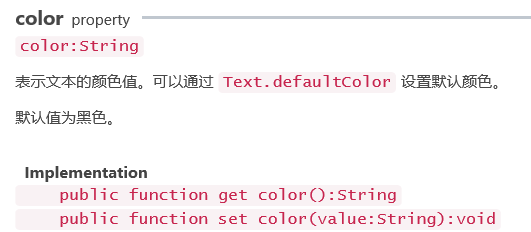

#Setting Text Foundation Styles

In some of our projects, text is often used. It is unavoidable to set font size, font color, text content, etc. for this text.

Let's first make a basic Demo to create a text, add text content to the text, set font color (the default background is black, no color changes have no effect).

API parameters about text styles in laya.display.text:

</br>

</br>


```typescript

//初始化引擎
Laya.init(1136,640);

var txt = new Laya.Text();
//设置文本内容
txt.text = "hello_world";
//设置文本颜色
txt.color = "#ffffff";
Laya.stage.addChild(txt);
```


At this time, we can see that TXT has been added to the stage, showing the white Hello world in txt.

Then we add some other font styles to the text, such as bold, italic, font size, etc.

<br/>

<br/>


```typescript

//初始化引擎
Laya.init(1136,640);

var txt = new Laya.Text();
//设置文本内容
txt.text = "hello_world";
//设置文本颜色
txt.color = "#ffffff";
//设置文本字体
txt.font = "Ya Hei";
//设置字体大小
txt.fontSize = 32;
//设置文本区背景
txt.bgColor = "#c30c30";
//设置文本框的颜色
txt.borderColor = "#23cfcf";
//设置粗体、斜体
txt.bold = true;
//设置斜体
txt.italic = true;
//设置边距
txt.padding = [5,5,5,5];  
Laya.stage.addChild(txt);
```


</br>

Here we can see that the font style, font size has changed significantly. There is a circle of light blue border around the text box, and the background of the text area becomes red. If you are interested, you can modify the values and understand how these attributes are used.