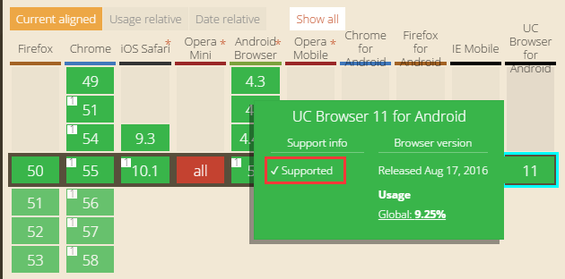

#Geolocation for Geographic Location Information
[TOC]

##geographical position

If the device supports Geolocation and the browser supports it, you can use Geolocation to get the current location of the device. You can open a web page[http://caniuse.com/](http://caniuse.com/#search=geolocation)#[search=geolocation](http://caniuse.com/#search=geolocation)See which browser versions support Geolocation. Display Supported for support.



The Geolocation Info returned by Geolocation contains the following information:

##-`latitude`—— Dimension (degree). `longitude` —— 经度（度）。

##-`altitude`—— Elevation (m) relative to sea level. If the equipment does not provide elevation data,`altitude`The value is null. `accuracy`—— Returns the accuracy of longitude and latitude in meters.
##-`altitudeAccuracy`—— The accuracy of returning to elevation is measured in meters.`altitudeAccuracy`May be`null`。 `heading`—— Return the direction of movement (angle) of the device, indicating the angle from the north. 0 degrees means to point north and rotate clockwise (this means 90 degrees in the East and 270 degrees in the west). If`speed`It's 0.`heading`Would be`NaN`。 If the equipment is not available`heading`Information, value`null`。
##-`speed`—— Returns the device's moving speed per second (m).`speed`May be`null`。 `timestamp`—— Timestamp for obtaining information.

Geolocation static attribute values contain the following general settings:

##-`enableHighAccuracy`—— Boolean value, if set to true and the device can provide a more precise location, then the application can obtain the best results as far as possible. Note that it can lead to longer response times and greater power consumption (e.g., GPS on mobile devices). `timeout`—— Positive integer, representing the maximum time (milliseconds) limit for the return position. The default value is`Infinity`It means`getCurrentPosition()`It will not return until the location is available.
-`maximumAge`—— A 32-bit positive integer represents the maximum lifetime of available cached locations that can be returned. If set to 0, it means that the device does not use the cache location and always tries to get the real-time location. If set to`Infinity`The device must return to the cache location regardless of its lifetime. Default value: 0.

###1. Acquiring Current Location

Using static methods`Geolocation.getCurrentPosition()`Get the current location,`getCurrentPosition()`Trigger only once.


```java

// 尝试获取当前位置
Geolocation.getCurrentPosition(
				Handler.create(this, onSuccess), 
				Handler.create(this, onError)
);

// 成功获取位置后触发
function onSuccess(info:GeolocationInfo):void
{
	trace('经纬度: (' + info.longitude + '°, ' + info.latitude + '°)，精确度：' + info.accuracy + 'm');
	
	if(info.altitude != null)
		trace('海拔：' + info.altitude + 'm' + (info.altitudeAccuracy != null ? ('，精确度：' + info.altitudeAccuracy + 'm') : ''));
		
	if(info.heading != null && !isNaN(info.heading))
		trace('方向：' + info.heading + "°");
		
	if(info.speed != null && !isNaN(info.speed))
		trace('速度：' + info.speed + "m/s");
}

// 获取位置失败后触发
function onError(err:Error):void
{
	var errType:String;
	if (err.code = Geolocation.PERMISSION_DENIED)
		errType = "Permission Denied";
	else if (err.code == Geolocation.POSITION_UNAVAILABLE)
		errType = "Position Unavailable";
	else if (err.code == Geolocation.TIMEOUT)
		errType = "Time Out";
	trace('ERROR(' + errType + '): ' + err.message);
}
```


The above example code demonstrates the use of`getCurrentPosition()`Get the current location information, print the location information when successful, print the error information when failed and the cause of the error.

###2. Monitoring position change

In addition to acquiring the current location, you can also monitor changes in location. Use`Geolocation.watchPosition()`Monitor location change, which returns a monitor ID value that can be used`Geolocation.clearWatch()`And pass in the ID value to cancel the`watchPosition()`Registered Location Monitor.


```typescript

// Geolocation.watchPosition函数签名
Geolocation.watchPosition(
	Handler.create(this, updatePosition),
	Handler.create(this, onError));
function updatePosition(info:GeolocationInfo):void { }
function onError(err:Error):void { }
```


​`watchPosition()`Have and`getCurrentPosition()`The same function signature. More about`watchPosition()`Application, you can view the document "Use Baidu Map to Display the Current Location"