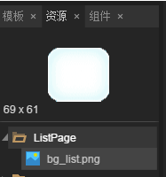
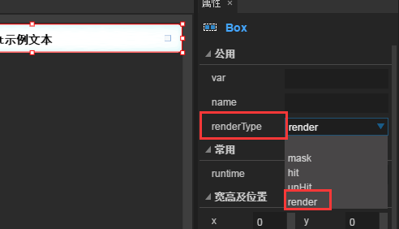

#List example: display, add, delete

List (list) is a commonly used function. This article, combined with LayaAir engine and IDE, gives a step-by-step explanation of List display, addition, deletion and other related operations for developers to learn engine and IDE for practical reference. (For basic operations such as creating projects, see other documents, skip this article)

###I. Making UI with LayaAirIDE

#####1.1 Create a View-type UI page

​
(Figure 1) Create a View-type UI page called ListPage

First, in the project manager of LayaAirIDE, we create a View-type UI page with a width of 640*1136. The page is named listpage.

#####1.2 Importing UI Resources

Import art-produced UI page resources into resource manager. (Specific import method refers to documents imported from LayaAirIDE resources.)

​
(Figure 2)

#####1.3 making list background with nine palace grids

**1.3.1 Drag List Background to Stage**

​
(Figure 3) Drag the picture background bg_list.png onto the stage

​**1.3.2 In the Image attribute, nine palaces are set through the sizeGrid attribute.**

​
(Figure 4) Click on the right button of the sizeGrid property to open the Nine Palaces Settings Panel

​**1.3.3 Set width to 640 (full screen width) in attributes**

​
(Fig. 5)


 #####1.4 Making List Containers

**1.4.1 Drag checkbox.png onto the stage and set the property name to check.**


​    
(Fig. 6)

​**1.4.2 Drag a label.png onto the stage and set the attribute name to listNumber. The other attributes are shown in Figure 7.**

​
(Figure 7) The label component for serial numbers

​**1.4.3 Drag another label.png onto the stage and modify the text content to "List sample text". Attribute settings are shown in Figure 8.**

​
(Figure 8) The label component for List text

​**1.4.4 Select list background map, serial number label, text label, checkbox, and create a Box container with Ctrl + B shortcut key. Then select the Box container and set the Box attribute renderType to render. Fig. 9 and 10.**

​
(Figure 9)

​
(Figure 10)

​**1.4.5 Click on the box container to create a List container again through Ctrl + B, as shown in Figure 11. Note that all List containers must be based on Box containers. Let's look at the hierarchical relationship in Figure 12 to make it clearer that lists are generated based on box loops.**

​
(Fig. 11)

​
(Fig. 12)

#####1.5 Setting List Properties

Select the List container, set the Lis attribute VaR to _list (through which all the attributes under the component can be invoked), and then set other attributes according to actual needs. RepatX is the number of lists on the X axis, repeatY is the number of lists on the Y axis, spaceX is the distance between lists on the X axis, and spaceY is the distance between lists on the Y axis. As shown in Figure 13:

​
(Figure 13)

#####1.6 Add operation button

Here, we directly use the Button Tab of the template, drag it onto the stage, then click on the sub-node, set var, label attributes, and the nine palaces. Fig. 14, Fig. 15:

​
(Figure 14)

​
(Fig. 15)

After adjusting the location details of the UI, see Figure 16. When F12 releases UI, you can enter the code phase.

​
(Fig. 16)


###2. Implementing List Code Logic in JavaScript Language

#####2.1 Display the UI Page Made

2.1.1 Create a ListDemo.js program file and set the corresponding JS as the startup file at the index.html entry.

​
(Figure 17)

2.1.2 Edit the code and display the UI.

We first introduce the loading and UI classes, then load the atlas resources used to display the UI, and finally exemplify the UI interface and add it to the stage. The following three steps are realized by coding:


```typescript

(function()
{
    var Stage= Laya.Stage;
    var Handler= Laya.Handler;
    var Loader= Laya.Loader;
    var WebGL = Laya.WebGL;
     
     var ListDemoView;
    (function()
    {
         Laya.init(640,1136,WebGL);
         Laya.stage.bgColor = "#ffffff";
          
         Laya.stage.scaleMode = Stage.SCALE_SHOWALL;
         //预加载资源文件后执行回调
         Laya.loader.load(["res/atlas/ListPage.atlas","res/atlas/template/ButtonTab.atlas"], Handler.create(this, onLoaded));
       
    })();
  
    function onLoaded(){
        ListDemoView = new ListPageUI();
        Laya.stage.addChild(ListDemoView);
    }
     
})();
```


​*Tips: Atlas paths in the code should be adjusted flexibly according to the actual situation of the project.*


After 2.1.3 encoding is completed, it runs according to F5. As shown in Figure 18, when the effect of page display is consistent with that of IDE production, it begins to edit the logic code.

​
(Figure 18)

#####2.2 Writing Code Logic

​**2.2.1 Implementing List Sequence Logic**

In order to add the data of List serial number, we need to use list data source assignment array in the "laya.ui.List" API, renderHandler of cell rendering processor, and getChildByName, a method of obtaining child node object by child node name under the "laya.display.Node" API. Let's first look at the API description: Figure 19, Figure 20, and Figure 21.

​
(Figure 19)

​
(Figure 20)

​
(Figure 21)


 **List serial number add code as follows:**


```typescript

(function()
{
    var Stage= Laya.Stage;
    var Handler= Laya.Handler;
    var Loader= Laya.Loader;
    var WebGL = Laya.WebGL;
     
     var ListDemoView;
     var arr;
    (function()
    {
         Laya.init(640,1136,WebGL);
         Laya.stage.bgColor = "#ffffff";
          
         Laya.stage.scaleMode = Stage.SCALE_SHOWALL;

          //预加载资源文件后执行回调
         Laya.loader.load(["res/atlas/ListPage.atlas","res/atlas/template/ButtonTab.atlas"], Handler.create(this, onLoaded));
       
    })();
  
    function onLoaded(){
        ListDemoView = new ListPageUI();
        Laya.stage.addChild(ListDemoView);
        //获得List模拟数据，并渲染
         getListData(); 
    }
  
    function getListData(){
        //添加list数据
        arr = [];
        for (var i  = 1; i <= 30; i++) {
            arr.push({listNumber: {text:i}});
           }
      
        ListDemoView._list.vScrollBarSkin='';//添加list滚动条功能（UI不可显示）
        ListDemoView._list.array = arr;//数据赋值
         //list渲染函数
          ListDemoView._list.renderHandler = new Handler(this, onRender);
    }
  
    function onRender(cell,index){
         //如果索引不再可索引范围，则终止该函数
        if(index > arr.length)return;
        //获取当前渲染条目的数据
        var data = arr[index];
        //根据子节点的名字listNumber，获取子节点对象。         
        var listNumber = cell.getChildByName("listNumber") ;
        //label渲染列表文本（序号）
        listNumber.text=data.listNumber.text;
    }

})();
```


The result of code running is shown in Figure 22, which successfully implements the introduction of serial data. Specific implementation logic and code description directly view code and comments.

​
(Figure 22)

2.2.2 Implementing List Sequential Scrolling
After running the above example, only 16 of the 30 simulated data can be seen. So we need to add a scrolling effect. VScrollBarSkin in the API of laya.ui.List can meet our needs. The API is illustrated in Figure 23:

​
(Figure 23)
It only needs one line of code to add this function, so it won't stick all the code. Put the following code before the assignment list data source.


```typescript

//添加list滚动条功能
listView._list.vScrollBarSkin='';
```


The effect of re-operation is shown in Figure 24.


​        
(Figure 24)

2.2.3 Implementing List Additional Function

To increase List, we need to use the event listening on () method in LayaAir engine laya. display. Sprite to listen for mouse click event CLICK, and add Item () to add cell data source in laya. ui. List API.

​
(Fig. 25)

​
(Figure 26)


 
```typescript

(function()
{
    var Handler= Laya.Handler;
    var Loader= Laya.Loader;
    var WebGL = Laya.WebGL;
    var Event   = Laya.Event;
    var Stage = Laya.Stage;
     
     var ListDemoView;
     var arr;
    (function()
    {
         Laya.init(640,1136,WebGL);
         Laya.stage.bgColor = "#ffffff";
          
         Laya.stage.scaleMode = Stage.SCALE_SHOWALL;

          //预加载资源文件后执行回调
         Laya.loader.load(["res/atlas/ListPage.atlas","res/atlas/template/ButtonTab.atlas"], Handler.create(this, onLoaded));
       
    })();
  
    function onLoaded(){
        ListDemoView = new ListPageUI();
        Laya.stage.addChild(ListDemoView);
        //获得List模拟数据，并渲染
         getListData(); 
         //侦听增加按钮点击事件
         ListDemoView.add.on(Event.CLICK,this,onAddClick);
    }
  
    function getListData(){
        //添加list数据
        arr = [];
        for (var i  = 1; i <= 30; i++) {
            arr.push({listNumber: {text:i}});
           }
      
        ListDemoView._list.vScrollBarSkin='';//添加list滚动条功能（UI不可显示）
        ListDemoView._list.array = arr;//数据赋值
         //list渲染函数
          ListDemoView._list.renderHandler = new Handler(this, onRender);
    }
  
    function onRender(cell,index){
         //如果索引不再可索引范围，则终止该函数
        if(index > arr.length)return;
        //获取当前渲染条目的数据
        var data = arr[index];
        //根据子节点的名字listNumber，获取子节点对象。         
        var listNumber = cell.getChildByName("listNumber") ;
        //label渲染列表文本（序号）
        listNumber.text=data.listNumber.text;
    }
      function onAddClick(){
         //添加单元格数据源
         ListDemoView._list.addItem({listNumber: {text:arr.length+1}});
    }

})();
 ```


See the code and comments directly for details.


The code runs as shown in Figure 27:


​       
(Figure 27) Implementing List Enhancement


2.2.3 Implementing List Added Function Delete Function

To realize List deletion function, it is necessary to implement checkbox function of multiple check boxes, mouse listening of deletion buttons, and data re-rendering after deletion operation. See the code and comments directly for details:


 
```typescript

(function()
{
    var Handler= Laya.Handler;
    var Loader= Laya.Loader;
    var WebGL = Laya.WebGL;
    var Event   = Laya.Event;
     var Stage = Laya.Stage;
     var CheckBox = Laya.CheckBox;
     
     var ListDemoView;
     var arr;
    (function()
    {
         Laya.init(640,1136,WebGL);
         Laya.stage.bgColor = "#ffffff";
          
         Laya.stage.scaleMode = Stage.SCALE_SHOWALL;

          //预加载资源文件后执行回调
         Laya.loader.load(["res/atlas/ListPage.atlas","res/atlas/template/ButtonTab.atlas"], Handler.create(this, onLoaded));
       
    })();
  
    function onLoaded(){
        ListDemoView = new ListPageUI();
        Laya.stage.addChild(ListDemoView);
        //获得List模拟数据，并渲染
         getListData(); 
         //侦听增加按钮点击事件
         ListDemoView.add.on(Event.CLICK,this,onAddClick);
         //侦听删除按钮点击事件
         ListDemoView.del.on(Event.CLICK,this,onRemoveClick);
    }
  
    function getListData(){
        //添加list数据
        arr = [];
        for (var i  = 1; i <= 30; i++) {
            arr.push({listNumber: {text:i}});
           }
      
        ListDemoView._list.vScrollBarSkin='';//添加list滚动条功能（UI不可显示）
        ListDemoView._list.array = arr;//数据赋值
         //list渲染函数
          ListDemoView._list.renderHandler = new Handler(this, onRender);
          //mouseHandler: list单元格鼠标事件处理器
          ListDemoView._list.mouseHandler = new Handler(this,onMouse);
    }
  
    function onRender(cell,index){
         //如果索引不再可索引范围，则终止该函数
        if(index > arr.length)return;
        //获取当前渲染条目的数据
        var data = arr[index];
        //根据子节点的名字listNumber，获取子节点对象。         
        var listNumber = cell.getChildByName("listNumber") ;
        //label渲染列表文本（序号）
        listNumber.text=data.listNumber.text;
        //获取当前渲染条目的check组件
        var check=cell.getChildByName("check");
        //根据isCheck的值，确定当前check组件是否为勾选状态（可以避免出现其他多余的选中状态）
        if(data.isCheck)
        {
                check.selected=true;
   
        }
        else
        {
                check.selected=false;
        }
    }
  
      function onRemoveClick(){
      //创建一个新的数组，存放移除条目后的数据
      var temp= [];
      for(var i=0;i<arr.length;i++)
      {
      //将非选中状态的条目数据存储起来
            if(!arr[i].isCheck)
            {
                  temp.push(arr[i]);
            }
      }
      arr = temp;
      //将新的数组赋值给list
      ListDemoView._list.array = arr;
    }
  
      function onAddClick(){
         //添加单元格数据源
         ListDemoView._list.addItem({listNumber: {text:arr.length+1}});
    }

      function onMouse(e,index)
      {
         //鼠标单击事件触发
         if(e.type == Event.CLICK)
         {
              //判断点击事件类型,如果点中的是checkBox组件执行
            if((e.target) instanceof CheckBox)
            {
                 //记录当前条目所包含组件的数据信息(避免后续删除条目后数据结构显示错误)
                var tempObj = arr[index];
                 //根据check的选中状态，设置条目的数据信息
                 if((e.target).selected)
                 {
             ListDemoView._list.setItem(index,{listNumber:{text:tempObj.listNumber.text} ,isCheck:true});
                 }
                 else
                 {
             ListDemoView._list.setItem(index,{listNumber:{text:tempObj.listNumber.text},isCheck:false});
                 }
            }
         }
      }
  
})();
 ```


The operation effect is shown in Figure 28.

​
(Figure 28) Effect of deleting 2, 3 and 4 items
​

At this point, we have completed the UI production of the list, as well as the code logic for display, addition and deletion. If you have any questions, please go to the community and ask. layabox. com.


