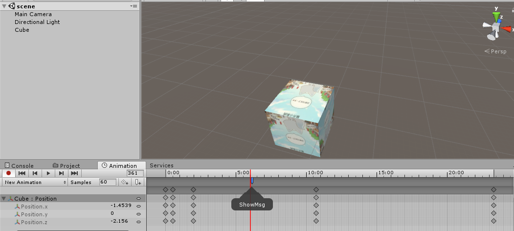
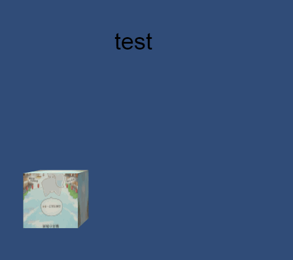

# 在Unity中设置动画事件

###### *version :2.1.0beta   Update:2019-6-13*

在unity的Animator中我们我们可以添加动画触发事件 **showMsg** 如图1。

<br>(图1)

这个事件就是说在动画播放到这个位置的时候，就会触发我们**ShowMsg**这个名字的事件。

在unity中设置好事件然后Apply，最后导出动画模型。

在LayaAir3D中我们就可以创建一个脚本来接收这个事件。

首先我们创建一个Script3D脚本，脚本名不影响事件的触发这里是随便取的名。

```typescript

export default class SceneScript extends Laya.Script3D {
	constructor(){
		super();
    	//用于表现的方法
        this.showMsgFunc = null;
	}
	
	//对应unity添加的AnimationEvent的动画事件函数，名字是可以对应上的
	ShowMsg() {
		console.log("ShowMsg");
		this.showMsgFunc && this.showMsgFunc();
	}
}
```

在加载好场景之后，我们将我们创建的这个脚本添加给cube。

```typescript
//加载场景
Laya.Scene3D.load("res/threeDimen/scene/LayaScene_AnimationEvent/Conventional/layaScene.ls", Laya.Handler.create(this, function(scene) {
    Laya.stage.addChild(scene);
    //获取cube对象
    var cube = scene.getChildByName("Cube");
    //添加组件(脚本)
    var _script = cube.addComponent(SceneScript);
    //label用于显示
    var _lab = new Laya.Label();
    _lab.text = "test";
    _lab.height = 100;
    _lab.width = 100;
    _lab.fontSize = 40;
    _lab.pos(200,200);
    Laya.stage.addChild(_lab);
	//给脚本的加强表现用方法赋值
    _script.showMsgFunc = function () 
    {
        text = "ShowMsg";
        color = "red";
    }.bind(_lab);
    
}));
```

最后了来看下效果，如图2。

<br>(图2)

