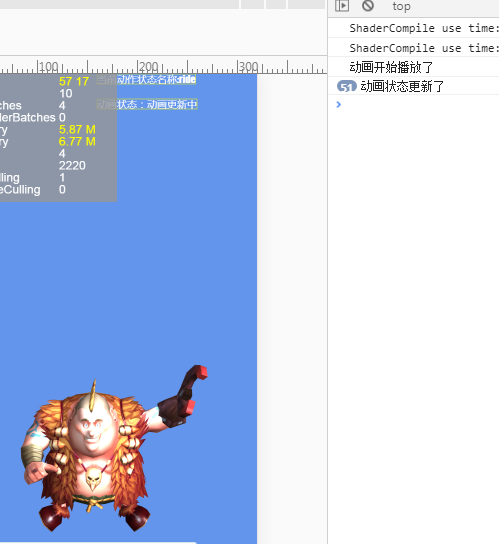

# 动画状态脚本

###### *version :2.1.0beta   Update:2019-6-13*

​	**AnimatorStateScript**动画状态脚本是一种特殊的脚本，是添加到 **AnimatorState** 动画状态上的脚本。这种脚本有一套自己的生命周期。跟随动画状态改变触发生命周期函数。

```typescript
/**
* 动画状态开始时执行。
*/
onStateEnter() {}
/**
* 动画状态更新时执行。
*/
 onStateUpdate() {}
/**
* 动画状态退出时执行。
*/
 onStateExit() {}
```

开发者可以通过重写这几个方法，来实现动画状态改变时执行自己的逻辑。

例如：

1.进入或者退出某个动画状态时播放声音。

2.在某个特定的状态下激活某系效果。

动画状态脚本可以创建并添加给动画状态，其方式与Sprite3D对象添加脚本非常相似。使用的是动画状态的`addScript` 方法来添加动画状态脚本。

下方的代码来自于官方示例（[demo地址](https://layaair.ldc.layabox.com/demo2/?language=ch&category=3d&group=Animation3D&name=AnimatorStateScriptDemo)）。

> 动画事件脚本

```typescript
//继承自AnimatorStateScript(动画状态脚本)
export default class AnimatorStateScriptTest extends Laya.AnimatorStateScript {
    constructor() {
        super();
        this._text = null;
    }
    
	get text() {
		return this._text;
	}
    
	set text(value) {
		this._text = value;
	}
    
	/**
	 * 动画状态开始时执行。
	 */
	 onStateEnter() {
		console.log("动画开始播放了");
		this._text.text = "动画状态：动画开始播放";
	}
	
	/**
	 * 动画状态更新时执行。
	 */
	 onStateUpdate() {
		console.log("动画状态更新了");
		this._text.text = "动画状态：动画更新中";
	}
	
	/**
	 * 动画状态退出时执行。
	 */
	onStateExit() {
		console.log("动画退出了");
		this._text.text = "动画状态：动画开始退出";
	}
}
```

> 添加动画状态脚本，并且绑定 _text 文本

```typescript
//创建一个动画状态
var state2 = new Laya.AnimatorState();
state2.name = "ride";
state2.clipStart = 0 / 581;
state2.clipEnd = 33 / 581;
state2.clip = animator.getDefaultState().clip;
state2.clip.islooping = true;
//给该动画状态添加脚本
var asst2 = state2.addScript(AnimatorStateScriptTest);
//给该脚本的text赋值（text由前面的代码创建）
asst2.text = text;
//给动画添加动画状态
this.animator.addState(state2);
```

来看下效果：

<br>(图1)