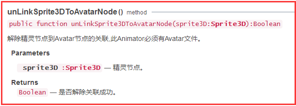
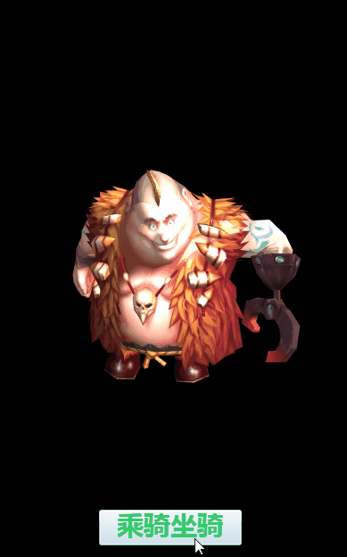

# 动画挂点

###### *version :2.1.0beta   Update:2019-6-13*

骨骼挂点技术在3D游戏中运用非常普遍，比如武器要随着角色的手的动作而变化，那么我们就可以把武器与手上骨骼进行挂点绑定，武器作为手骨骼的子节点，自然就可以跟随手的动作而变化。

当然，绑定后的3D模型也可以通过代码来移除绑定或者更换另外的3D模型，通过这种方式可以实现武器或装备的换装功能，骑乘功能等。

#### (1) 在Unity中设置骨骼挂点

骨骼挂点在Unity中设置非常方便，可以在场景的资源层级中直接操作。如下图（图1）

需要绑定的对象可以是一个3D容器，也可以只是一个3D模型，调整好它们的位置后，把它们拖入到指定骨骼下作为子层级就挂点绑定成功了，播放动画时，我们可以发现它跟随骨骼动画而变化了。

有的时候，我们需要在刚开始的时候无武器，但又需要挂点，为以后换武器作准备，那么我们也可以在骨骼下放入一个空节点容器GameObject，需要的时候再往里添加不同的3D模型或是多个模型。

<br>(图1)

**Tips：当我们的骨骼挂点设置好后，骨骼与挂点对象会自动导出到.ls或.lh文件中，我们可以通过getChildByName()方法获取到它们。**

#### (2) 在代码中实现骨骼挂点

Animator动画组件类提供了两个实例方法 `linkSprite3DToAvatarNode()` 与 `unLinkSprite3DToAvatarNode()` 可以实现挂点的添加与移除（图2、图3）。

Tips：代码添加骨骼动画之前，需要美术提供需要关联骨骼节点的名字。

<br>(图2)

<br>(图3)

具体使用的代码节选自官方示例，更详细的使用可以查看：（[demo地址](<https://layaair.ldc.layabox.com/demo2/?language=ch&category=3d&group=Animation3D&name=BoneLinkSprite3D>)）。

**从场景中获取骨骼动画模型—获取模型的动画组件—创建挂点对象—在按钮点击后，通过动画组件绑定骨骼与挂点对象。**

点击事件中的部分挂点的添加代码：

```typescript
//往场景上添加龙
this.scene.addChild(this.dragon1);
//将角色节点添加到龙的节点上
this.aniSprte3D1.addChild(this.role);
//关联精灵节点到Avatar节点
this.dragonAnimator1.linkSprite3DToAvatarNode("point", this.role);
//胖子播放骑乘动作
this.animator.play("ride");
//龙播放奔跑动作
this.dragonAnimator1.play("run");
//调整胖子的相对旋转，相对位移，以及缩放。
this.pangzi.transform.localRotation = this._rotation;
this.pangzi.transform.localPosition = this._position;
this.pangzi.transform.localScale = this._scale;
```

点击事件中的部分挂点的移除代码：

```typescript
//将role从龙2的节点上移除
this.dragonAnimator2.unLinkSprite3DToAvatarNode(this.role);
this.aniSprte3D2.removeChild(this.role);
//移除龙2
this.dragon2.removeSelf();
//将role添加到场景上，同时播放hello动画
this.scene.addChild(this.role);
this.animator.play("hello");
```

<br>(图4)

