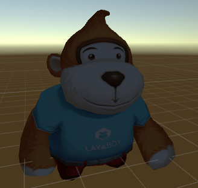
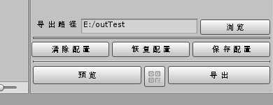
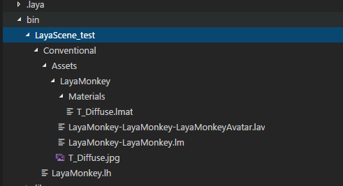

# 从Unity中导出模型

###### *version :2.0.2beta   Update:2019-4-26 插件版本:2.0.2*

在前面的[Unity插件篇](地址)有简单的使用插件导出精灵，在这里将会详细的讲解精灵的导出。

*这里我们使用猴子模型作为示例*

 (图1)

来看下猴子模型的文件结构

 (图2)

选择`预设`，然后我们点击`导出`将猴子模型导出。

 (图3)

在导出后文件目录如下图所示：

 (图4)

#### *.lh格式数据文件

`*.lh`导出的3D显示对象容器Spirte3D类型数据文件，JSON格式编码，是unity3D中layaAir导出插件选择导出**预设**类别生成，内容比*.ls格式少了光照贴图，其他全部相同。

#### *.lm格式数据文件

无论是导出 **场景文件** 或 **预设文件** 类型，在导出的资源文件夹中都包含了系列*.lm格式文件，本项目中`LayaMonkey`文件夹为unity中开发者自建的存储FBX模型的文件夹，如图4，在导出时生成了对应的文件夹和.lm资源文件。

`*.lm`文件就是模型的网格数据文件。可以生成MeshSprite3D或SkinnedMeshSprite3D类型显示对象的Mesh（网格），文件中包含了模型网格的顶点位置、法线、顶点色、顶点UV等信息。

#### *.lav格式数据文件

`*.lav`文件是蒙皮骨骼动画数据文件。可以生成SkinnedMeshSprite3D蒙皮网格精灵的Avatar（骨骼）。

文件中包含了骨骼节点信息。

#### *.lmat格式数据文件

`*.lmat`文件是材质数据文件。可以生成模型可以使用的material（材质）。其中包含了材质贴图，材质球颜色信息，定点色信息，纹理偏移信息等材质相关的信息。

> 更多的资源类型可以查看资源概述篇的资源类型讲解（[地址](https://ldc2.layabox.com/doc/?nav=zh-js-4-3-0)）