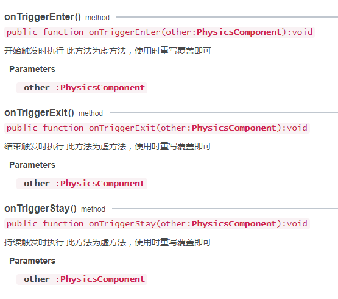
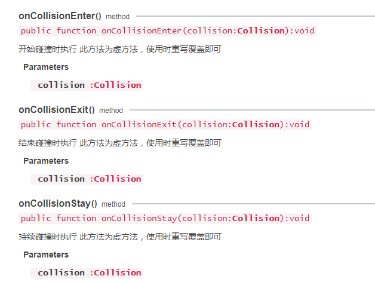
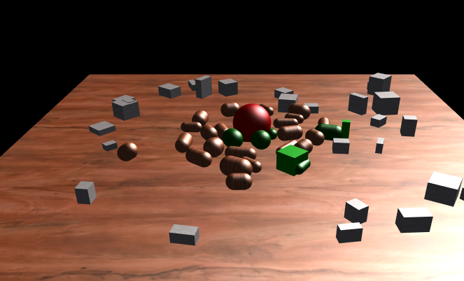

# 物理碰撞脚本和触发器脚本

###### *version :2.1.1   Update:2019-8-2*

触发器发出的事件，开发者可以在触发器物体上添加的脚本（Script3D）监听。监听的方法如图1所示：

<br>(图1)

碰撞器也是会派发事件的。监听方法如下图2：

<br>(图2)

下面我们来看下具体如何额使用这些接口，本次代码节选自官方示例，更详细情况可以查看：([demo地址](https://layaair.ldc.layabox.com/demo2/?language=ch&category=3d&group=Physics3D&name=PhysicsWorld_TriggerAndCollisionEvent))

```javascript
/**
 * 当其他碰撞器进入绑定物体碰撞器时触发（子弹进入物品时）
 * 此处当触发器进入时将脚本的owner（所属节点）第一个实例材质的漫反射颜色改为绿色
 * 注：如相对移动速度过快，可能直接越过
 */
onTriggerEnter(other) {
	this.owner.meshRenderer.sharedMaterial.albedoColor = new Laya.Vector4(0.0, 1.0, 0.0, 1.0);
}

/**
 * 当其他碰撞器进入绑定物体碰撞器后逐帧触发（子弹在物品内时）
 * 注：如相对移动速度过快，可能直接越过
 */	
onTriggerStay(other) {}

/**
 * 当其他碰撞器退出绑定物体碰撞器时逐帧触发（子弹穿出物品时）
 * 此处当触发器退出时将脚本的owner（所属节点）第一个实例材质的漫反射颜色改为白色
 * 注：如相对移动速度过快，可能直接越过
 */	
onTriggerExit(other) {
	this.owner.meshRenderer.sharedMaterial.albedoColor = new Laya.Vector4(1.0, 1.0, 1.0, 1.0);
}

/**
 *碰撞器事件与触发器事件对应
 * 碰撞器进入时将脚本的owner（所属节点）第一个实例材质的漫反射颜色改为黑色
 */
onCollisionEnter(collision) {
	if (collision.other.owner === this.kinematicSprite)
		this.owner.meshRenderer.sharedMaterial.albedoColor = new Laya.Vector4(0.0, 0.0, 0.0, 1.0);
}
	
onCollisionStay(collision) {}
	
onCollisionExit(collision) {}

```

运行效果图3所示：

<br>(图3)


#### 触碰信息与触发信息规则

对于碰撞规则可以查看下方表格。

触发信息是指：`onTriggerStay`,`onTriggerStay`,`onTriggerExit`三个函数。

碰撞信息是指：`onCollisionEnter`,`onCollisionStay`,`onCollisionExit`三个函数。

> *碰撞后有碰撞检测并且有碰撞信息*

|                             | PhysicsCollider | RigidBody | Kinematic RigidBody | PhysicsCollider Trigger | RigidBody Trigger | Kinematic RigidBody Trigger |
| --------------------------- | --------------- | --------- | ------------------- | ----------------------- | ----------------- | --------------------------- |
| PhysicsCollider             |                 | Y         |                     |                         |                   |                             |
| RigidBody                   | Y               | Y         | Y                   |                         |                   |                             |
| Kinematic RigidBody         |                 | Y         |                     |                         |                   |                             |
| PhysicsCollider Trigger     |                 |           |                     |                         |                   |                             |
| RigidBody Trigger           |                 |           |                     |                         |                   |                             |
| Kinematic RigidBody Trigger |                 |           |                     |                         |                   |                             |

> *碰撞后有触发信息*

|                             | PhysicsCollider | RigidBody | Kinematic RigidBody | PhysicsCollider Trigger | RigidBody Trigger | Kinematic RigidBody Trigger |
| --------------------------- | --------------- | --------- | ------------------- | ----------------------- | ----------------- | --------------------------- |
| PhysicsCollider             |                 |           |                     |                         | Y                 | Y                           |
| RigidBody                   |                 |           |                     | Y                       | Y                 | Y                           |
| Kinematic RigidBody         |                 |           |                     | Y                       | Y                 | Y                           |
| PhysicsCollider Trigger     |                 | Y         | Y                   |                         | Y                 | Y                           |
| RigidBody Trigger           | Y               | Y         | Y                   | Y                       | Y                 | Y                           |
| Kinematic RigidBody Trigger | Y               | Y         | Y                   | Y                       | Y                 | Y                           |

