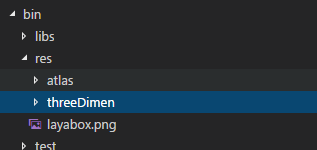
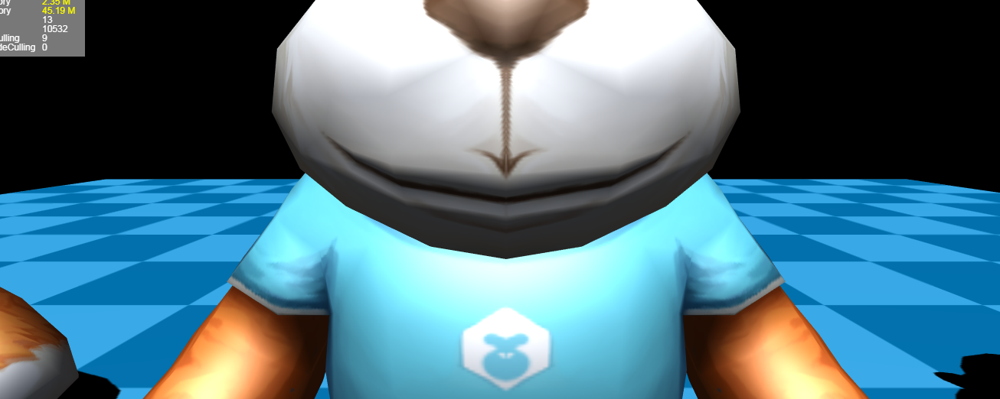
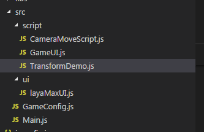

# 	关于官网下载的DEMO如何使用

​	在新的示例全部测试并且检测过之后才会发布新的官方示例。所以新文档所使用到的示例暂时无法直接在官网示例处查看。

​	为了暂时性解决该问题，官方将在使用新示例的处将源码的git地址附带上，需要开发者自行配置地址。

​	在新示例正式发布后文档会同步再更新。

此处将讲解下载到的demo如何使用(如果知道如何使用可以直接跳过该文档)。

**Tip:**建议开发者在运行下载的示例一直使用一个项目。那样就不用再多次修改资源地址。示例所使用的的资源地址根目录：[资源](<https://github.com/layabox/layaair-demo/tree/master/h5/res/threeDimen>)。

这里我们使用**图形基础篇的Transform**示例来做例子([地址](<https://github.com/layabox/layaair-demo/blob/master/h5/3d/js/LayaAir3D_Sprite3D/TransformDemo.js>))。

拿到代码后，打开ide创建的示例项目。我们将下载到的资源放到`bin/res`目录下。

<br>(图1)

然后在`src/script`文件夹下创建一个新文件。注意名字需要从`地址中复制`。(这里命名为TransformDemo.js)

<br>(图2)

加上之后这时候我们要给`TransformDemo`添加一个默认导出类型，方便其它地方引用。

```javascript
export default class TransformDemo
//注意注释掉本js底端的这段代码
//new TransformDemo();
```

`CameraMoveScript`这个脚本是为了方便开发者观察示例准备的一个摄影机操作脚本。（w往前移动，s后退，a向左移动，d向右移动，按住左键拖动鼠标可以调整视角）,如果需要添加脚本可以查看使用**摄影机脚本**。否则直接注释即可。（本处直接注释的摄影机脚本）

<br>(图3)

在这最后一步，我们只需要重写`Main.js`文件就能运行示例了。因为在demo是自带各种初始化的，所以可以直接不用管之前的Main逻辑。我们来看下修改后的Main。

```typescript
import TransformDemo from "./script/TransformDemo"
class Main {
	constructor() {
		new TransformDemo();
	}
}
//激活启动类
new Main();
```

然后F5运行就能看到效果了。

<br>(图4)

## 使用摄像机脚本

使用摄影机脚本需要把common文件夹下的`CameraMoveScript.js`摄像机脚本拷贝到`script`目录下，同时给摄像机脚本设置默认导出类。

```typescript
export default class CameraMoveScript extends Laya.Script3D
```

<br>(图5)

然后我们在`TransformDemo`里引入`CameraMoveScript`。

```javascript
import CameraMoveScript from "./CameraMoveScript"
export default class TransformDemo{
    //....省略
}
```

添加完之后再把注释打开就能测试了。

**新增新的示例只需要在script文件夹下继续新增示例代码，然后使用main去调起即可。**