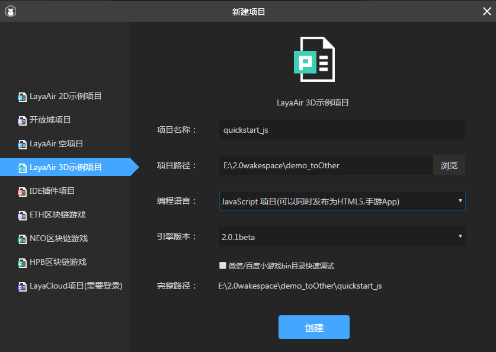

#Quickly start a LayaAir3D project

Below we will use the LayaAir engine to quickly start a 3D project, and use AS language as a tutorial, a simple demonstration using engine code to achieve a basic 3D application.

##IDE Creates 3D Sample Projects

Download LayaAirIDE, start a new project, select a 3D project as shown in the figure.

(图1)


Here we choose**JavaScript**Language. After the creation, we found that ide created a 3D template for us. Developers can refer to 2D novice tutorials for project structure introduction. I'm not going to elaborate here.

##Fast display of 3D scene

We can directly F6 (MAC system users may want CMD + F6) or click the run button, and we can see the 3D scene of the sample project running.

(图2)


In the Runtime class of GameUI.js, the start page, we build a 3D world, and add several essential elements (scenes, cameras, lights, models, materials) for a simple 3D world. The following code excerpt is from GameUI.js.


```typescript

//加载场景文件
this.loadScene("test/TestScene.scene");

//添加3D场景
var scene = Laya.stage.addChild(new Laya.Scene3D());

//添加照相机
var camera = (scene.addChild(new Laya.Camera(0, 0.1, 100)));
camera.transform.translate(new Laya.Vector3(0, 3, 3));
camera.transform.rotate(new Laya.Vector3(-30, 0, 0), true, false);
camera.clearColor = null;

//添加方向光
var directionLight = scene.addChild(new Laya.DirectionLight());
directionLight.color = new Laya.Vector3(0.6, 0.6, 0.6);
directionLight.transform.worldMatrix.setForward(new Laya.Vector3(1, -1, 0));

//添加自定义模型
var box = scene.addChild(new Laya.MeshSprite3D(Laya.PrimitiveMesh.createBox(1, 1, 1)));
box.transform.rotate(new Laya.Vector3(0, 45, 0), false, false);
var material = new Laya.BlinnPhongMaterial();
Laya.Texture2D.load("res/layabox.png", Laya.Handler.create(null, function(tex) {
    material.albedoTexture = tex;
}));
box.meshRenderer.material = material;
```


##### 	