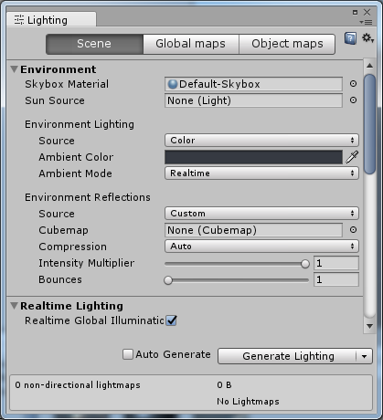
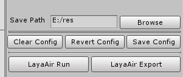
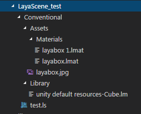

# 场景渲染配置介绍

###### *version :2.0.1beta   Update:2019-3-19*

### Scene3D概述

​	场景即为LayaAir引擎的3D世界容器，用于呈现游戏的3D画面和加载各种3D元素，游戏中的摄像机，灯光，人物，物品等都需要放到场景中才能展示出画面，相当于一个游戏3D播放器或者3D视图。

通过Scene3D的继承关系我们可以看到它是继承于Sprite类。所以简单的可以把它当做2D中的显示对象来对待。

在LayaAir引擎中，3D和2D可以混合使用，创建的Scene 3D场景和Sprite 2D容器或元素可以同时加载到舞台上。

### 在Unity中导出光照渲染配置

​	开发者可以编辑渲染设置，来渲染出更出色的游戏场景。在Unity中编辑可以更直观的看到渲染效果，所以在这里我们是推荐开发者在Unity中编辑好渲染设置，最后再导出使用场景。

#### Ligthing(光照)渲染支持

​	在`window-lighting-settings` 打开光照渲染面板。

 (图1)

**(1) Skybox Material**（material） 天空盒。

​	**Tip**：请使用LayaAir3D/Sky目录下的Shader。

**(2) Environment Lighting**环境光照

​	支持使用Color，AmbientMode-Realtime（实时）光照。

**(3) Environment Reflections**环境反射

​	支持使用Custom自定义环境反射。

**(4) Lightmapping Setting**光照贴图设置

​	全部支持，但是不包含Directional Mode(Directional) 

​	**Tip**：烘焙光照贴图必须使用Non-Directional

**(5) Other Setting**其他设置

​	Fog场景雾化

**(6) Global maps**

​	可导出，效果和PC，Mac&Linux Standalone保持一致。

#### 导出场景

​	在前面的[Unity插件篇](地址)有简单的使用插件导出场景，在这里将会详细的讲解场景的导出。

​	在确认要导出的场景后，打开导出插件面板，点击 **Browse** 选择导出目录，选择好导出目录后，点击 **LayaAir Export** 导出场景。

 (图2)

来让我们看下导出后的场景(图2):

 (图3)

test.ls 就是我们导出的场景场景文件了，里面记录了场景各种数据、模型、光照贴图、位置等。

Library文件夹下的是默认碰撞盒。

Assets文件夹下的场景资源目录，.jpg,.png等文件是材质贴图。

Materials文件下是材质球。

