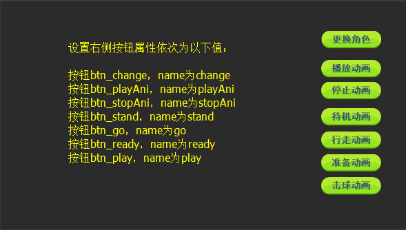

# 3D角色切换与动画

### 3D实例分析与资源准备

通过技术文档的学习，我们基本掌握了3D游戏开发的基础知识。下面我们将通过实例讲解3D技术的综合运用。

观察以下示例效果（图1），它类似于游戏中3D角色选择界面，首先我们来分析一下示例中的3D游戏世界组成的部分。

(图1)</br>

#### 2D界面与3D结合

3D场景经常与2D界面混合使用，在本示例中，界面UI部分为LayaAirIDE编辑而成，包括了资源加载进度页面与游戏中控制UI页面。它们的制作方法与2D游戏完全一致，如对IDE编辑界面不熟悉，可参考“技术文档——LayaAirIDE篇”。


#### 3D场景

示例中场景模型为3ds max中制作导出成FBX，再导入至untiy中编辑，主要有两个工作：

一为编辑创建场景光照贴图，光照贴图可产生模型之间的静态阴影、光照颜色及氛围的效果，因此非常重要，可增强游戏的美术品质。

二为编辑广告移动的材质UV动画。需要注意是在3ds max中的材质UV动画在untiy中并不支持，因此需要在unity中制作。

材质UV动画unity制作方法见“技术文档—LayaAir 3D引擎—LayaAir3D之动画二”


#### 3D角色与骨骼动画

3D角色模型与骨骼动画都是在3ds max中编辑导出，然后导入unity中处理动画剪辑、增加动画组件等。

注意角色的骨骼动画在max中制作时，最好在时间轴上一次性编辑好多个动作，单独编辑动作再通过动画连接方式制作的动画，在导入unity后容易出现错误动作及抖动现象。

本例中为多个动画连接方式制作，连接后的动画出现过很多问题，发生过抖动现象、模型相交现象，花费了较长时间才达到以上效果。

骨骼动画unity中编辑方法见“技术文档—LayaAir 3D引擎—LayaAir3D之动画一”


#### 3D特效

光环特效为刚体动画（变换动画：旋转、位移、缩放），可以在3ds max中编辑导入到unity中，但建议只在3ds max中制作模型，动画在unity中制作，因为在untiy中可以制作材质与刚体结合的动画，效果更好。

光环特效的unity动画制作方式与流程和材质动画方式类似。

以上3D资源在unity中制作完成后，通过LayaAir导出工具分别导出成四个资源文件夹，分别为场景资源LayaScene_scene02、两个角色资源LayaScene_girl与LayaScene_boy、光环特效资源LayaScene_effect。并将资源拷贝至项目h5目录下以供使用。


### 3D实例功能的代码实现

#### UI界面功能实现

在IDE中编辑好界面，并对界面中元素进行var及name属性设置，以供代码调用，如（图2）（图3）。

注意界面分辨率大小与Laya.init()中设置的分辨率大小一致，屏幕适配才会正确。

资源加载进度界面ProgressBar.ui解析

(图2)</br>

角色控制按钮界面Control.ui解析

(图3)</br>

编辑好以上界面后，在IDE中导出资源，在项目文件夹中产生了相应的打包资源与UI类。我们建立两个UI显示控制类分别继承于它们，代码如下：

进度UI显示控制类ProgressView，在类中我们使用了假进度条（否则初始资源如果较小，界面会一闪而过）

```typescript
var ProgressView = (function(_super){
    function ProgressView(){
        ProgressView.super(this);
        this.progress = 0;
        //进度增加的帧循环
        Laya.timer.loop(30,this,this.onLoop);
    }
    Laya.class(ProgressView,"ProgressView",_super);
    var _proto = ProgressView.prototype;
    /*资源加载进度模拟（假进度）*/
    _proto.onLoop = function(){
        //进度增加
        this.progress++;
        //最高100%进度
        if(this.progress > 100){
            this.progress = 100;
            this.tips.text = "游戏加载完毕，即将进入游戏...";
            //清除所有事件监听，包括帧循环
            Laya.timer.clearAll(this);
            //进度100%后，自动移除界面
            this.removeSelf();
        }
        else{
            //更新组件显示进度
            this.pro.value = this.progress/100;
            this.tips.text = "游戏正在加载中，当前进度为："+this.progress+"%!";
        }
    }
    return ProgressView;
})(ui.ProgressUI);
```

角色控制UI显示控制类ContorlView，我们通过事件方式向主类发送当前所点击的按钮名。

```typescript
var ControlView = (function(_super){
    function ControlView(){
        ControlView.super(this);
        //监听UI鼠标点击事件
        this.on(Laya.Event.MOUSE_DOWN,this,this.onClick);
    }
    Laya.class(ControlView,"ControlView",_super);
    var _proto = ControlView.prototype;
    _proto.onClick = function(e){
        //发送点击的组件名称
        this.event("btn_action",e.target.name);
    }
    return ControlView;
})(ui.ControlUI);
```

2D与3D结合实现

3D场景Scene类是继承于2D的显示对象Sprite类，因此它可以像2D显示对象一样加载到舞台上，并通过setChildIndex()方法调整它的层级，处理它与背景、界面的上下层遮挡关系。

在本例中，资源加载进度界面与角色控制界面需要设置到3D场景的上层，我们可以使用上述方法实现，代码为Laya.stage.setChildIndex(scene,0)，主类中加载界面与场景的代码如下：

```typescript
//初始化引擎
Laya3D.init(1280, 720, true);
/*****角色资源名数组******/
this.roleArray= ["LayaScene_girl/girl.lh", "LayaScene_boy/boy.lh"];
//适配模式
Laya.stage.scaleMode = Laya.Stage.SCALE_EXACTFIT;
Laya.stage.screenMode = Laya.Stage.SCREEN_NONE;

//加载2D界面资源
Laya.loader.load(["res/atlas/comp.atlas","res/atlas/myAssets.atlas"], Laya.Handler.create(this, onUIComplete));

/*界面资源加载完成后*/
function onUIComplete() {
    //加载3D场景与角色资源（资源资源后缀名，会创建默认3D显示对象类型）
    Laya.loader.create([{ url: "LayaScene_scene02/scene02.ls" },
    { url: this.roleArray[0] }, { url: this.roleArray[1] },
    { url: "LayaScene_effect/effect.lh" }
    ], Laya.Handler.create(this, this.onSceneOK));
    //创建角色控制界面
    this.control = new ControlView();
    Laya.stage.addChild(this.control);
    //创建资源载入界面
    var assetLoad = new ProgressView();
    Laya.stage.addChild(assetLoad);
}
/**
 * 场景角色加载完成后回调
 */
function onSceneOK() {
    //创建加载场景
    this.scene = Laya.loader.getRes("LayaScene_scene02/scene02.ls");
    Laya.stage.addChild(this.scene);
    //设置场景在2D界面最后（最底层为第0层）
    Laya.stage.setChildIndex(this.scene, 0);
    //创建摄像机(横纵比，近距裁剪，远距裁剪)
    var camera = new Laya.Camera(0, 0.1, 1000);
    //加载到场景
    this.scene.addChild(camera);
    //移动摄像机位置
    camera.transform.position = new Laya.Vector3(-3, 1.5, 6);
    //旋转摄像机角度
    camera.transform.rotate(new Laya.Vector3(-6, 0, 0), true, false);
    //设置摄像机视野范围（角度） 
    camera.fieldOfView = 33;
}
```

编译运行上述代码，我们可以看到资源界面结束后，才出现了3D场景，并且控制界面在3D场景之上了。

3D场景中有材质UV动画，在加载.ls后，动画会自动被加载并播放出来，如果需要对动画进行控制，可以按下角色的动画控制方式，先获取动画组件，再通过动画组件进行控制。


#### 3D角色的创建与控制

角色动画控制最重要的是需要获取动画组件，因为本例中运用了预加载，因此创建角色时可以从角色模型上直接获取。

Tips:如果没有使用预加载方式，直接使用Sprite.load()异步加载，需要加入监听资源加载完成事件后才能获取动画组件，否则会报错。

##### 创建角色：

在主类中加入角色相关全局属性，包括当前角色资源、当前角色动画组件、当前角色动作名等，并添加创建角色方法，代码如下：

```typescript
//初始化引擎
Laya3D.init(1280, 720, true);
/*****角色资源名数组******/
this.roleArray= ["LayaScene_girl/girl.lh", "LayaScene_boy/boy.lh"];
/*当前场景中角色资源*/
this.currentRole = "LayaScene_girl/girl.lh";
/*当前角色动作名*/
this.currentActive = "stand";
//适配模式
Laya.stage.scaleMode = Laya.Stage.SCALE_EXACTFIT;
Laya.stage.screenMode = Laya.Stage.SCREEN_NONE;

//加载2D界面资源
Laya.loader.load(["res/atlas/comp.atlas","res/atlas/myAssets.atlas"], Laya.Handler.create(this, onUIComplete));

/*界面资源加载完成后*/
function onUIComplete() {
    //加载3D场景与角色资源（资源资源后缀名，会创建默认3D显示对象类型）
    Laya.loader.create([{ url: "LayaScene_scene02/scene02.ls" },
    { url: this.roleArray[0] }, { url: this.roleArray[1] },
    { url: "LayaScene_effect/effect.lh" }
    ], Laya.Handler.create(this, this.onSceneOK));
    //创建角色控制界面
    this.control = new ControlView();
    Laya.stage.addChild(this.control);
    //创建资源载入界面
    var assetLoad = new ProgressView();
    Laya.stage.addChild(assetLoad);
}
/**
 * 场景角色加载完成后回调
 */
function onSceneOK() {
    //创建加载场景
    this.scene = Laya.loader.getRes("LayaScene_scene02/scene02.ls");
    Laya.stage.addChild(this.scene);
    //设置场景在2D界面最后（最底层为第0层）
    Laya.stage.setChildIndex(this.scene, 0);
    //创建摄像机(横纵比，近距裁剪，远距裁剪)
    var camera = new Laya.Camera(0, 0.1, 1000);
    //加载到场景
    this.scene.addChild(camera);
    //移动摄像机位置
    camera.transform.position = new Laya.Vector3(-3, 1.5, 6);
    //旋转摄像机角度
    camera.transform.rotate(new Laya.Vector3(-6, 0, 0), true, false);
    //设置摄像机视野范围（角度） 
    camera.fieldOfView = 33;

    //创建角色
    this.createRole3D();
}
/*创建角色并获取动画组件*/
function createRole3D(){
    //创建角色
    this.role3D = Laya.loader.getRes(this.currentRole);
    //获取角色动画组件（.lh格式会把scene当做一层Sprite3D导出，因此组件是在子对象上）
    this.roleAni = (this.role3D.getChildAt(0)).getComponentByType(Laya.Animator);
    //监听动画完成事件
    this.roleAni.on(Laya.Event.COMPLETE,this,this.onAniComplete);
    //播放上一个角色的当前动作
    this.roleAni.play(this.currentActive);
    //角色位置
    this.role3D.transform.position = new Laya.Vector3(-3,0,1);
    this.scene.addChild(this.role3D);
}
/*动画播放完成后回调*/
function onAniComplete(){
    //如果当前的完成动画剪辑名为“play”击球
    if(this.roleAni.currentPlayClip.name == "play"){
        //完成击球后播放准备动作动画
        this.roleAni.play("ready");
        this.currentActive = "ready";
    }
}
```

在上述代码中，我们还添加了动画播放完成的回调` this.roleAni.on(Laya.Event.COMPLETE,this,this.onAniComplete);`，它与2D动画基本一样，是指一个动画剪辑播放完成后的调度，可通过当前动画剪辑名字currentPlayClip.name判断完成了哪段动画，方便开发者们编辑游戏逻辑。


##### 角色动画控制

角色控制是通过UI中按钮点击进行控制的，我们在主类中添加控制界面的监听事件回调`this.control.on("btn_action",this,this.onBtnAction)`来控制角色。

角色切换方法是更换角色资源并重新创建觉得，不过在Laya.loader.create()加载资源时就已经根据类型创建了角色，放入了对象池中，因此切换角色反复调用创建角色方法createRole3D()时，不用担心性能问题，它会直接从对象池中创建。

动画切换上主要通过动画组件来播放、停止、切换动作。代码修改如下所示：

```typescript
/*界面资源加载完成后*/
function onUIComplete() {
    ......
    //创建角色控制界面
    this.control = new ControlView();
    Laya.stage.addChild(this.control);
    //监听控制界面按钮信息
    this.control.on("btn_action", this, onBtnAction);
    ......
}
/*控制界面动作监听回调
action：当前执行的控制名称
*/
function onBtnAction(action) {
    if (action == "change") {
        //切换角色
        this.changeRole();
    } else if (action == "playAni") {
        //播放当前动作
        this.roleAni.play(this.currentActive);
    } else if (action == "stopAni") {
        //停止动画
        this.roleAni.stop();
    } else if (action == "stand" || action == "go" || action == "ready" || action == "play") {
        //播放动作
        this.roleAni.play(action);
        this.currentActive = action;
    }
}
/*切换角色*/
function changeRole() {
    //移除角色
    this.role3D.removeSelf();
    //移除所有事件监听
    this.roleAni.offAll();
    //当前角色索引
    var index = this.roleArray.indexOf(this.currentRole);
    //下一个角色
    index++;
    if (index > this.roleArray.length - 1) {
        index = 0;
    }
    this.currentRole = this.roleArray[index];
    //创建角色
    this.createRole3D();
}
/**
 * 场景角色加载完成后回调
 */
function onSceneOK() {
    //创建加载场景
    this.scene = Laya.loader.getRes("LayaScene_scene02/scene02.ls");
    Laya.stage.addChild(this.scene);
    //设置场景在2D界面最后（最底层为第0层）
    Laya.stage.setChildIndex(this.scene, 0);
    //创建摄像机(横纵比，近距裁剪，远距裁剪)
    var camera = new Laya.Camera(0, 0.1, 1000);
    //加载到场景
    this.scene.addChild(camera);
    //移动摄像机位置
    camera.transform.position = new Laya.Vector3(-3, 1.5, 6);
    //旋转摄像机角度
    camera.transform.rotate(new Laya.Vector3(-6, 0, 0), true, false);
    //设置摄像机视野范围（角度） 
    camera.fieldOfView = 33;

    //创建角色
    this.createRole3D();
}
```


#### 特效动画创建

特效动画调用相当简单，在此我们并不需要控制它，因此直接加载到角色脚底即可，代码如下：

```typescript
/*创建特效*/
function createEffect3D() {
    //创建特效
    this.effect3D = Laya.loader.getRes("LayaScene_effect/effect.lh");
    this.scene.addChild(this.effect3D);
    //特效位置
    this.effect3D.transform.position = new Laya.Vector3(-3, 0.01, 1.2);
    //特效缩放
    this.effect3D.transform.localScale = new Laya.Vector3(0.15, 0.15, 0.15);
}
```

在场景加载完成的回调中加入创建特效方法，编译运行后，效果如（图1）所示。


#### 主类最终全部代码

```typescript
//初始化引擎
Laya3D.init(1280, 720, true);
/*****角色资源名数组******/
this.roleArray = ["LayaScene_girl/girl.lh", "LayaScene_boy/boy.lh"];
/*当前场景中角色资源*/
this.currentRole = "LayaScene_girl/girl.lh";
/*当前角色动作名*/
this.currentActive = "stand";
//适配模式
Laya.stage.scaleMode = Laya.Stage.SCALE_EXACTFIT;
Laya.stage.screenMode = Laya.Stage.SCREEN_NONE;

//加载2D界面资源
Laya.loader.load(["res/atlas/comp.atlas", "res/atlas/myAssets.atlas"], Laya.Handler.create(this, onUIComplete));

/*界面资源加载完成后*/
function onUIComplete() {
    //加载3D场景与角色资源（资源资源后缀名，会创建默认3D显示对象类型）
    Laya.loader.create([{ url: "LayaScene_scene02/scene02.ls" },
    { url: this.roleArray[0] }, { url: this.roleArray[1] },
    { url: "LayaScene_effect/effect.lh" }
    ], Laya.Handler.create(this, this.onSceneOK));
    //创建角色控制界面
    this.control = new ControlView();
    Laya.stage.addChild(this.control);
    //监听控制界面按钮信息
    this.control.on("btn_action", this, onBtnAction);
    //创建资源载入界面
    var assetLoad = new ProgressView();
    Laya.stage.addChild(assetLoad);
}
/*控制界面动作监听回调
action：当前执行的控制名称
*/
function onBtnAction(action) {
    if (action == "change") {
        //切换角色
        this.changeRole();
    } else if (action == "playAni") {
        //播放当前动作
        this.roleAni.play(this.currentActive);
    } else if (action == "stopAni") {
        //停止动画
        this.roleAni.stop();
    } else if (action == "stand" || action == "go" || action == "ready" || action == "play") {
        //播放动作
        this.roleAni.play(action);
        this.currentActive = action;
    }
}
/*切换角色*/
function changeRole() {
    //移除角色
    this.role3D.removeSelf();
    //移除所有事件监听
    this.roleAni.offAll();
    //当前角色索引
    var index = this.roleArray.indexOf(this.currentRole);
    //下一个角色
    index++;
    if (index > this.roleArray.length - 1) {
        index = 0;
    }
    this.currentRole = this.roleArray[index];
    //创建角色
    this.createRole3D();
}
/**
 * 场景角色加载完成后回调
 */
function onSceneOK() {
    //创建加载场景
    this.scene = Laya.loader.getRes("LayaScene_scene02/scene02.ls");
    Laya.stage.addChild(this.scene);
    //设置场景在2D界面最后（最底层为第0层）
    Laya.stage.setChildIndex(this.scene, 0);
    //创建摄像机(横纵比，近距裁剪，远距裁剪)
    var camera = new Laya.Camera(0, 0.1, 1000);
    //加载到场景
    this.scene.addChild(camera);
    //移动摄像机位置
    camera.transform.position = new Laya.Vector3(-3, 1.5, 6);
    //旋转摄像机角度
    camera.transform.rotate(new Laya.Vector3(-6, 0, 0), true, false);
    //设置摄像机视野范围（角度） 
    camera.fieldOfView = 33;

    //创建角色
    createRole3D();
    //创建特效
    createEffect3D();
}
/*创建特效*/
function createEffect3D() {
    //创建特效
    this.effect3D = Laya.loader.getRes("LayaScene_effect/effect.lh");
    this.scene.addChild(this.effect3D);
    //特效位置
    this.effect3D.transform.position = new Laya.Vector3(-3, 0.01, 1.2);
    //特效缩放
    this.effect3D.transform.localScale = new Laya.Vector3(0.15, 0.15, 0.15);
}
/*创建角色并获取动画组件*/
function createRole3D() {
    //创建角色
    this.role3D = Laya.loader.getRes(this.currentRole);
    //获取角色动画组件（.lh格式会把scene当做一层Sprite3D导出，因此组件是在子对象上）
    this.roleAni = (this.role3D.getChildAt(0)).getComponentByType(Laya.Animator);
    //监听动画完成事件
    this.roleAni.on(Laya.Event.COMPLETE, this, this.onAniComplete);
    //播放上一个角色的当前动作
    this.roleAni.play(this.currentActive);
    //角色位置
    this.role3D.transform.position = new Laya.Vector3(-3, 0, 1);
    this.scene.addChild(this.role3D);
}
/*动画播放完成后回调*/
function onAniComplete() {
    //如果当前的完成动画剪辑名为“play”击球
    if (this.roleAni.currentPlayClip.name == "play") {
        //完成击球后播放准备动作动画
        this.roleAni.play("ready");
        this.currentActive = "ready";
    }
}
```