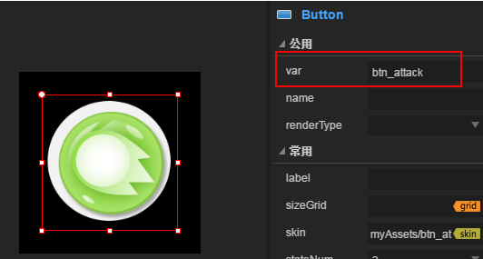

# 3D角色脚本控制与碰撞检测

### 需求分析

本章课程主要向初学者们讲解3D引擎的综合运用，包括了3D场景的处理与加载，角色碰撞检测与动画的控制切换等。向开发者们展示一个类似于RPG游戏关卡的最基础的开发示例。

**基本需求为：**

1、通过摇杆控制器控制角色在场景中来回走动，摇杆控制器松开后，角色停止移动并待机。

2、可通过攻击按钮切换为角色攻击动画，一直按下按钮可不停攻击，点击一次按钮至少播放一次完整的攻击动画，结束后播放之前的动画，攻击按钮优先级大于摇杆，如摇杆还在按下状态，攻击停止后播放移动动画并位移。

3、场景中需要有阻挡，某些地方角色无法行走，当角色行走至阻挡区时停止移动。

4、克隆一个相同的角色，两个角色被同时控制，如其中一个遇到阻挡停止后，另一个角色不会受到影响。

参考效果如下图1：

(图1)</br>


### 需用的引擎技术方案分析

1、摇杆：采用2D引擎鼠标监听方式，2D引擎鼠标事件支持多点触摸，适应手机多点的复杂操作。

2、角色控制：LayaAir3D引擎支持组件式开发模型，因此角色控制我们采用脚本组件方式，有效的把控制与显示分开。

3、场景：在文档编写时，3D引擎的高级地形正在完善中，因此场景中的阻挡暂时采用行走区碰撞器与射线检测方式判断。

美术可以在3D场景中制作一个角色可行走区的单独模型，如图2。导出使用时，不进行渲染，但在代码中需为它添加网格碰撞器，由角色前行位置产生一条射线与碰撞器进行碰撞检测，如果无碰撞信息，则角色无法行走，有碰撞信息角色可以行走。当然，也可以反过来，不可行走区域制作一个模型。

当高级地形功能完善后，将出技术文档详细介绍，并推荐开发者们使用高级地形，性能上更加。

(图2)</br>


### 摇杆控制器与攻击按钮

加载进度页面与“技术文档—3D角色切换与动画”示例中界面与代码基本一致，在此不多做说明。

遥杆控制器与攻击按钮界面通用于2D、3D游戏，开发者们可以参考使用。在LayaAirIDE中创建两个界面，取名为Rocker.ui、Attack.ui，Rocker.ui是由触摸点图片与背景图构成，Attack.ui是由一个攻击按钮构成，它里面还可以加入其它技能按钮进行扩展。界面如下图3、图4.

(图3)</br>

(图4)</br>

IDE发布导出资源后，在项目ui文件夹中会产生对应的类，我们建立View文件夹并创建RockerView、AttackView类继承它，在里面编写摇杆控制、攻击逻辑代码，示例如下：

```typescript
var RockerView = (function(_super){
    function RockerView(){
        RockerView.super(this);
         /***当前多点触摸id****/
        this.curTouchId = 0;
        /***手指（鼠标）是否按下****/
        this.isDown = false;
        /***摇杆的角度****/
        this.angle = -1;        
        /***摇杆的弧度****/
        this.radians = -1;
        /***是否左手遥控****/
        this.isleftControl = true;   
        //鼠标按下事件监听
        Laya.stage.on(Laya.Event.MOUSE_DOWN,this,onMouseDown);
        //鼠标抬起事件监听
        Laya.stage.on(Laya.Event.MOUSE_UP,this,onMouseUp);
        //鼠标是否移除屏幕事件监听
        // this.touchRect.on(Laya.Event.MOUSE_OUT,this,onBlur);
        //控制器中心点位置初始化
        this.originPiont = new Laya.Point(this.width/2,this.height/2);
        //默认为控制器不显示
        this.visible = false;
    }
    Laya.class(RockerView,"RockerView",_super);

    /*鼠标按下事件回调*/
    function onMouseDown(e){
        console.log('mouse donw');
        //左右手遥控
        if(this.isleftControl){
            //如果按下时是右边屏幕位置或已经按下鼠标，则返回
            if(e.stageX > Laya.stage.width/2 || this.isDown)return;
        }
        else{
            //如果按下时是左边屏幕位置或已经按下鼠标，则返回
            if(e.stageX < Laya.stage.width/2 || this.isDown)return;
        }
        //记录当前按下id
         this.curTouchId = e.touchId;
         //已按下
         this.isDown = true;
         //更新摇杆到屏幕按下位置
         this.pos(Laya.stage.mouseX - (this.width / 2),Laya.stage.mouseY - (this.height / 2));
         //初始化摇杆控制点位置
         this.knob.pos(this.width / 2, this.height / 2);
         //按下后显示摇杆
         this.visible = true;
         //摇杆移动控制事件监听
         Laya.stage.on(Laya.Event.MOUSE_MOVE,this,onMove);
    }
    /*鼠标抬起事件回调*/
    function onMouseUp(e){
        console.log('mouse up');
        //如果不是上次的点击id，返回（避免多点抬起，以第一次按下id为准）
        if(e.touchId != this.curTouchId)return;
        this.isDown = false;
        this.visible = false;
        //移除摇杆移动事件监听
        Laya.stage.off(Laya.Event.MOUSE_MOVE,this,onMove);
        //修改摇杆角度与弧度为-1（代表无角度）
        this.radians = this.angle = -1;
    }
    /*鼠标移动事件回调*/
    function onMove(e){
        console.log('mouse move');
        //如果不是上次的点击id，返回（避免多点抬起，以第一次按下id为准）
        if(e.touchId != this.curTouchId)return;
        //将移动时的鼠标屏幕坐标转化为摇杆局部坐标
        var locationPos = this.globalToLocal(new Laya.Point(Laya.stage.mouseX,Laya.stage.mouseY),false);
        //更新摇杆控制点位置
        this.knob.pos(locationPos.x,locationPos.y);
        //更新控制点与摇杆中心点位置距离
        this.deltaX = locationPos.x - this.originPiont.x;
        this.deltaY = locationPos.y - this.originPiont.y;
        //计算控制点在摇杆中的角度
        var dx = this.deltaX * this.deltaX;
        var dy = this.deltaY * this.deltaY;
        this.angle = Math.atan2(this.deltaX,this.deltaY) * 180 / Math.PI; 
        if(this.angle < 0) this.angle += 360;
        //对角度取整
        this.angle = Math.round(this.angle);
        //计算控制点在摇杆中的弧度
        this.radians = Math.PI / 180 * this.angle;
        //强制控制点与中心距离不超过80像素
        if(dx+dy >= 80*80){
            //控制点在半径为80像素的位置（根据弧度变化）
            var x = Math.floor(Math.sin(this.radians) * 80 +this.originPiont.x);
            var y = Math.floor(Math.cos(this.radians) * 80 + this.originPiont.y);
            this.knob.pos(x,y);
        }
        else{
            //不超过80像素取原坐标
            this.knob.pos(locationPos.x,locationPos.y);
        }
    }
    return RockerView;
})(ui.RockerUI);
```

```javascript
var attackView = (function(_super){
    function attackView(){
        attackView.super(this);
        /*是否按下攻击按钮*/
        attackView.isAttack = false;

        //按钮按下与抬起事件监听
        this.btn_attack.on(Laya.Event.MOUSE_DOWN,this,onAttack);
        this.stage.on(Laya.Event.MOUSE_UP,this,onUp);
    }
    Laya.class(attackView,"attackView",_super);

    /*抬起攻击按钮事件回调*/
    function onUp(e){
        //如果抬起时的ID与按下时的相同 则为不攻击
        if(e.touchId == this.touchId) this.isAttack = false;
    }
    /*按下攻击按钮事件回调*/
    function onAttack(e){
        //获取按下时的id
        this.touchId = e.touchId;
        //获取事件传参值
        this.isAttack = true;
    }
    return attackView;
})(ui.attackUI);
```

### 示例主类

示例主类中基本没有控制方面的逻辑，同样是创建场景、摄像机、角色。示例中将不使用灯光，用光照贴图即可，建议开发者们如果场景中没有动态光，可不添加灯光，性能上会高很多，角色阴影可以使用透明贴图模型片。

场景上需从场景模型中获取行走区域模型moveArea，可以设置它为不渲染，代码为`moveArea.meshRender.enable=false`，并给它加上网格碰撞器MeshCollider，网格碰撞器检测较为精确，与模型本身一致，镂空的区域将不会被检测到。当然，性能上开销将较大。

摇杆、攻击按钮及摄像机移动量设置为静态，以方便角色控制脚本使用和控制。

主类全部代码如下：

```typescript
var Example_roleControl = (function(){
    function Example_roleControl(){
        //初始化引擎
        Laya3D.init(1334,750,true);
        //画布垂直居中对齐
        Laya.stage.alignV = Laya.Stage.ALIGN_MIDDLE;
        //画布水平居中对齐
        Laya.stage.alignH = Laya.Stage.ALIGN_CENTER;
        //等比缩放
        Laya.stage.scaleMode = Laya.Stage.SCALE_FIXED_AUTO;
        //自动横屏，游戏的水平方向始终与浏览器屏幕较短边保持垂直
        Laya.stage.screenMode = Laya.Stage.SCREEN_HORIZONTAL;

        this.cameraTranslate = new Laya.Vector3;
        //预加载2D资源
        Laya.loader.load("res/atlas/myAssets.atlas",Laya.Handler.create(this,this.on2DComplete));
    }
    /*加载2D资源完成回调*/
    Example_roleControl.prototype.on2DComplete = function(){
        //实例化摇杆控制器
        Example_roleControl.rocker = new RockerView();
        Laya.stage.addChild(Example_roleControl.rocker);
        //实例化攻击按钮
        Example_roleControl.attack = new attackView();
        Laya.stage.addChild(Example_roleControl.attack);
        //实例化加载进度页面
        var progress = new ProgressView();
        Laya.stage.addChild(progress);
        //加载3D资源
        Laya.loader.create(["LayaScene_scene03/scene03.ls","LayaScene_girl/girl.lh"],Laya.Handler.create(this,this.on3DComplete));
    }
    /*加载3D资源完成回调*/
    Example_roleControl.prototype.on3DComplete = function(){
        //创建3D场景
        this.createScene();
        //创建3D摄像机
        this.createCamera();
        //创建3D角色
        this.createRole();
        //游戏帧循环
        Laya.timer.frameLoop(1,this,this.onFrameLoop);
        
    }
    /*创建3D场景*/
    Example_roleControl.prototype.createScene = function(){
        //实例化场景
        this.scene = Laya.loader.getRes("LayaScene_scene03/scene03.ls");
        Laya.stage.addChild(this.scene);
        //将场景层级调至最低（UI界面后面）
        Laya.stage.setChildIndex(this.scene,0);
        //获取场景模型中的角色移动碰撞区模型
        var moveArea = this.scene.getChildAt(0).getChildByName("MoveArea");
        //设置为不渲染
        moveArea.meshRender.enable = false;
        //加载网格碰撞器组件
        moveArea.addComponent(Laya.MeshCollider);
    }
    /*创建3D摄像机*/
    Example_roleControl.prototype.createCamera = function(){
        //实例化摄像机
        this.camera = new Laya.Camera();
        //移动摄像机位置
        this.camera.transform.translate(new Laya.Vector3(0,4.5,12));
        //设置摄像机视野范围（角度）
        this.camera.fieldOfView = 25;
        this.scene.addChild(this.camera);
    }
    /*创建3D角色*/
    Example_roleControl.prototype.createRole = function(){
        //实例化角色
        this.role = Laya.loader.getRes("LayaScene_girl/girl.lh");
        this.scene.addChild(this.role);
        //角色位置
        this.role.transform.position = new Laya.Vector3(0,0,1);
        //加入角色控制器脚本
        this.role.addComponent(RoleControlScript);
        //摄像机对准角色模型附近位置
        this.camera.transform.lookAt(new Laya.Vector3(0,0.5,1),new Laya.Vector3(0,0,0));
        //克隆一个角色（克隆包括子对象、组件、脚本等。tips：用此方法克隆Sprite3D继承类会有问题）
        var role1 = Laya.Sprite3D.instantiate(this.role);
        this.scene.addChild(role1);
        //角色位置
        this.role.transform.position = new Laya.Vector3(-1,0,1);
    }
    /*游戏帧循环*/
    Example_roleControl.prototype.onFrameLoop = function(){
        //摄像机位置改变（数据为角色控制脚本修改）
        this.camera.transform.translate(this.cameraTranslate,false);
    }
    return Example_roleControl;
})();
new Example_roleControl;
```


### 角色控制脚本组件

组件功能比较强大，而脚本继承于组件。其中重要属性与方法请查阅“技术文档—LayaAir3D之脚本组件”

脚本组件式开发模式为我们提供了另一套思维方式，与继承不同的是它更灵活多变，随时可以添加移除、组合组件，以达到我们所需效果，并且还能达到控制与显示可彻底分离。开发者们可以多多尝试此种方法。

在本例中角色控制我们使用了脚本组件式的方法，在脚本中，我们主要执行以下功能。

1、获取脚本所属角色动画组件，以供控制动画用，在覆写组件_start()方法中获取动画组件。

2、角色动画，行走、待机、攻击方法分离，角色动画完成事件监听。

3、角色碰撞检测，在脚本更新方法_update()中，角色位置射线与行走区碰撞检测，判断角色是否被阻挡。

4、角色更新，在脚本更新方法_update()中，获取摇杆角度、攻击按钮并根据其属性控制角色动画切换。

5、摄像机跟随角色移动的位移量进行同步位移更新。

脚本全部代码如下：

```typescript
var RoleControlScript = (function(_super){
    function RoleControlScript(){
        RoleControlScript.super(this);
        /*角色当前动作*/
        this.currentAction = "stand";
        /*角色动画是否完成*/
        this.aniComplete = true;
        /*角色移动速度*/
        this.speed = 0.04;
        /*摇杆上一帧角度*/
        this.lastAngle = 0;

        this.ray = new Laya.Ray(new Laya.Vector3(0,0,0),new Laya.Vector3(0,-2,0));
        this.outHitInfo = new Laya.RaycastHit();
    }
    Laya.class(RoleControlScript,"RoleControlScript",_super);

    /*覆写3D组件方法，指3D对象加载组件时执行
    *owner：此组件所属的3D对象
    */
    RoleControlScript.prototype._load = function(owner){
        //获取控制器UI
        this.rocker = Example_roleControl.rocker;
        this.attack = Example_roleControl.attack;
    }
    /*覆写加载组件的3D对象实例化完成后，第一次更新时执行*/
    RoleControlScript.prototype._start = function(state){
        //获取被绑定脚本的模型，需等待角色实例化完成
        //获取有动画组件的内层模型（.lh资源导出时会在角色外包裹一层sprite3D）
        this.roleModel = this.owner.getChildByName("girl1");
        //模型缩放
        this.roleModel.transform.localScale = new Laya.Vector3(0.8,0.8,0.8);
        //获取角色动画组件
        this.roleAni = this.roleModel.getComponentByType(Laya.Animator);
        //动画完成事件监听
        this.roleAni.on(Laya.Event.COMPLETE,this,this.onComplete);
    }
    /*覆写3D组件更新方法（相当于帧循环）*/
    RoleControlScript.prototype._update = function(state){
        //如果是攻击状态播放击球动画（优先播放击球动画）
        if(this.attack.isAttack){
            if(this.currentAction != "play"){
                this.play();
                //摄像机移动向量
                Example_roleControl.cameraTranslate = new Laya.Vector3(0,0,0);
            }
        }
        //上次击球动画如果未结束，不执行以下代码
        if(!this.aniComplete)return;
        //如果摇杆有方向角度
        if(this.rocker.angle != -1){
            //摇杆控制角色旋转方向（笨帧摇杆的角度-上一帧的角度=本帧应当旋转的角度）
            this.roleModel.transform.rotate(new Laya.Vector3(0,this.rocker.angle - this.lastAngle,0),false,false);

            //通过弧度和速度计算角色在x，z轴上移动的量
            var speedX = Math.sin(this.rocker.radians) * this.speed;
            var speedZ = Math.cos(this.rocker.radians) * this.speed;
            //记录角色本帧的角度
            this.lastAngle = this.rocker.angle;
            //行走区域碰撞检测，如未与行走区域模型碰撞，则不移动
            //射线原点
            var rayOrigin = new Laya.Vector3(0,0,0);
            //根据角色位置计算射线原点
            Laya.Vector3.add(this.owner.transform.position,new Laya.Vector3(speedX,2,speedZ),rayOrigin);
            //射线原点位置更新
            this.ray.origin = rayOrigin;

            //物理射线与碰撞器相交检测
            Laya.Physics.rayCast(this.ray,this.outHitInfo,5);
            //如果未有碰撞则返回
            if(this.outHitInfo.distance < 0)speedX = speedZ = 0;
            //更新角色位置
            this.owner.transform.translate(new Laya.Vector3(speedX,0,speedZ),false);
            //播放行走动画
            if(this.currentAction != "go")this.go();
        }
        else{
            //如果摇杆未有角度则播放待机动画
            if(this.currentAction != "stand")this.stand();
        }
        //摄像机移动向量
        //注：因为克隆需求，所以提供移动向量给主类，由主类控制摄像机更新。
        //如果只有单一主角，可以直接在脚本中控制摄像机移动。
        Example_roleControl.prototype.cameraTranslate = new Laya.Vector3(speedX,0,speedZ);
    }
    /*动画播放完成回调*/
    function onComplete(){
        //角色动画完成
        this.aniComplete = true;
        //如果结束的动画剪辑名为play，则播放站立待机动画
        if(this.roleAni.currentPlayClip.name == "play") this.stand();
    }
    /*角色行走动画*/
    RoleControlScript.prototype.go = function(){
        this.roleAni.play("go",1.4);
        this.currentAction = "go";
    }
    /*角色待机动画*/
    RoleControlScript.prototype.stand = function(){
        this.roleAni.play("stand");
        this.currentAction = "stand";
    }
    /*角色击球动画*/
    RoleControlScript.prototype.play = function(){
        this.roleAni.play("play");
        this.currentAction = "play";
        this.aniComplete = false;
    }
    return RoleControlScript;
})(Laya.Script);
```

如果角色有行走go、站立stand、攻击play动画，当脚本加入到此对象上后，就可以像主角一样被控制了。这就是脚本的灵活之处。

编译运行代码，可得出图1演示效果。