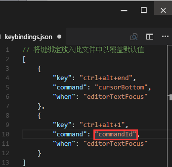

# 代码模式的快捷键设置

###Custom shortcut keys

The code part shortcuts of LayaAirIDE inherit the function of vscode. Individual shortcuts will vary. Users can set their own preferences; if developers want to change the shortcut keys, please follow the following steps:

**Menu-File-Preferences-Keyboard Shortcuts.**

Open the shortcut setting interface to open two editors. The default shortcut is set on the left. Edit the keybindings.json file in the editor on the right to customize the shortcut, as shown in Figure 1.

​         
(Figure 1) Default shortcuts

**Modification method:**

1. Find the shortcut command to modify on the left (default key binding), then copy the item on the left to the right (keybindings. json), and modify the key field. As shown in Figure 2

​ 
(Figure 2) modify shortcut key

2. Press twice`Ctrl+K`Keyboard shortcuts, or click the Definition Key Binding button in the lower right corner of the keybindings. JSON editing area. After the shortcut key setting panel appears, set a non-conflicting shortcut key and press Enter. Then we change the value of Command to the shortcut command we want to set, and then we complete the shortcut key settings.

​ 
(Figure 3) Setting up new shortcuts

​ 
(Figure 4) Multiple shortcut key settings to be used, numbered

​

###2. General

A kind of**Press**A kind of**Function**A kind of
| --------------------------------------------------------------------------------------------------------------------------------------------------------------------------|
A kind of`Ctrl + Shift + P，F1`| Show Command Palette Display Command Panel|
A kind of`Ctrl + P`| Quick Open Quick|
A kind of`Ctrl + Shift + N`| New window/instance New window/instance|
A kind of`Ctrl + Shift + W`| Close window/instance Close window/instance|
A kind of`Ctrl+X`| Cut line (empty selection)|
A kind of`Ctrl+C`| Copy line (empty selection)|
A kind of`Alt+ ↑ / ↓`| Move up/down the line|
A kind of`Shift+Alt + ↓ / ↑`|Copy line up / down|
A kind of`Ctrl+Shift+K`| Delete line|
A kind of`Ctrl+Enter`| Insert line below|
A kind of`Ctrl+Shift+Enter`| Insert the line Insert line above|
A kind of`Ctrl+Shift+\`| Jump to matching bracket|
A kind of`Ctrl+] / [`|Indent / indent line|
| Home | Go to the beginning of line|
| End | Go to end of line|
A kind of`Ctrl+Home`| Go to the beginning of the file|
A kind of`Ctrl+End`| Go to the end of the file|
A kind of`Ctrl+↑ / ↓`| Scroll up/down the line Scroll up/down|
A kind of`Alt+PgUp / PgDown`| Scroll up/down the page Scroll up/down|
A kind of`Ctrl+Shift+[`| Fold (collapse) region|
A kind of`Ctrl+Shift+]`| Unfold (uncollapse) region|
A kind of`Ctrl+K Ctrl+[`| Fold (collapse) all subregions|
A kind of`Ctrl+K Ctrl+]`| Unfold (uncollapse) all subregions|
A kind of`Ctrl+K Ctrl+0`| Fold (collapse) all regions|
A kind of`Ctrl+K Ctrl+J`| Unfold (uncollapse) all regions|
A kind of`Ctrl+K Ctrl+C`| Add line comment|
A kind of`Ctrl+K Ctrl+U`| Delete the line comment Remove line comment|
A kind of`Ctrl+/`| Switching line comment Toggle line comment|
A kind of`Shift+Alt+A`| Switching Block Comment Toggle Block Comment|
A kind of`Alt+Z`| Switching Toggle Word wrap|