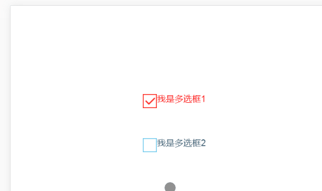
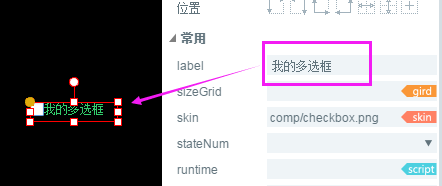
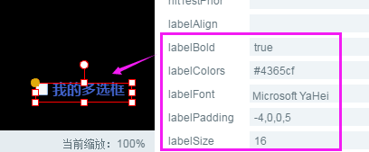
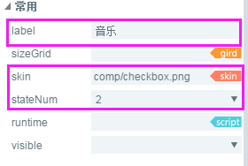
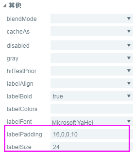

#CheckBox Component Details

> Since many component attributes are generic, common and generic component attributes are`属性设置器`This is described in the document. Read the Property Setter document before reading this article.

##1. Creating CheckBox Components

The CheckBox component consists of two parts, the selection status box and the content description label. The selection status box must be an image resource labeled as text. When using the CheckBox component, you can either use only the selection status box or set only one label.

###1.1 Reserve resources

The CheckBox component's selection box image is the skin of the CheckBox component, and the name of the image resource is usually used.`check`,`checkbox`Or to`check_`For prefix, as shown in Figure 1. CheckBox component resources are usually composed of three-state or two-state skin image components.

< br / > (Figure 1)

*Tips: For component skin skins and polymorphic cutting stateNum, please see the Properties Setter document.*

###1.2 Create CheckBox components directly with engine


Using LayaAir engine to create a CheckBox component is relatively simple. Usually it only takes a few steps to load resources, create a CheckBox instance, add CheckBox to the stage, and set the properties of the CheckBox component. Specific implementation refers to the following code and comments.

**Create an entry class GameMain.js and write the following code:**


```javascript

//初始化引擎，设置宽高并开启WebGL渲染模式
Laya.init(600, 400,Laya.WebGL);
//设置舞台背景颜色
Laya.stage.bgColor = "#ffffff";
//资源路径
this.skin1 = "checkbox.png";
this.skin2 = "checkbox.png";
//加载资源成功后，执行onLoad回调方法
Laya.loader.load([skin1,skin2],Laya.Handler.create(this,onLoaded));
function onLoaded(){
    //创建一个CheckBox实例cb1
			var cb1 = new Laya.CheckBox(this.skin1);
			//添加到舞台上显示
			Laya.stage.addChild(cb1);			
			//设置checkbox的坐标位置
			cb1.pos(300,200);			
			//文本标签内容
			cb1.label="我是多选框1";
			//label文本字体大小
			cb1.labelSize = 20;
            //设置为默认选中状态
			cb1.selected = true; 

			//再创建一个CheckBox实例cb2
			var cb2 = new Laya.CheckBox(this.skin2);
			//添加到舞台上显示
			Laya.stage.addChild(cb2);			
			//设置checkbox的坐标位置
			cb2.pos(300,300);			
			//文本标签内容
			cb2.label="我是多选框2";
			//label文本字体大小
			cb2.labelSize = 20;
}
```


The code runs as shown in Figure 2.

<br/> (Motion 2)


**Tips:**For an introduction to the property interface of CheckBox components, please refer to[CheckBox API](https://layaair.ldc.layabox.com/api2/Chinese/index.html?category=Core&class=laya.ui.CheckBox)。


##2. Creating CheckBox Components through LayaAirIDE

###2.1 Create CheckBox

Create a UI DEMO page, click Select`资源管理器`Drag the checkbox component resource in the scene editor to add the checkbox component to the page, as shown in Figure 3-1.

<br/>     （图3-1）


###2.2 Setting common properties of CheckBox

After creating the component, you can set the properties for the component through the property setter. For example, the default text of the CheckBox component is "label". We change the default text to "My Multiple Choice Box" and set the label label's color, status, font, size, etc. As shown in Figures 3-2 and 3-3.

<br/>  （图3-2）

<br/> (Figure 3-3)


####2.2.1 Other label-related attributes

A kind of**Attribute name**A kind of**Function description**A kind of
| ----------------------------------------------------------------------------------------------------------------------------------------------------------------------|
| label Align | Label alignment mode, default to center alignment. Note: Invalid in CheckBox|
| label Colors | represents the text color in each state of the label. Format: "upColor, overColor, downColor, disableColor". The default is "blue, green". A kind of
| labelBold | indicates whether the label text label is bold. A kind of
| labelFont | represents the font name of the text label, expressed as a string. IDE is optional. A kind of
| label Padding | represents the margin of a text label. Format: "upper margin, right margin, lower margin, left margin". A kind of
| labelSize | indicates the font size of the text label. A kind of
| label Stroke | Text stroke width (in pixels). The default value is 0, which means no edge strokes. A kind of
| label StrokeColor | Text edge color, represented as a string. The default value is“#000 000 "(black);"|
| StrkeColor | represents the edge color in each state. Format: "upColor, overColor, downColor, disableColor". A kind of


####2.2.2 On the Size of Multiple Choice Box and Nine Palaces

In particular, the sizeGrid is invalid in the CheckBox component.**Checkbox**The size needs to be set when making art resources.


####2.2.3 Skin and stateNum cooperate to exchange skin resources


 **Skin:**Select the image resources of the box. Similar to buttons, there are two or three-state art resources. IDE or program can be modified.

**StateNum:**Represents the state of the selection box. The multi-selection box component defaults to three states. If the multi-selection box art resources are changed to two states, as shown in Figure 4, the state value should be set to 2, and under normal circumstances, the multi-selection box should have at least two states.

<br/>  （图4）两态美术资源图

*Tips: In special cases, singletons can also be used. For example, a CheckBox component consisting of label text only.*

**Two-state CheckBox adjustment example:**

Next, let's replace our previous multiple-checkbox with another two-state "Music Switch" multiple-checkbox. Drag a two-state resource from the resource manager to the skin attribute, set stateNum to 2, modify label text to music, and adjust the font size and margin of label label tags. Figs 5-1 and 5-2 are shown.


<br/> (Fig. 5-1)

<br/> (Fig. 5-2)


####2.2.4 Check selected by default

Boolean value, which indicates whether the multi-check box is selected or not, can be set by program call or IDE. After setting the value of selected attribute of CheckBox to true, the display effect is shown in Figure 6.

<br/> (Fig. 6)

####2.2.5 Attribute toggle that cannot be set

Toggle decides whether to switch the display status of the component when it is pressed. In particular, this property should not be changed to false in the CheckBox component, otherwise it will become a button mode and will never be selected.


