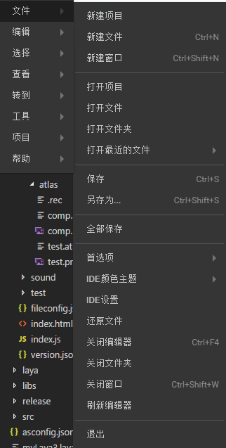
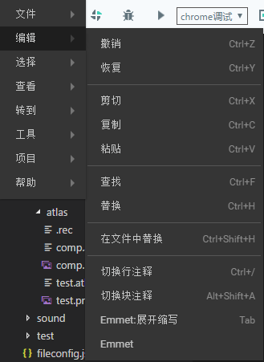
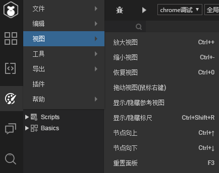
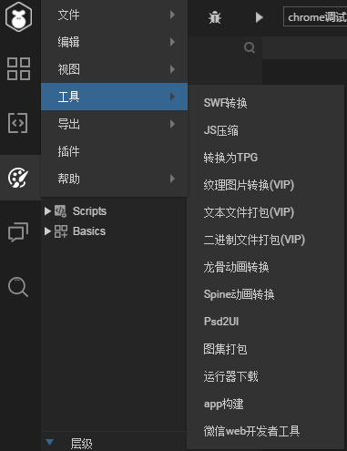
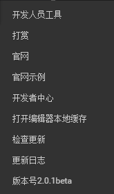

#Introduction to menu bar

The menu bar is located at the top of the interface, which contains the control information of the IDE. Friends who are not familiar with the interface can quickly find the functions that need to be operated in the menu bar. Next, we will introduce the menu bar in detail.

​ 
(Fig. 1)

 

###I. documents

​ 
(Figure 2)

- New project: Create a new project by creating a new project options window.

- New File: Create a new edit page by creating a new page window. Keyboard shortcut Ctrl + N.

- New directory: Create a new page folder in the project, shortcut key Ctrl + D.

- Open Project: Browse through Resource Manager and open a project, shortcut key Ctrl + D.

- Conversion project: In the conversion project window, you can select the MornUI project and convert it to the LayaAir project.

- Set up the project: Set up the project configuration file, shortcut F9.

- Setting Page: Set the default properties of the page, shortcut key Ctrl + P.

- Refresh Editor: The status of the editor can be refreshed, equivalent to resetting or restarting the editor.

​

###Two, editors

​ 
(Figure 3)

- Undo: Undo the current operation, return to the previous step, shortcut key Ctrl + Z.

- Redo: When Undo is too much, you can resume the undo operation, shortcut key Ctrl + Y.

- Delete: Delete the selected resource or control with the shortcut key Delete.

- Copy: Copy the currently selected resource or control, shortcut key Ctrl + C.

- Paste: Paste the copied resources or controls. Keyboard Ctrl + V.

- In-situ pasting: Copy and paste the selected control in the original position of the control, and the shortcut key Ctrl+Shift+V.

- Cut: Cut the selected control or resource, and click Ctrl + X.

- Selection: Select all controls, shortcut key Ctrl + A.

- Fast Move: Move the selected control 10 pixels to the direction key position quickly, and the shortcut key Shift + direction key.

- Convert to Container: Convert the selected control to Container, you can select the specific type of container in the Conversion Box, shortcut key Ctrl + B.

- Remove Container: Change the selected container type to a normal control, and the shortcut key Ctrl + U.

- Duplicate replication: Set the number and spacing of rows and columns to be replicated multiple times in the pop-up duplicate component, and the shortcut key Ctrl+R.

- Locate resources: Quickly locate the location of resources in resource manager, shortcut key Ctrl + K.

- Find Replacement: Pop up the Replacement Window to replace the location found with something else. Keyboard shortcut Ctrl + F.

- Save files: Save file changes, shortcut key Ctrl + S.

-Save all files: save all file changes, shortcut key Ctrl + Shift + s.

​

###Three, view

​ 
##(Figure 4)Zoom in view: zoom in scene editor, shortcut key Ctrl++.

- Narrow View: Narrow Scene Editor, shortcut key Ctrl+-.

- Restore View: Restore Scene Editor to original size, shortcut key Ctrl + 0 (or Ctrl + |).

- Drag View: Hold down the right mouse button (or mouse wheel) to drag the view position.

- Display/Hide Reference Views: Set up to display/hide views in the Scene Editor.

- Display/Hide Scale: Set up Display/Hide Scale in Scene Editor, shortcut key Ctrl+Shift+R.

- Node Up: Controls the selected control to move one bit upward in the hierarchical position of the hierarchical manager, and the shortcut key Ctrl+.

- Node Down: Control the selected control to move one bit downward in the hierarchical position of the hierarchical manager, and the shortcut key Ctrl+.

​

###Four. Tools

​    
(Fig. 5)

##- SWF Conversion: Open the SWF Resource Conversion Tool window for users to perform SWF conversion operations.JS compression: opens the JS compression tool window for users to compress and obfuscate JS files.
##- Convert to TPG: Only in a few cases of QQ browser can be used, and the domain name and Tencent can be filed.Texture image conversion: (vip exclusive function) compress texture, Android can not compress png.
##- Text file packaging: (vip exclusive function) merge multiple files in JSON format into one file.Binary file packaging: (vip exclusive function) merge multiple binary files into one.
##- Dragon Bones Animation Conversion: Open the Dragon Bones Animation Conversion Window for users to convert Dragon Bones skeleton animation into LayaAir recognition format.Spine Animation Conversion: Open the Spine Animation Conversion Window for users to convert Spine skeleton animation into LayaAir recognition format.
##- Atlas Packaging: Open the Atlas Packaging Window for users to do Atlas Packaging.Psd2UI: Convert the PSD files made by Ps according to certain rules into UI files used by laya.
##- Atlas Packing: Packing multiple small maps into a large atlas.Runner download: Open the two-dimensional code window downloaded by the runner for users to download LayaNative's runner.
##-App building: open the building function window for users to build the layaair engine project into three mobile app projects, namely Android eclipse, Android studio and Xcode (IOS).Wechat Web Development Tool: IDE download of Wechat games.

​

###Five. Export

​ 
(Figure 7)

- Export: Package and export the completed interface. If the resource folder does not change, skip the folder and only package and export the changed folder. Keyboard F12.

-Clean up and export: forces the resource files that have been packed before to be cleaned up. Repackage and export all files. Press Ctrl + F12.

- Export code (not resources): When resources do not change, but UI location, attributes and other changes, using this function, only re-export UI code, not re-export resources, will speed up the export efficiency of UI projects.

- Publishing (not packaging unused resources): It's similar to F12, but it only packages and exports used resources, and does not operate on unused resources. Using this function will slow down the exporting speed of UI projects because it needs to traverse the usage status of all resources. Therefore, it is not recommended to use it when developing, but only when publishing online versions of projects.

- Export Language Pack: This function can extract all UI text content of the current LayaAirIDE and generate lang. Lang files for setting up multilingual versions.

- Refresh resources and pages: Refresh and re-display resources and pages, usually in the case of resource changes to refresh all.

- Refresh Page: Refresh the page and re-display the page.

- Refresh Resources: Refresh Resource Manager, re-display resource manager's reference to resources.

- Find unused resources: Find unused resources in the project and organize them into a list to facilitate the rapid deletion of unused resources, shortcut key F4.

​

###Six, help

​ 
(Figure 8)

##- Developer Tools: Used to open debugging pages of the editor.Official website: Open the Layabox official website link.
##- Official Web Example: Open the LayaAir Engine Example Link for Official Web.Developer Center: Open the Layabox Developer Center link.
##- Open Editor Local Cache: Open the directory where the editor's local cached files are located.Check for updates: Open the link to the LayaAirIDE version download list.
##- Update Log: Open the link between the engine in gitHub and the IDE version update log.Current version number: Displays the current version number of LayaAirIDE.

