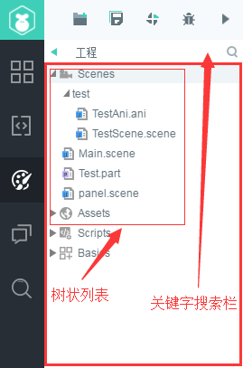
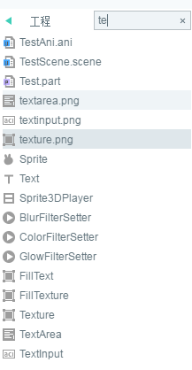
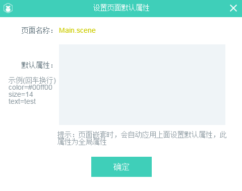

# 项目管理器

> 本篇采用LayaAirIDE 2.0.1 bate 截图，如有不同，请下载最新的LayaAirIDE，以最新版本IDE为准。

## 一、项目管理器面板介绍

​         项目管理器是我们用来访问和管理项目的工作区域。在我们使用过程中，项目管理器将“`项目文件夹\laya\pages`”的目录以及工程页面以树状结构展示出来。如图1所示：

​                

​        （图1）

**树状页面列表： **显示已创建或已导入的项目文件夹及页面。

**打开所在目录：** 打开选中的页面的所在目录。

**设置属性： **在弹出的属性设置窗口中，您可以设置该页面的导出类型与默认属性，如默认大小，color等，该属性全局通用。

​        

​        （图2）           

​       

## 二、项目管理器的右键功能介绍

**打开**

​        右键`文件`，点击打开，**可以直接在场景编辑器中打开该文件。**

​        右键`目录`，点击打开，**可以直接打开当前目录的资源管理器**

**重命名**

​        重新设定目录或文件的名字。

**转为模板**

　　只有UI文件才能使用该功能，将UI设置为模板，存放于模板库中被使用。可以设置为常用模板和自定义模板。

**Clone**

​        对于文件会复制一个完全一样的项目文件。

​        对于目录，会复制整个目录（含目录内的文件）。

**设置默认属性**

​        只能对`文件`设置页面的默认属性，以及导出类型。如图3所示。

　　   (图3)

**删除**

　　可以通过右键的`删除`功能，删除目录或文件。也可以选中页面后直接按Backspace或Delete键进行删除。如果选中目录文件夹进行删除，删除时会将目录下所有项目页面一并删除，请谨慎操作。

**新建**

​        在项目管理器中，可以新建UI页面/场景、粒子、动画、脚本。鼠标右键单击弹出菜单栏后，我们选择相应的新建功能即可。如图4所示

​        

​        （图4）

 **新建目录**

​        我们还可以在项目管理器中直接新建一个目录。

**打开所在目录**

​        选中文件或目录，点击该功能即可打开文件或目录所在的资源管理器目录。

