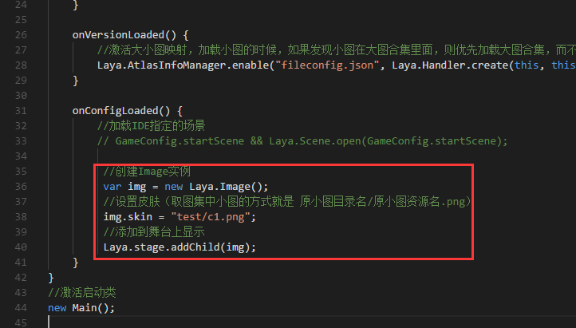
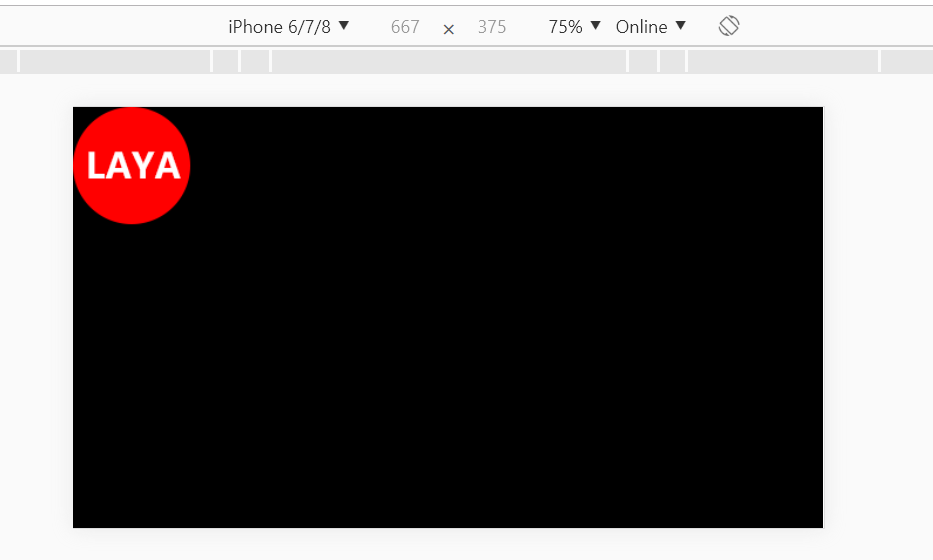

# 图集制作与使用详解


> author: charley     Language: JavaScript     update: 2019.01.11  

*[Note] LayaAirIDE 2.0.0 is the official version of this tutorial. If there are any differences, please refer to the latest version of LayaAirIDE.*


Atlas is a common art resource in game development. It combines many pictures into one big picture through tools, and stores the original picture resource information through files in atlas and JSON formats. Figure 1 shows a PNG atlas resource packaged in LayaAirIDE.


   


(Fig. 1)


##1. Why Use Atlas Resources

**In the game, the use of multi-picture composite atlas resources as art resources has the following advantages:**

####1.1 Optimizing Memory

When synthesizing atlas, the blank area around each picture will be removed, and various optimization algorithms can be implemented as a whole. After synthesizing atlas, the game package and memory occupancy will be greatly reduced.

####1.2 Reduce CPU operations

Multiple`Sprite`If you render a picture from the same atlas, these`Sprite`The same rendering batch can be used to process, which greatly reduces the CPU operation time and improves the operation efficiency.


##2. Support the format of atlas packaging

LayaAirIDE supports packaging PNG and JPG resource formats into atlases. However, PNG is recommended for the original resources packaged in the atlas because of the larger size of JPG.

*Tips: it should be noted that the bit depth of PNG's original resource cannot exceed 32, otherwise the packed atlas will show a splash screen. In addition, PNG and JPG resources can not be renamed as PNG and JPG resources in other formats.*


##3. Making Atlas with LayaAirIDE

There are two ways to package atlases in LayaAirIDE.

####3.1 Atlas Packaging Tool Using IDE

Navigated in IDE`工具`In the menu, Click`图集打包`Open the Atlas Packaging Tool Panel, as shown in Figures 2 and 3.

 


(Fig. 2)

　　<br/> (Figure 3)


**Description of Atlas Packaging Tools Panel**

**`资源根目录`**

　　`资源根目录`It refers to the parent directory of the original resource directory before the atlas is packaged. In this directory, each directory corresponds to a Atlas file, and multiple directories generate multiple Atlas files. (The packaged atlas file is named after the subdirectory name in the resource root directory, as shown in Figures 4 and 5)

 


(Fig. 4)

　  


(Fig. 5)


####Operational tips:

Drag directories directly to`资源根目录`Input box, or click`浏览`When the directory path is obtained, the`输出目录`Automatically fill in and`资源根目录`A considerable path.

#### **`输出目录`**

`输出目录`是指打包后的图集资源存放目录。

The default is the same as the resource root directory, you can click`浏览`Or manually.`输出目录`Change the path in the input box.

*Tips: Changing the output directory cannot be done by dragging and dropping the directory, otherwise it will affect the path of the resource root directory.*

#### **`图集最大宽\高度`**

The default value is`2048×2048`This value determines the maximum size of a single atlas. If there are too many original images, which exceed the maximum width and height of a single atlas, new atlas files (multiple atlases) will be generated when packaged.

#### **`单图最大宽\高度`**

The default value is`512×512`A single graph beyond this size will not be packaged into the atlas.

*Tips: Single graphs over 512 * 512 are not recommended to be packaged into the atlas. They can be preloaded separately. However, single graphs should not exceed 1024 * 1024, otherwise, their performance will be affected.*

#### `缩放系数`

Here we can reduce the collective product of the graph by zooming, for example, to 0.5. The tool will multiply 0.5 by the width and height of the original image, and keep the size of the original image by stretching when displaying. After processing, although the size of the collection will be smaller, the effect of the display will also be affected, which can be regarded as an alternative compression scheme of the atlas. If you want to maintain the design accuracy of the picture, try not to adjust the default value.

#### **`2的整次幂`**

If checked, the width and height of the generated atlas will be an integral power of 2. Here, it is suggested that when designing art, it should be designed according to the integral power of 2. By forcibly maintaining the integral power of 2 through the tool of atlas, the volume of the atlas will certainly be enlarged. Therefore, unless there are some compulsory Runtime environments requiring the optimization of the whole power of 2, there is no need to check in the normal circumstances, so as to ask the art designers to design the width of the picture according to the whole power of 32, 64, 128, 256 and so on.

#### **`空白裁剪`**

If checked, the generated atlas image will automatically cut out the blank area in the original image. The default is to check the status, do not remove it.

#### `数据文件后缀`

The data file suffix defaults to atlas or json. But we recommend that developers use atlas as the suffix of the atlas when using the LayaAir engine.


###3.2 Automatic Packaging Atlas in Resource Manager

####3.2.1 Atlas Packing Method

#### **LayaAirIDE automatically packages resources in the Assets directory when exporting**

All image resources in the Assets directory are shown in Figure 6-1. When pressed`F12`perhaps`Ctrl+F12`When exported, the**Automatically packaged as atlas by directory name**As shown in Figure 6-2.

 


(Fig. 6-1)

####Atlas export path in resource manager

After exporting UI, etc. to a project, the automatically packaged atlas defaults to be located at“`项目根目录/bin/res/atlas/`” Under the catalog, the name of the atlas is the same as the name of the atlas in the packaging tool, with the subdirectory in Assets as the name of the atlas, as shown in Figure 6-2.


   


(Fig. 6-2)

####Changing the default Atlas Export Path

If you want to change the default export directory of the atlas, you can use the shortcut F9 in the design mode.`项目设置`Panel`图集设置`Hurdles`资源发布目录`Change the export path of the atlas as shown in Figure 6-3. You can also set the maximum width and height of the atlas, as well as the width and height limitation criteria for unpackaged single atlas, etc. The meanings of each parameter are the same as those described in the Atlas Tool above.

  


(Fig. 6-3)

#### **How to unpackage unused resources into Atlas**

`资源管理器`If the resources in the menu are not used in the project scenario, the`导出`>`发布（不打包未使用）`Functions, as shown in Figure 6-4. Unused resources can be unpackaged into the atlas to reduce the size of the atlas. However, because this packaging method needs to traverse the usage status of all resources, resulting in slower packaging speed, so it is usually used only when the release version is online.

 


(Fig. 6-4)

#### **How to set a single resource not to be packed into the atlas**

Select resources, double-click left, or right-click`设置默认属性`As shown in Figure 6-5. Open the panel for resource property settings.

   


(Fig. 6-5)

In the Property Settings panel, the`打包类型`Options are set to _____________`不打包`Type, as shown in Figure 6-6. This resource will not be packaged into the atlas.

 


(Fig. 6-6)


##4. Introduction of Atlas Files Generated by Packaging

####4.1 Packaged Atlas Files

After wrapping the atlas, the atlas-specific resources (with the same name, respectively) are generated.`.atlas`Files (or`.json`Document and`.png`File), and the`rec`Files (* This rec file package software is used, developers do not care *), as shown in Figure 6-2 above.

####4.2 The Difference between Atlas and json's Atlas Suffixes

`.atlas`And`.json`All files are configuration information files of PNG atlas. The original LayaAir engine used JSON as the default format for Atlas configuration information. Later, in order to optimize the use of the engine, the default was changed to`.atlas`However, in order to be compatible with the old version, both IDE versions will exist for a long time when generating the atlas. Today, the Laaya AirIDE version only generates by default.`.atlas`If you want to generate json, you need to manually change the settings for the suffix of the atlas.

When used, the difference between the two suffixes is that:

`.atlas`LayaAirIDE is a unique atlas format, which is only used for atlases, so it is loaded`.atlas`It does not need to fill in the type. It is more convenient to load the ordinary single graph. It is the recommended way to load the atlas. The sample code of atlas loading atlas is as follows:


```javascript

//atlas方式图集使用示例
Laya.loader.load("./res/test/c1.atlas", Laya.Handler.create(this, onLoaded));
```


　　`.json`It is a third-party compatible atlas configuration method, because`.json`Files are widely used, not just for atlases, so in order to identify whether to configure information for atlases, they are loaded.`.json`Fill in the type of atlas to distinguish. The sample code for loading the atlas in JSON mode is as follows:


```javascript

//json方式图集使用示例
Laya.loader.load([{url: "res/test/c1.json", type: Laya.Loader.ATLAS}], Laya.Handler.create(this, onLoaded));
```


##5. Common Errors in Packaging Atlas

####Problems that cannot be re-exported after deleting atlas files

When the user manually deletes the atlas file, but does not delete the rec file, as shown in Figure 7-1. Under these circumstances,**If the original resources have not changed, it is impossible to re-export the atlas files directly using F12.**

At this point, you can use the shortcut key`Ctrl+F12`Clean and export. Or delete rec files directly and export them using F12. The atlas can be derived normally.

 


(Fig. 7-1)


##6. How to use small graphs in the atlas in a project

In the project, if you use the resources in the atlas, you need to preload the atlas resources first, and then set the skin (* skin *) attribute value of the image as "original catalog name / original resource name. png".


 

(Fig. 6-1)

   


(Fig. 1)

####In Resource Manager

For example, the resources in Figure 6-1 above are packaged as shown in Figure 1. Now let's look at Figure 6-1.`test`Small maps in the catalog`c1.png`The sample code is shown in Figure 8 as follows:

 


(Fig. 8)

Because the layaair 2.0 ide has been initialized and the basic code such as Atlas loading has been written when creating the project, we can directly write and display the c1.png picture in the atlas.

The core code is as follows:


```javascript

    //创建Image实例
    var img = new Laya.Image();
    //设置皮肤（取图集中小图的方式就是 原小图目录名/原小图资源名.png）
    img.skin = "test/c1.png";
    //添加到舞台上显示
    Laya.stage.addChild(img);
```


The code runs as shown in Figure 9:

  （图9）


As shown in Figure 9, we succeeded in extracting small map resources from the atlas and applying them to the project, while in the code.`sink`value`test/c1.png`In fact, it is the directory and resource name and path corresponding to the atlas before packaging.

This is the end of this article. If you have any questions, please come to the community and ask:[https://ask.layabox.com](http://localhost/LayaAir2_Auto/img/https://ask.layabox.com)


##This article appreciates

If you think this article is helpful to you, you are welcome to sweep the code and appreciate the author. Your motivation is our motivation to write more high quality documents.

