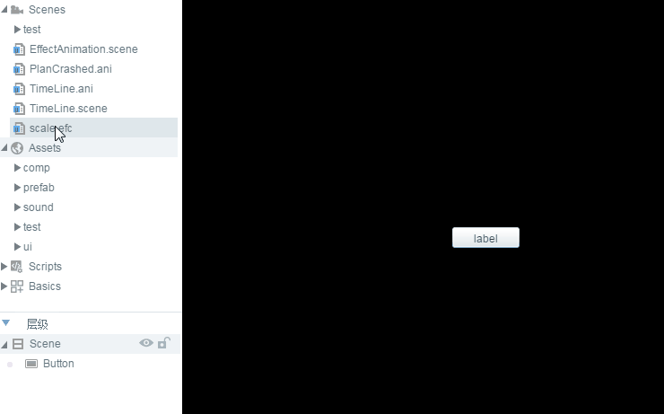
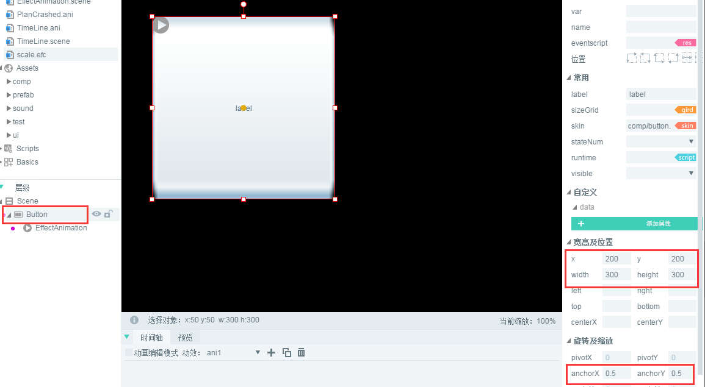

#Create Effect Animation

###1. What is dynamic template

Motion template is an animation effect based on the time axis, by presupposing the animation effect, and then attaching the effect to a component. It makes it easy to achieve the same animation effect as coding without coding. Kinetic template can not be displayed independently. It can only be used as a dynamic template to animate components in UI pages.


###2. Making and Using Action Template in IDE

####2.1 Create Effect Animation Template File

In Project Manager, mouse`右键`> selection`新建`>`动画`。 In the new animation panel, select the animation type as`EffectAnimation`。 Since we are going to create a zoom effect template, we name the animation scale, as shown in Figure 1.

<br/> (Fig. 1)

click`确定`After that, a`scale.efc`Double-click the action template file and we see the animation editing scene as shown in Figure 2.

<br/> (Fig. 2)


####2.2 Create dynamic template

**Goal: Create an animation effect template that shrinks first and then restores.**

**Step one**We drag an Image component from Resource Manager to`scale.efc`Scene Editor. As shown in Figure 3.

<br/>(图3)


**Step two**Selection`动画编辑模式`Then select`第1帧`and`Image`Component, right-click on the component to create the key frame. As shown in Figure 4.

<br/> (Fig. 4)


**Step three**Select`第1帧`In the property manager, the`scaleX`And`scaleY`Attribute values are set to`0.2`。 As shown in Figure 5. After setting the property value,`Image`Scaling attributes are automatically added to the timeline`scaleX`And`scaleY`。 (* Since our dynamic template does not need displacement effects, we can delete the attributes X generated by keyframe automatically before *)

<br/> (Fig. 5)

**Tips**It should be noted that there is an important difference between dynamic template and time axis animation, that is, if the animation effect is set in the first frame of the current animation effect of dynamic template, the animation effect is invalid. For example, when we want to reduce the size to 0.2 first, we can reduce the animation component directly to 0.2 in the time axis animation in the 0th frame, but in the dynamic template, we can not set the zoom effect directly in the 0th frame, we must set the zoom target effect (0.2) in other frames (such as the 1st frame).


**Step four**Create a key frame in frame 13 (see Fig. 4), set scaleX and scaleY attribute values to 1, click Play to preview the animation effect.

<br/> (Fig. 6)


####2.3 Use dynamic template in IDE

**Step one**Create a UI page (in this case`EffectAnimation.ui`Then drag and drop a Button component into the scene editor, as shown in Figure 7 (* Note: The Button component in this example is in the UI directory *).

<br/> (Fig. 7)


**Step two**Drag and drop the scaled. EFC under the Button component, as shown in Figure 8.

<br/> (Fig. 8)


**Step three**To achieve the center zoom effect, and let the button see more clearly. We choose`Button`Components, in the Properties Panel, set the pivot properties`anchorX`And`anchorY`The value is`0.5`And then set`Button`The width and height of the XY axis and the position of the axis center are shown in Fig. 9.

<br/> (Fig. 9)

*Tips: Axis effects need to be set in the component properties of the UI. Axis effects set in the dynamic template are invalid for components.*

**Step four**Select`Button`The action template under the component sets the event attributes that trigger playback in the right property panel`playEvent`The value is`mousedown`。 As shown in Figure 10.

<br/> (FIG. 10)

**Step five:**So far, the production of dynamic template has been completed. Press F9 to open the project settings. The class used by the dynamic template will be imported at the location of the UICode import class, otherwise an error will be reported. As shown in Figure 11. Then export the UI page according to F12 (or Ctrl + F12), which can be used in the project.

<br/> (FIG. 11)


###3. Demonstrating the effect of dynamic template in the project

Create a`Mian.js`File, referenced in index. html. Write the following code:


```javascript

//初始化引擎
Laya.init(1334,750);
//设置舞台背景色
Laya.stage.bgColor = "#ffffff";
//加载图集资源，加载成功后将UI界面添加到舞台上
Laya.loader.load("./res/atlas/comp.atlas",Laya.Handler.create(this,onLoaded));
function onLoaded(){
    //实例化导出的UI类
    var efc = new ui.TestPUI();
    //添加到舞台
    Laya.stage.addChild(efc);
}

```


After running, when the button is pressed, the animation effect is shown in Figure 12.

<br/>(图12)


###4. Creating Complex Kinetic Effects by Multiple Kinetic Effects Templates

Just after the button is pressed, the animation effect becomes larger from a small age. We can make a dynamic template to achieve the reduction effect when the button is bounced. In order to realize the continuous animation effect demonstration of fast switching state between press and pop-up.

First, we create a dynamic template file. Because the dynamic template is directly reduced, only two key frames are needed. As shown in Figure 13, we are`第12帧`Scaling attributes`scaleX`And`scaleY`The value is set to`0.2`。

<br/>(图13)


Then, in the UI page, drag the action template to`Button`Under components, and settings`playEvent`Attribute is`mouseup`。 As shown in Figure 14.

<br/> (FIG. 14)


Finally, save it, export the UI according to F12, and compile the code again in the project. The effect of the animation is shown in Fig. 15. The animation effect is very smooth under the event of continuous press and pop-up.
<br/> (FIG. 15)


At this point, the basic course of effect animation is over. Developers can use the dynamic template function of Laya air ide to quickly develop animation effects of various components.