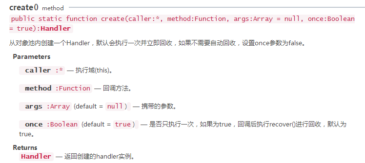
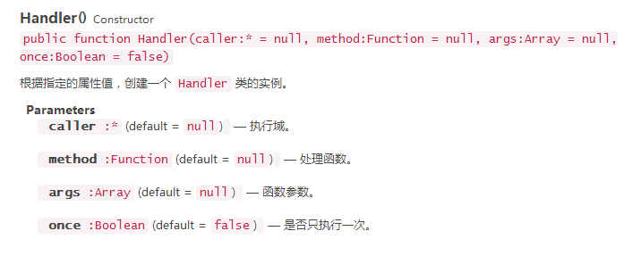

#Memory optimization

###1. Optimizing memory through object pool

Object pool optimization is a very important optimization method in game development, and it is also one of the important factors affecting game performance.

In the game, many objects are constantly created and removed, such as character attack bullets, creation and removal of special effects, elimination and refresh of NPC, etc. In the process of creation, performance is consumed, especially in the case of a large number of cases.

Object pool technology can solve the above problems very well. When objects are removed and disappeared, they are recycled to the object pool. When new objects are needed, they are taken out of the object pool directly.

The advantage is that it reduces the overhead of instantiating objects, allows objects to be reused repeatedly, and reduces the chances of new memory allocation and garbage collector running.

**Be careful**Object removal is not immediately erased from memory. Only when there is insufficient memory, can the garbage collection mechanism be used to empty it. It is very memory-consuming to empty it, which may lead to Katon phenomenon.**After using object pool, the garbage objects of the program will be reduced, and the running speed and stability of the program will be improved effectively.**。

####1.1 Object pool class of LayaAir engine

The LayaAir engine provides object pool classes[laya.utils.Pool](http://layaair.ldc.layabox.com/api/index.html?category=Core&class=laya.utils.Pool)For object storage and reuse. More commonly used are`对象池创建`Method`getItemByClass()`And`回收到对象池`Method`recover()`。  Figures 1 and 2 are shown.

</br>


(Figure 1) Object pool creation method

</br>

(Figure 2) Recycle to the object pool method, putting the used objects back into the object pool.

####1.2 Example of using object pool optimization

The following code demonstrates how to create 100 snowflakes every 100 frames using the object pool method, remove the stage when the snowflakes move beyond the boundary or zoom less than 0, and call the Pool. recovery () method to reclaim the specified object into the object pool.

##### 


```typescript

class PoolTest {
    private createTime: number = 0;

    constructor() {

        //初始化引擎
        Laya.init(1136, 640, Laya.WebGL);
        //等比缩放
        Laya.stage.scaleMode = Laya.Stage.SCALE_SHOWALL;
        //背景颜色
        Laya.stage.bgColor = "#232628";
        //帧循环
        Laya.timer.frameLoop(1, this, this.onFrame);

    }
    onFrame(): void {
        //如果创建对象时间为100帧间隔后
        if (this.createTime >= 100) {
            //每200帧间隔创建30个雪花
            for (var i: number = 0; i < 100; i++) {

                //img:Image=new Image(); //不使用对象池的写法
                //通过对象池创建图片，如对象池中无相应的对象，则根据Image类型执行new Image()创建
                var img: Laya.Image = Laya.Pool.getItemByClass("img", Laya.Image);
                //通过锚点设置轴心点
                img.anchorX = img.anchorY = 0.5;
                //图片的资源
                img.skin = "res/snow0.png"
                //在舞台上方随机位置创建
                img.x = Math.random() * 1136;
                img.y = Math.random() * -150;
                //对象池中的图片被缩放了，需重新设置其缩放属性。
                //如果对象中还有其他属性被改变了，
                img.scaleX = img.scaleY = 1;
                //加载到舞台
                Laya.stage.addChild(img);
                //到100帧后创建完对象后时间归0
                this.createTime = 0;
            }
        } else {
            //更新创建时间
            this.createTime++;
        }
        //检测每个舞台中的图片对象，并进行位置更新。
   for(var j:number=0;j<Laya.stage.numChildren;j++)
            {
                //获取舞台中的图片对象
                var img1:Laya.Image=Laya.stage.getChildAt(j) as Laya.Image;
                //位置更新
                img1.y++;
                //缩放更新
                img1.scaleX-=0.001;
                img1.scaleY-=0.001;
                //图片旋转
                img1.rotation++;
                //超出边界或缩放小于0
                if(img1.y>640+20||img1.scaleX<=0)
                {
                    //从舞台中移除
                    Laya.stage.removeChild(img1);
                    //img1.destroy(); //不使用对象池的编写方式,直接用destroy清空             
                    //回收到对象池
                   Laya.Pool.recover("img",img1);
                }
            }
        }
    }

new PoolTest();
//以上代码的说明都在注释里，请详细查看。
```


###2. Use Handler.create.

Handler is often used to complete asynchronous callbacks during development. Laya. Handler. create uses built-in object pool management, so Laya. Handler. create can be used to create callback processors when using Handler objects. The following code uses Laya. Handler. create to create a callback processor for resource loading:

One`Laya.loader.load(urls, Laya.Handler.create(this, this.onAssetLoaded));`

We often load resources in batches according to the game logic and stages, and the first batch of resources is loaded, triggering the completion event callback method created by Laya. Handler. create () to be reclaimed by the object pool; when the game goes to a certain time, the second batch of resources need to be loaded, Laya. Handler. create () will first retrieve the same callback method processor in the object pool, if it is found. The method in the object pool is used directly, thus saving memory overhead.

####Notes for using Handler. create

</br>

In some special cases, we need to pay attention to`Laya.Hanlder.create()`In terms of usage, let's take a closer look at Figure 3.`Laya.Hanlder.create()`Method description.

Create a Handler from the object pool, which is executed once by default and reclaimed immediately.

In other words, if you need to trigger this callback method multiple times, you need to`Laya.Hanlder.create()`Method in`once`The parameters are set to`false`。 Or use`new Laya.Handler()`The way to create.

For example, we need to load resources in the game start interface, we need to show the progress of loading resources, the following code is wrong.

One`Laya.loader.load(urls, Laya.Handler.create(this, this.onAssetLoaded), Laya.Handler.create(this, this.onLoading));`

In the above code, use`Laya.Handler.create(this,this.onLoading)`The callback method returned is to process the progress load progress event. Since the callback is recycled by the object pool after it is executed once, the progress load progress event is triggered only once and ends. In fact, the resource is not loaded and is still in the process of loading, so such coding can not meet our expectations.

The correct way of writing is:


```

Laya.loader.load(urls, Laya.Handler.create(this,this.onAssetLoaded), Laya.Handler.create(this,this.onLoading, null, false));
```


Or:

One`Laya.loader.load(urls, Laya.Handler.create(this,this.onAssetLoaded), new Laya.Handler(this, this.onLoading));`

**Tips**What can't be confused here is that`Handler()`There is no way to use object pools.`Laya.Handler.create()`Object pooling is used by default. There is no confusion about Handler.

**Handler () API reference as shown in Figure 2-2**:

</br>

(Fig. 4)

###3. Release memory

The garbage collector cannot be started at JavaScript runtime. To ensure that an object can be reclaimed, all references to that object need to be deleted. Sprite provides`destory()`Method helps set the internal reference to null.

For example, the following code ensures that objects can be garbage collected:

One`//创建一个Sprite实例`
Two`var sp:Laya.Sprite = new Laya.Sprite();`
Three`//将sp内部引用设置为null`
Four`sp.destroy();`

When an object is set to null, it is not immediately removed from memory. The garbage collector will only run if the system considers that the memory is low enough. Memory allocation, rather than object deletion, triggers garbage collection.

Garbage collection can take up a lot of CPUs and affect performance. By reusing objects, try to limit the use of garbage collection. In addition, set the reference to null as much as possible so that the garbage collector spends less time looking up objects. Sometimes (for example, when two objects refer to each other) it is impossible to set two references to null at the same time, and the garbage collector scans the unreachable objects and clears them, which consumes more performance than reference counting.

###4. Unloading of resources

Many resources will always be loaded when the game is running. These resources should be unloaded in time after they are used. Otherwise, they will remain in memory.

The following example demonstrates comparing resource status before and after unloading after loading resources:


```typescript

var assets: Array<any> = []
assets.push("res/apes/monkey0.png");
assets.push("res/apes/monkey1.png");
assets.push("res/apes/monkey2.png");
assets.push("res/apes/monkey3.png");
Laya.loader.load(assets, Laya.Handler.create(this, onAssetsLoaded));
function onAssetsLoaded():void
{
  for(var i:number = 0, len: number = assets.length; i<len; ++i)
  {
    var asset:string = assets[i];
    //查看log，清理前资源一直在内存中
    console.log(Laya.loader.getRes(asset));
    //调用清理方法
    Laya.loader.clearRes(asset);
    //查看log，清理后，资源被卸载
    console.log(Laya.loader.getRes(asset));
  }
}
```


One###5. About filters and masks

Try to minimize the use of filters. When BlurFilter and GlowFilter are applied to display objects, two bitmaps are created in memory at run time. Each bitmap has the same size as the display object. Create the first bitmap as a rasterized version of the display object, and then use it to generate another bitmap of the application filter:


   </br>

(Fig. 5)

Two bitmaps in memory when applying filters

When modifying an attribute of a filter or a display object, two bitmaps in memory will be updated to create the generated bitmaps, which may occupy a large amount of memory. In addition, this process involves CPU computing, which will degrade performance when dynamically updated.

ColorFiter needs to compute every pixel in Canvas rendering, while GPU consumption in WebGL is negligible.

The best way to do this is to use bitmaps created by image authoring tools to simulate filters as much as possible. Avoiding creating dynamic bitmaps at runtime can help reduce CPU or GPU load. Especially an image with filters and no modification.