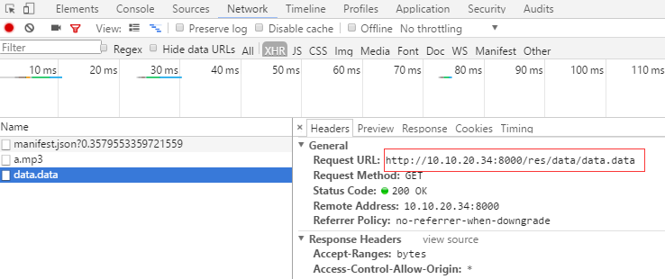
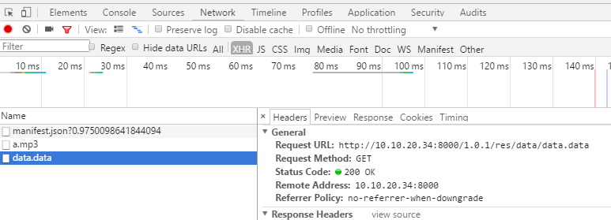

#Resource Version Management

After the project goes online, it is inevitable to encounter the need to update the resource version. However, the caching problem of browsers will lead to the pulled resources are not the latest version, and the inconsistency of project versions will lead to abnormal operation. So it is necessary to manage resources reasonably and renew resources. The resource version management tool provided by LayaAir engine effectively solves this problem. Let's look at the specific usage.**Note: The engine version number needs more than 1.7.3.**

Here we use it in conjunction with the command line. Let's look at the next steps.

- Install nodejs, download nodejs download address on official website[https://nodejs.org/en/](https://nodejs.org/en/%E3%80%82)

- Install the layacmd tool. Download address[https://www.npmjs.com/package/layacmd](https://www.npmjs.com/package/layacmd%E3%80%82)

Here I use Win system to demonstrate. Open the CMD window and enter NPM install layacmd - G from the command line.

This command-line tool provides many functions, including compiling, publishing, exporting resources, creating static servers and so on. Related tutorials can refer to the layacmd topic tutorial. Here we will take the function of resource management to explain.

- New LayaAir project.

Then go into the H5 directory, create a new res folder to put resources in the res directory, here we add a few resources at will. Here we add a voice folder, which contains a voice file a. mp3, an img folder on the outer layer, and an image of 1. png.

Open command line input in bin directory`layacmd resourceVersion -i res -o . -n 1.0.0`Here - I represents the resource path, and - O represents the version resource output path as the current path. Of course, developers can also customize the output path, such as defining the path as version folder, etc. - N 1.0.0 initialization version is 1.0.0. After returning, we saw several files and folders generated. As shown in the following figure:


  (图1)</br>


1.0.0 folder contains 1.0.0 version of resources.`.record`The file records the MD5 information of the file, do not delete it!`manifest.json`The resource version number recorded in the file.

Let's see how to apply it in the program.

​


```typescript

class Main {
    /*设置资源配置文件的地址，这里加了随机参数，保证每次加载的都是新的*/
    private configUrl:string = "manifest.json?"+Math.random();
    constructor() {
        Laya.init(500,500);
        Laya.ResourceVersion.enable(this.configUrl,Laya.Handler.create(this,this.completeHandler));
    }
    private completeHandler(e:any):void{
        Laya.loader.load([{"url":"res/sound/a.mp3","type":Laya.Loader.BUFFER}],Laya.Handler.create(this,this.loadSound));
    }
    private loadSound():void{
        var obj:any = Laya.loader.getRes("res/sound/a.mp3");
    }
}
new Main;
```


- After initializing the engine, the first thing we need to do is load this.`manifest.json`This file. The engine provides a way to enable version management.

`ResourceVersion.enable`This method passes in the path of the manifest. JSON file, and the ResourceVersion class rewrites the method of the URL. customFormat. When loading a resource, it matches the version number of the resource in manifest. JSON and loads it. After loading the manifest. JSON file, we begin the formal logic of our project.

We loaded a sound file in the project logic. Compile and run the above code. Open Google's console. Look at the information for loading the file. As shown in the picture:

(Fig. 2) </br>

You can see that the load is`1.0.0/res/sound/a.mp3`Resources under folders. We are adding a resource to create a new text file. Name it data. data. Add the file res/data/data.data. The loading code is as follows:


```typescript

class Main {
    /*设置资源配置文件的地址，这里加了随机参数，保证每次加载的都是新的*/
    private configUrl:string = "manifest.json?"+Math.random();
    constructor() {
        Laya.init(500,500);
        Laya.ResourceVersion.enable(this.configUrl,Laya.Handler.create(this,this.completeHandler));
    }
    private completeHandler(e:any):void{
        var obj:Object = Laya.loader.getRes(this.configUrl);
        var data:any =[
            {"url":"res/sound/a.mp3","type":Laya.Loader.BUFFER},
            {"url":"res/data/data.data","type":Laya.Loader.TEXT}
        ]
        Laya.loader.load(data,Laya.Handler.create(this,this.resComplete));
    }
    private resComplete():void{
        
    }
}
new Main;
```


Compile the above code and open the Google Manager to see the loading path.

(图3)</br>


From this we can see that in the development mode, our resources are still placed in the res directory, while in the formal version development, we use command line tools for version management.

Now let's enter the command from the command line, assuming we still define it as version 1.0.0.`layacmd resourceVersion -i res -o . -n 1.0.0`After execution, look at the refresh page:

(图4)</br>


It was found that the resources under the 1.0.0 folder had been loaded.

What is said above is to increase resources. What if resources are modified? Then we should add the next version number when we release the version. For example, let's modify the content of data. data. Then release it

`layacmd resourceVersion -i res -o . -n 1.0.1`Command line execution. Then refresh the page to see how it loads.

(Fig. 5) </br>


 **Look at the resources loaded in folder 1.0.1 at this time. The file A.mp3 has not been modified, but he still loads the resources in folder 1.0.0.**

Conclusion:

So far we have seen that as long as we have the resources to modify, we can modify the release version number. This will go to the appropriate folder to load resources. The version information recorded in the manifest.json file changes.