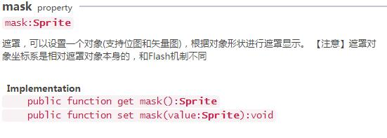
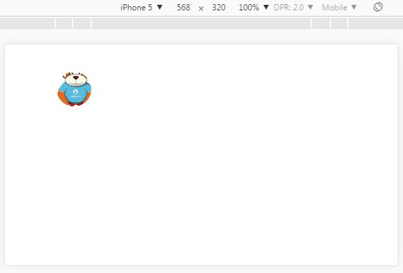
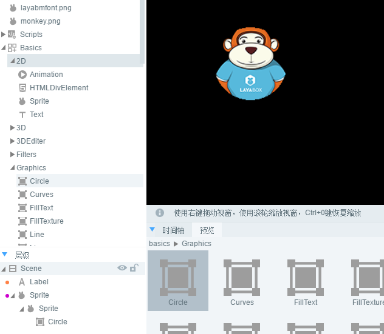
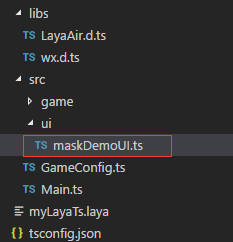

#Set Matte

> LayaAir's mask can set up an object (supporting bitmaps and vector maps), and then display the mask according to the shape of the object.
>


##Introduction of Mask API


　　遮罩属性位于[laya.display.Sprite](http://layaair.ldc.layabox.com/api/index.html?category=Core&class=laya.display.Sprite%3Ch1%3Emask)Within the API, the description of this property is shown in Figure 1.

<br/> (Fig. 1)


##2. Simple examples of masks

###2.1 Let's first display a bitmap with the LayaAir engine

Create a`MaskDemo.ts`Entry class, write the code as follows:


```typescript

// 程序入口
class MaskDemo{
    private Res:string;
    private img:Laya.Sprite;
    constructor()
    {
        Laya.init(1336,640);
        //设置舞台背景色
        Laya.stage.bgColor = "#ffffff";
        //资源路径
        this.Res = "res/img/monkey1.png";
        //先加载图片资源，在图片资源加载成功后，通过回调方法绘制图片并添加到舞台
        Laya.loader.load(this.Res,Laya.Handler.create(this,this.graphicsImg));
    }
    private graphicsImg():void{
        this.img = new Laya.Sprite();
        //获取图片资源，绘制到画布
        this.img.graphics.drawTexture(Laya.loader.getRes(this.Res),150,50);
        //添加到舞台
        Laya.stage.addChild(this.img);
    }
}
new MaskDemo();
```


The operation effect is shown in Figure 2.

<br/> (Figure 2)

###2.2 Create a circular mask area

Create a circular mask area with code. The masking effect can be achieved by mask attributes. Continuing with the code and comments, we changed the 2.1 sample code to the following code:


```java

// 程序入口
class MaskDemo{
    private Res:string;
    private img:Laya.Sprite;
    private cMask:Laya.Sprite;
    constructor()
    {
        Laya.init(1336,640);
        //设置舞台背景色
        Laya.stage.bgColor = "#ffffff";
        //资源路径
        this.Res = "res/img/monkey1.png";
        //先加载图片资源，在图片资源加载成功后，通过回调方法绘制图片并添加到舞台
        Laya.loader.load(this.Res,Laya.Handler.create(this,this.graphicsImg));
    }
    private graphicsImg():void{
        this.img = new Laya.Sprite();
        //获取图片资源，绘制到画布
        this.img.graphics.drawTexture(Laya.loader.getRes(this.Res),150,50);
        //添加到舞台
        Laya.stage.addChild(this.img);

        //创建遮罩对象
        this.cMask = new Laya.Sprite();
        //画一个圆形的遮罩区域
        this.cMask.graphics.drawCircle(80,80,50,"#ff0000");
        //圆形所在的位置坐标
        this.cMask.pos(120,50);
        
        //实现img显示对象的遮罩效果
        this.img.mask = this.cMask;
    }
}
new MaskDemo();
```


The operation effect is shown in Figure 3.

 <br />（图3）


By comparing the codes, we find that the implementation of masking is very simple. The masking effect of img display object is realized by assigning the created display object cMask to the mask attribute of img object as the masking object.


##3. Setting up masks in Laya AirIDE

>In addition to setting masks directly in the code, you can also easily set masks for objects through Laya air ide. Now let's follow the lead step by step.

Step 1: Create a UI page`maskDemo.ui`Import resources.*(If you are not familiar with this step, please go to the IDE section to see the documents related to UI creation and resource import.)*


Step 2: Drag in a resource panel`Image`Components to the scene editing area, as shown in Figure 4

<br/> (Figure 4)


Step 3: Double-click Enter`Image`Inside the component, then drag one into the component panel`Sprite`Components, as shown in Figure 5.

<br/> (Fig. 5)


Step 4: Select`Sprite`Components, in the right-hand property panel, will share properties`renderType`Set to`mask`As shown in Figure 6.

<br/> (Fig. 6)


Step 5: Double-click Enter`Sprite`Inside the component, then drag one into the component panel`Graphics`Round components, adjust the position and size. The hierarchical relationship is shown in Figure 7.

<br/> (Figure 7)


Step 6: Continuously double-click the blank area of the editing area to exit`Image`Inside the component, you can see the effect of the mask, as shown in Figure 8.

<br/> (Figure 8)


##4. Applying the masks set by LayaAirIDE in the project

###4.1 release UI

On the IDE interface, press`F12`Publish UI pages for masking effects, which will`src/ui`Generate UI classes under the directory, as shown in Figure 9.

 <br />（图9）


###4.2 Use class and Atlas generated by IDE to achieve masking effect

Press F9 to set up engine preview in editing mode and start the scene as maskDemoUI


The main class code is as follows:


```java

import GameConfig from "./GameConfig";
import { ui } from "./ui/maskDemoUI";
class Main {
	constructor() {
		//根据IDE设置初始化引擎		
		if (window["Laya3D"]) Laya3D.init(GameConfig.width, GameConfig.height);
		else Laya.init(GameConfig.width, GameConfig.height, Laya["WebGL"]);
		Laya["Physics"] && Laya["Physics"].enable();
		Laya["DebugPanel"] && Laya["Physics"].enable();
		Laya.stage.scaleMode = GameConfig.scaleMode;
		Laya.stage.screenMode = GameConfig.screenMode;

		//打开调试面板（通过IDE设置调试模式，或者url地址增加debug=true参数，均可打开调试面板）
		if (GameConfig.debug || Laya.Utils.getQueryString("debug") == "true") Laya.enableDebugPanel();
		if (GameConfig.stat) Laya.Stat.show();
		Laya.alertGlobalError = true;

		//激活资源版本控制，version.json由IDE发布功能自动生成，如果没有也不影响后续流程
		Laya.ResourceVersion.enable("version.json", Laya.Handler.create(this, this.onVersionLoaded), Laya.ResourceVersion.FILENAME_VERSION);
	}

	onVersionLoaded(): void {
		//激活大小图映射，加载小图的时候，如果发现小图在大图合集里面，则优先加载大图合集，而不是小图
		Laya.AtlasInfoManager.enable("fileconfig.json", Laya.Handler.create(this, this.onConfigLoaded));
	}

	onConfigLoaded(): void {
		//加载IDE指定的场景
		GameConfig.startScene && Laya.Scene.open(GameConfig.startScene);
	}
}
//激活启动类
new Main();

```


The operation effect is shown in Figure 10. We quickly realized the effect of the mask.

<br/> (Fig. 10)

