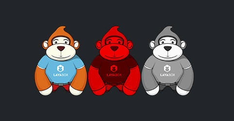
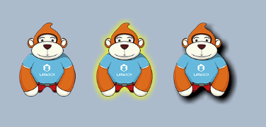

#Setting up filter effect

> LayaAir engine provides three effects: color filter, light (or shadow) filter and blur filter. Among them, color filters support Canvas and WebGL modes, while light filters and fuzzy filters only support WebGL modes because of their high performance consumption.


##1. Setting up color filters

###1.1 Color Filter API

The color filter class, ColorFilter, is located in the laya. filters package and changes the color channels by specifying a matrix (* arranged into 4 x 5 matrices *).

click[laya.filters.ColorFilter ](http://layaair.ldc.layabox.com/api/index.html?category=Filter&class=laya.filters.ColorFilter)View the API description.


###1.2 Setting Color Filter

If you want to set a color filter for a bitmap, you need to set a color matrix first, and then create an example of a color filter using the ColorFilter method, as shown in the following code:


```typescript

//颜色滤镜矩阵，红色
var colorMatrix:any = 
  [
  1, 0, 0, 0, 0, //R
  0, 0, 0, 0, 0, //G
  0, 0, 0, 0, 0, //B
  0, 0, 0, 1, 0, //A
];

//创建红色颜色滤镜
var redFilter:Laya.ColorFilter = new Laya.ColorFilter(colorMatrix);
```


Finally, the color filter effect is superimposed on the bitmap through the filter attribute of Spriter. Let's create a Main. TS class and write the following code:


```typescript

module laya {
    import Sprite = Laya.Sprite;
    import Stage = Laya.Stage;
    import ColorFilter = Laya.ColorFilter;
    import Texture = Laya.Texture;
    import Browser = Laya.Browser;
    import Handler = Laya.Handler;
    import WebGL = Laya.WebGL;

    export class Main {
        private ApePath: string = "../../res/apes/monkey2.png";

        private apeTexture: Texture;

        constructor() {
            // 不支持WebGL时自动切换至Canvas
            Laya.init(Browser.clientWidth, Browser.clientHeight, WebGL);

            Laya.stage.alignV = Stage.ALIGN_MIDDLE;
            Laya.stage.alignH = Stage.ALIGN_CENTER;

            Laya.stage.scaleMode = "showall";
            Laya.stage.bgColor = "#232628";

            Laya.loader.load(this.ApePath, Handler.create(this, this.setup));
        }

        private setup(): void {
            this.normalizeApe();
            this.makeRedApe();
            this.grayingApe();
        }

        private normalizeApe(): void {
            var originalApe: Sprite = this.createApe();

            this.apeTexture = Laya.loader.getRes(this.ApePath);
            originalApe.x = (Laya.stage.width - this.apeTexture.width * 3) / 2;
            originalApe.y = (Laya.stage.height - this.apeTexture.height) / 2;
        }

        private makeRedApe(): void {
            //由 20 个项目（排列成 4 x 5 矩阵）组成的数组，红色
            var redMat: Array<number> =
                [
                    1, 0, 0, 0, 0, //R
                    0, 0, 0, 0, 0, //G
                    0, 0, 0, 0, 0, //B
                    0, 0, 0, 1, 0, //A
                ];

            //创建一个颜色滤镜对象,红色
            var redFilter: ColorFilter = new ColorFilter(redMat);

            // 赤化猩猩
            var redApe: Sprite = this.createApe();
            redApe.filters = [redFilter];

            var firstChild: any = Laya.stage.getChildAt(0);
            redApe.x = firstChild.x + this.apeTexture.width;
            redApe.y = firstChild.y;
        }

        private grayingApe(): void {
            //由 20 个项目（排列成 4 x 5 矩阵）组成的数组，灰图
            var grayscaleMat: Array<number> = [0.3086, 0.6094, 0.0820, 0, 0, 0.3086, 0.6094, 0.0820, 0, 0, 0.3086, 0.6094, 0.0820, 0, 0, 0, 0, 0, 1, 0];

            //创建一个颜色滤镜对象，灰图
            var grayscaleFilter: ColorFilter = new ColorFilter(grayscaleMat);

            // 灰度猩猩
            var grayApe: Sprite = this.createApe();
            grayApe.filters = [grayscaleFilter];

            var secondChild: any = Laya.stage.getChildAt(1);
            grayApe.x = secondChild.x + this.apeTexture.width;
            grayApe.y = secondChild.y;
        }

        private createApe(): Sprite {
            var ape: Sprite = new Sprite();
            ape.loadImage("../../res/apes/monkey2.png");
            Laya.stage.addChild(ape);

            return ape;
        }
    }
}

new laya.Main();
```


In the code above, we create an original bitmap, a red filter effect bitmap, and a gray filter effect bitmap. The operation effect is shown in Figure 1.

<br/> (Fig. 1)


##2. Setting up Luminescent and Shadow Filters

###2.1 Luminescent Filter API

The GlowFilter class is located in the laya. filters package. It can also be used as a shadow filter by adjusting the light-emitting offset angle. The parameter description is shown in Figure 2. Note: This filter only supports WebGL mode.

<br/> (Figure 2)

click[laya.filters. GlowFilter](http://layaair.ldc.layabox.com/api/index.html?category=Filter&class=laya.filters.GlowFilter)Check the API instructions.


###2.2 Setting up Luminescent Filter and Shadow Filter

The settings of luminous and shadow filters are relatively simple. We can see the effect of the example directly by encoding.

First create a Main. TS class and write the following code:


```typescript

module laya {
    import Sprite = Laya.Sprite;
    import Stage = Laya.Stage;
    import GlowFilter = Laya.GlowFilter;
    import Browser = Laya.Browser;
    import Handler = Laya.Handler;
    import WebGL = Laya.WebGL;

    export class Main{
        private apePath: string = "../../res/apes/monkey2.png";

        private ape: Sprite;
        private apeGlow:Sprite;
        private apeShadow:Sprite;

        constructor() {
            // 不支持WebGL时自动切换至Canvas
            Laya.init(Browser.clientWidth, Browser.clientHeight, WebGL);

            Laya.stage.alignV = Stage.ALIGN_MIDDLE;
            Laya.stage.alignH = Stage.ALIGN_CENTER;

            Laya.stage.scaleMode = "showall";
            Laya.stage.bgColor = "#aabbcc";

            Laya.loader.load(this.apePath, Handler.create(this, this.setup));
        }

        private setup(): void {
             this.ape=this.createApe();
             this.ape.pos(100,50);
             this.apeGlow = this.createApe();
             this.apeGlow.pos(250,50);
             this.apeShadow = this.createApe();
             this.apeShadow.pos(400,50);
             this.GlowFilter();
             this.ShadowFilter();
        }
 
        private createApe(): Sprite {
            var ape = new Sprite();
            ape.loadImage(this.apePath);
            Laya.stage.addChild(ape);
            return ape;
        }

        private GlowFilter(): void {
            //创建一个发光滤镜
            var glowFilter: GlowFilter = new GlowFilter("#ffff00", 10, 0, 0);
            //设置滤镜集合为发光滤镜
            this.apeGlow.filters = [glowFilter];
        }
        private ShadowFilter(): void {
            //创建一个发光滤镜
            var shadowFilter: GlowFilter = new GlowFilter("#000000", 8, 8, 8);
            //设置滤镜为阴影滤镜
            this.apeShadow.filters = [shadowFilter];
        }
    }
}
new laya.Main();
```


In the code above, we create an original bitmap, a light-emitting filter effect bitmap, and a shadow filter effect bitmap. The operation effect is shown in Figure 3.

<br/> (Figure 3)


##3. Setting up a Fuzzy Filter

###3.1 Brief Introduction of Fuzzy Filter API

BlurFilter is located in laya. filters package. By adjusting the strength parameter to set the intensity of the blurred filter, the greater the value, the more blurred the filter. The parameter description is shown in Figure 4. Note: This filter only supports WebGL mode.

<br/> (Figure 4)

click[laya.filters. BlurFilter](http://layaair.ldc.layabox.com/api/index.html?category=Filter&class=laya.filters.BlurFilter)Check the API instructions.


###3.2 Setting up Fuzzy Filter

The setting of the blur filter is relatively simple. Create an example of the blur filter, then set the blur intensity and superimpose it on the bitmap. We can see the effect of the example directly by coding.

First create a Main. TS class and write the following code:


```typescript

module laya {
    import Sprite = Laya.Sprite;
    import Stage = Laya.Stage;
    import BlurFilter = Laya.BlurFilter;
    import Browser = Laya.Browser;
    import Handler = Laya.Handler;
    import WebGL = Laya.WebGL;

    export class Main {
        private apePath: string = "../../res/apes/monkey2.png";

        constructor() {
            // 不支持WebGL时自动切换至Canvas
            Laya.init(Browser.clientWidth, Browser.clientHeight, WebGL);

            Laya.stage.alignV = Stage.ALIGN_MIDDLE;
            Laya.stage.alignH = Stage.ALIGN_CENTER;

            Laya.stage.scaleMode = "showall";
            Laya.stage.bgColor = "#232628";

            Laya.loader.load(this.apePath, Handler.create(this, this.createApe));
        }

        private createApe(): void {
            var ape: Sprite = new Sprite();
            ape.loadImage(this.apePath);

            ape.pos(100,50);
            
            var apeBlur:Sprite = new Sprite();
            apeBlur.loadImage(this.apePath);
            apeBlur.pos(250,50);

            Laya.stage.addChild(ape);
            Laya.stage.addChild(apeBlur);

            this.applayFilter(apeBlur);
        }

        private applayFilter(ape: Sprite): void {
            var blurFilter: BlurFilter = new BlurFilter();
            blurFilter.strength = 5;
            ape.filters = [blurFilter];
        }
    }
}
new laya.Main();
```


In the code above, we created an original bitmap, a blurred filter effect bitmap. The operation effect is shown in Figure 5.

<br/> (Fig. 5)


