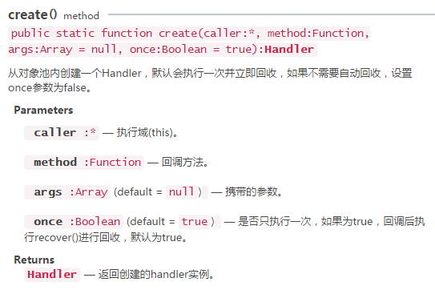

# 显示与切换图片

> 图片的显示是游戏开发基础，本篇从API到示例分别介绍Sprite.loadImage与Graphics.drawTexture两种显示图片的方法。

## 1、用loadImage方法显示与切换图片

### 1.1 loadImage API概述

在API文档中搜索laya.display.Sprite，可以找到loadImage()方法，如图1所示，我们先熟悉一下该方法的参数。

 <br /> (图1)

### 1.2 用loadImage加载显示图片的示例

创建一个Sprite_DisplayImage.ts类，编写代码如下：

```typescript
module laya {
    import Sprite = Laya.Sprite;
    import Stage = Laya.Stage;
    import Texture = Laya.Texture;
    import Browser = Laya.Browser;
    import Handler = Laya.Handler;
    import WebGL = Laya.WebGL;

    export class Sprite_DisplayImage {
        constructor() {
            // 不支持WebGL时自动切换至Canvas
            Laya.init(Browser.clientWidth, Browser.clientHeight, WebGL);
            Laya.stage.alignV = Stage.ALIGN_MIDDLE;
            Laya.stage.alignH = Stage.ALIGN_CENTER;
            Laya.stage.scaleMode = "showall";
            Laya.stage.bgColor = "#ffffff";
            this.showApe();
        }
         private showApe(): void {
            // 方法1：使用loadImage
            var ape: Sprite = new Sprite();
    	    ape.pos(100,50);
            Laya.stage.addChild(ape);
            ape.loadImage("../../res/apes/monkey3.png");
        }
    }
}
new laya.Sprite_DisplayImage();
```

在示例代码里，“`100,50`”是图片的显示坐标信息。示例代码运行效果如图2-1所示：

 <br /> (图2-1)

### 1.3 用loadImage切换图片的示例

  切换图片是在显示图片的基础之上，增加了清空绘制，然后通过代码逻辑获得新的图片资源重新绘制。具体的代码说明可以参考代码注释及API，结合实例运行体验。

下面我们在Sprite_SwitchTexture.ts类中修改代码为如下所示：

```typescript
module laya {
    import Sprite = Laya.Sprite;
    import Stage = Laya.Stage;
    import Texture = Laya.Texture;
    import Handler = Laya.Handler;
    import Browser= Laya.Browser;
    import WebGL = Laya.WebGL;

    export class Sprite_SwitchTexture {
        private texture1: string = "../../res/apes/monkey2.png";
        private texture2: string = "../../res/apes/monkey3.png";
        private flag: boolean = false;
        private ape: Sprite;

        constructor() {
            // 不支持WebGL时自动切换至Canvas
            Laya.init(Browser.clientWidth, Browser.clientHeight, WebGL);

            Laya.stage.alignV = Stage.ALIGN_MIDDLE;
            Laya.stage.alignH = Stage.ALIGN_CENTER; 
            Laya.stage.scaleMode = "showall";
            Laya.stage.bgColor = "#ffffff";

            Laya.loader.load([this.texture1, this.texture2], Handler.create(this, this.onAssetsLoaded));
        }
        private onAssetsLoaded(): void {
            this.ape = new Sprite();
            Laya.stage.addChild(this.ape);
            this.ape.pivot(55, 72);
            this.ape.pos(100,50);

            // 显示默认纹理
            this.switchTexture();

            this.ape.on("click", this, this.switchTexture);
        }

        private switchTexture(): void {
            var textureUrl: string = (this.flag = !this.flag) ? this.texture1 : this.texture2;

            // 更换纹理
            this.ape.graphics.clear();
            var texture: Texture = Laya.loader.getRes(textureUrl);
            this.ape.loadImage(textureUrl);

            // 设置交互区域
            this.ape.size(texture.width, texture.height);
        }
    }
}

new laya.Sprite_SwitchTexture();
```

运行代码效果如动图2-2所示：

 <br /> (动图2-2)


## 2 、用drawTexture方法显示与切换图片

### 2.1  drawTexture API 概述

在API文档中搜索laya.display.Graphics，可以找到drawTexture()方法，除此之外，还需要了解laya.net.LoaderManager中的load()方法和getRes()方法，以及laya.utils.Handler中的create()方法，各方法的参数图3、图4、图5、图6所示：

 <br /> (图3)

 <br /> (图4)

 <br /> (图5)

 <br /> (图6)


### 2.2 用drawTexture 加载显示图片的示例

​     loadImage()方法可以即时加载外部图片资源，也可以从缓冲区读取图片资源，drawTexture()方法则必须先加载完图片后，再绘制添加到舞台中来，因此在示例代码中需要使用到加载（`Laya.loader.load()`）与回调(`Handler.create()`)的方法，下面我们通过简单的示例代码加载显示一张图片，代码说明请查看代码中的注释部分以及相关API说明。

创建一个Sprite_DisplayImage.ts类，编写代码如下：

```typescript

module laya {
    import Sprite = Laya.Sprite;
    import Stage = Laya.Stage;
    import Texture = Laya.Texture;
    import Browser = Laya.Browser;
    import Handler = Laya.Handler;
    import WebGL = Laya.WebGL;

    export class Sprite_DisplayImage {
        constructor() {
            // 不支持WebGL时自动切换至Canvas
            Laya.init(Browser.clientWidth, Browser.clientHeight, WebGL);

            Laya.stage.alignV = Stage.ALIGN_MIDDLE;
            Laya.stage.alignH = Stage.ALIGN_CENTER;

            Laya.stage.scaleMode = "showall";
            Laya.stage.bgColor = "#ffffff";

            this.showApe();
        }
 
        private showApe(): void {
        
            // 方法2：使用drawTexture
            Laya.loader.load("../../res/apes/monkey2.png", Handler.create(this, function(): void {
                var t: Texture = Laya.loader.getRes("../../res/apes/monkey2.png");
                var ape: Sprite = new Sprite();
                ape.graphics.drawTexture(t, 0, 0);
                Laya.stage.addChild(ape);
                ape.pos(100, 50);
            }));
        }
    }
}
new laya.Sprite_DisplayImage();
```

代码运行效果如图7-1所示。

 <br /> (图7-1)


### 2.3 用drawTexture 切换图片的示例

 切换图片是在显示图片的基础之上，增加了清空绘制，然后通过代码逻辑获得新的图片资源重新绘制。具体的代码说明可以参考代码注释及API，结合实例运行体验。

下面我们在Main.as入口类中修改代码为如下所示：

```typescript
module laya {
    import Sprite = Laya.Sprite;
    import Stage = Laya.Stage;
    import Texture = Laya.Texture;
    import Handler = Laya.Handler;
    import Browser= Laya.Browser;
    import WebGL = Laya.WebGL;

    export class Sprite_SwitchTexture {
        private texture1: string = "../../res/apes/monkey2.png";
        private texture2: string = "../../res/apes/monkey3.png";
        private flag: boolean = false;

        private ape: Sprite;

        constructor() {
            // 不支持WebGL时自动切换至Canvas
            Laya.init(Browser.clientWidth, Browser.clientHeight, WebGL);
            Laya.stage.alignV = Stage.ALIGN_MIDDLE;
            Laya.stage.alignH = Stage.ALIGN_CENTER;
            Laya.stage.scaleMode = "showall";
            Laya.stage.bgColor = "#232628";
            Laya.loader.load([this.texture1, this.texture2], Handler.create(this, this.onAssetsLoaded));
        }
        private onAssetsLoaded(): void {
            this.ape = new Sprite();
            Laya.stage.addChild(this.ape);
            this.ape.pivot(55, 72);
            this.ape.pos(100,50);
            // 显示默认纹理
            this.switchTexture();
            this.ape.on("click", this, this.switchTexture);
        }
        private switchTexture(): void {
            var textureUrl: string = (this.flag = !this.flag) ? this.texture1 : this.texture2;
            // 更换纹理
            this.ape.graphics.clear();
            var texture: Texture = Laya.loader.getRes(textureUrl);
            this.ape.graphics.drawTexture(texture, 0, 0);
            // 设置交互区域
            this.ape.size(texture.width, texture.height);
        }
    }
}
new laya.Sprite_SwitchTexture();
```

代码运行效果如图7-2所示。

 <br /> (动图7-2)


