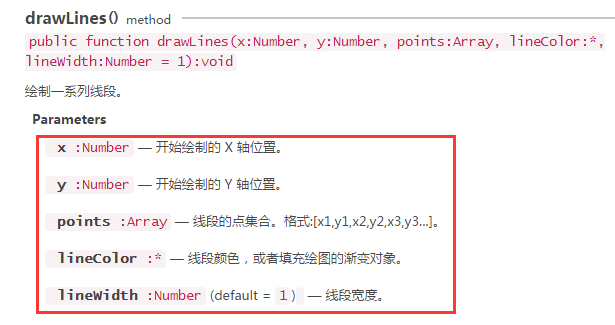
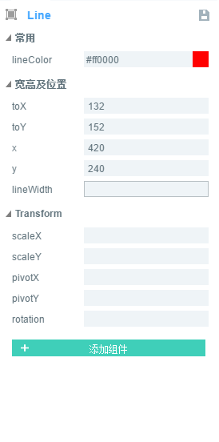
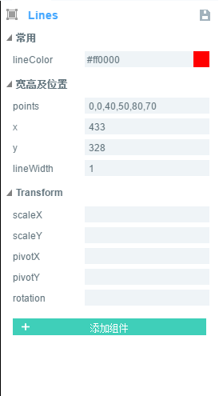

#Drawing Lines and Folds


###I. Drawing Lines

Search the laya.display.Graphics class in the API to see the various vector drawing methods of the API. Where drawLine (); is used to draw vector lines. A detailed description of the method is shown in the following figure:

​<br/>

(Fig. 1)

Let's draw a straight line with the layaair engine. The example code is as follows:


```javascript

module laya {
    import Sprite = Laya.Sprite;
    import Stage = Laya.Stage;
    import WebGL = Laya.WebGL;
 
    export class Sprite_DrawShapes {
        private sp: Sprite;
 
        constructor()
        {
            Laya.init(500, 300, WebGL);
            this.drawSomething();
        }
 
        private drawSomething(): void {
            this.sp = new Sprite();
            Laya.stage.addChild(this.sp);
            //画直线
            this.sp.graphics.drawLine(10, 58, 146, 58, "#ff0000", 3);
 
        }
    }
}
new laya.Sprite_DrawShapes();
```


After the publication, as shown in the following figure, we drew a red line.

​<br/>
(Figure 2)


###2. Drawing polygons

So how to draw a broken line? Use drawLines (); the method is OK. This method is similar to drawLine, so don't miss the "s" at the end of coding. The drawLines parameters are described in detail as shown in the following figure:

​<br/>
(Figure 3)

Next, we use the LayaAir engine to draw a broken line. The sample code is as follows:


Code operation


```typescript

module laya {
    import Sprite = Laya.Sprite;
    import Stage = Laya.Stage;
    import WebGL = Laya.WebGL;
 
    export class Sprite_DrawShapes {
        private sp: Sprite;
 
        constructor()
        {
            Laya.init(500, 300, WebGL);
            this.drawSomething();
        }
 
        private drawSomething(): void {
            this.sp = new Sprite();
            Laya.stage.addChild(this.sp);
            //画折线
            this.sp.graphics.drawLines(20, 88, [0, 0, 39, -50, 78, 0, 120, -50], "#ff0000", 3);
      }
    }
}
new laya.Sprite_DrawShapes();
```


Effect:

​<br/>
(Figure 4)

Through the code, we can see that the parameter difference between drawing a broken line and drawing a straight line starts from the third position. The third parameter is the set of broken line points of Array type, in which "0, 0" is the starting coordinate of the broken point A. "39,-50" is the starting coordinate of the breakpoint B. "78,0" is the starting coordinate of the breakpoint C, and "120,-50" is the coordinate of the end point D. But what we need to understand and notice here is that all coordinates in the third parameter are relative coordinates, which will be affected by the "20,88" of the first and second parameters. Once the "20,88" changes, the overall broken line will be affected.

You can feel the difference in the actual coding process by manually adjusting the parameters.


###Drawing Lines with LayaAirIDE Drag Controls

**Step one:**Open our LayaAirIDE, click Design Patterns, and create a new View page

​<br/>
(Fig. 5)

**Step two:**Drag the curve component from the component onto the View page and automatically generate the default line

​<br/>
(Fig. 6)

**Step three:**Modify (add/reduce) the values in the Line component properties, change the length, width, color of the line, and so on.

​<br/>
(Figure 7)

​<br/>
(Figure 8)


###4. Drawing Folded Lines with LayaAirIDE Drag Controls

**Step one:**Open our LayaAirIDE, click Design Patterns, and create a new View page

​<br/>
(Figure 9)

**Step two:**Drag the curve component in the component to the view page, and the default polyline will be generated automatically.

​<br/>
(Fig. 10)

**Step three:**Modify (add/reduce) the values in the Lines component properties, change the angle, color, width of the broken line, or add a new discount.

​<br/>
(Fig. 11)

​<br/>
(Fig. 12)

So far we have finished drawing straight lines and broken lines through the components of LayaAirIDE.