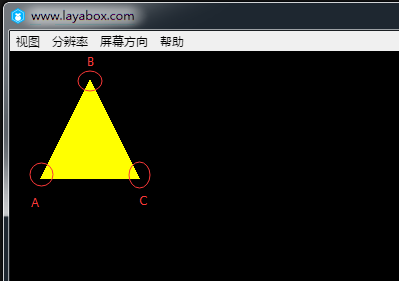
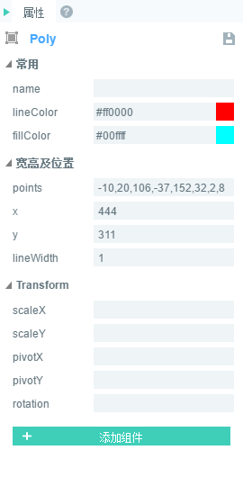

#Drawing triangles, polygons and patterns based on data


Drawing triangles, polygons and patterns based on specified path data can be realized by using the "drawpoly ();" method of LayaAir engine laya.display.Graphics class. A detailed description of the method is shown in the following figure:

​<br/>
(Fig. 1)


###Drawing triangles

Let's start by drawing a triangle with the LayaAir engine. The sample code is as follows:


```javascript

module laya {
    import Sprite = Laya.Sprite;
    import Stage = Laya.Stage;
  
    export class Sprite_DrawShapes {
        private sp: Sprite;
  
        constructor()
        {
            Laya.init(500, 300);
            this.drawSomething();
        }
  
        private drawSomething(): void {
            this.sp = new Sprite();
            Laya.stage.addChild(this.sp);
            //画三角形
            this.sp.graphics.drawPoly(30, 28, [0, 100, 50, 0, 100, 100], "#ffff00");
  
        }
    }
}
new laya.Sprite_DrawShapes();
```


The code runs as shown in the following figure:

​<br/>
(Figure 2)

From the code, we can see that the "0,100" of the third parameter of drawPoly is the coordinate of point A. "50, 0" is the coordinate of point B. "100, 100" is the coordinate of C point. After connecting the three coordinate points, fill in the color value of the fourth parameter, that is to say, draw the yellow triangle of the picture above. But what we need to understand and pay attention to here is that all coordinates in the third parameter are relative coordinates, which will be affected by the first and second coordinate parameters "30,28". Once the "30, 28" changes, the overall shape and position will be affected.


### **Drawing Polygons**

We continue to use the above code example to draw polygons by adding coordinates of the third parameter of drawPoly. The modified code is as follows:


```typescript

//画多边形
this.sp.graphics.drawPoly(30, 28, [0, 100, 50, 0, 100, 100, 75, 150, 25, 150], "#ffff00");
```


The code runs as shown in the following figure:

​<br/>
(Figure 3)

In the revised code, the D-point coordinates 75, 150 and E-point coordinates 25, 150 are added. By connecting the coordinate points and filling the color, we can draw the polygon we want. To draw polygons with more edges, add coordinate points in the above way.


### **3. Drawing patterns according to specified path data**

Through the above triangles and polygons, we have mastered the drawing usage of drawpoly. Next, we will introduce how to specify a path to draw a pentagram star through an example. The sample code is as follows:


```typescript

module laya {
    import Sprite = Laya.Sprite;
    import Stage = Laya.Stage;
  
    export class Sprite_DrawShapes {
        private sp: Sprite;
  
        constructor()
        {
            Laya.init(500, 300);
            this.drawSomething();
        }
  
        private drawSomething(): void {
            var canvas: Sprite = new Sprite();
            Laya.stage.addChild(canvas);
 
            var path: Array<number> = [];
            path.push(0, -130);//五角星A点坐标
            path.push(33, -33);//五角星B点坐标
            path.push(137, -30);//五角星C点坐标
            path.push(55, 32);//五角星D点坐标
            path.push(85, 130);//五角星E点坐标
            path.push(0, 73);//五角星F点坐标
            path.push(-85, 130);//五角星G点坐标
            path.push(-55, 32);//五角星H点坐标
            path.push(-137, -30);//五角星I点坐标
            path.push(-33, -33);//五角星J点坐标
 
            canvas.graphics.drawPoly(Laya.stage.width / 2, Laya.stage.height / 2, path, "#FF7F50");
      }
    }
}
new laya.Sprite_DrawShapes();
```


The code runs as shown in the following figure:

​<br/>
(Figure 4)

Do you feel that the readability of the code has been enhanced through the above example code? You can also change the previous triangle or polygon to experience it in this way. Mastering these foundations, you can derive many flexible uses, such as data from the server.


###4. Drawing irregular graphics (including triangles and polygons) by using LayaAirIDE control


**Step one:**Open our LayaAirIDE, click Design Patterns, and create a new View page

​<br/>
(Fig. 5)

**Step two:**Drag the curve component from the component onto the View page and automatically generate the default polygon

​<br/>
(Fig. 6)

**Step three:**Modify (add/reduce) values in Poly component attributes, change the size, color, etc. of polygons.

​<br/>
(Figure 7)

​<br/>
(Figure 8) Triangle

​<br/>
(Figure 9) Irregular polygon


So far, we have finished drawing polygons through the components of LayaAirIDE.