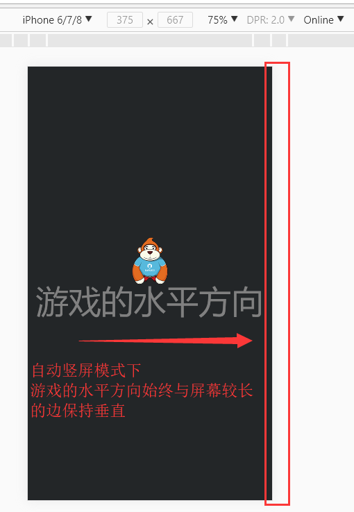
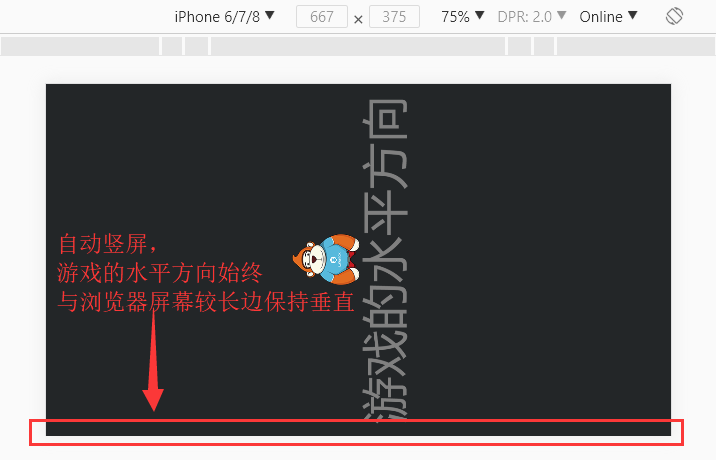

# 屏幕方向：自动横屏与自动竖屏的设置

> author:charley
>

###1. Overview of API for screen orientation settings

Open the API document of the engine, search laya. display. Stage, and find[screenMode属性](https://layaair.ldc.layabox.com/api/?category=Core&class=laya.display.Stage%3Ch1%3EscreenMode)。 As shown in Figure 1. 


(Fig. 1)

####1.1 default value none or screenMode property is not set

When the default value none or screen mode property is not set, no matter how the screen direction rotates, the horizontal direction of the game will not change with the screen rotation.

For example, the effects of Figures 2-1 and 2-2:

 


(Figure 2-1) The effect of screen mode not set when the mobile phone screen is vertical

 


(Figure 2-2) The effect of screen mode not set when the mobile phone screen is horizontal

####1.2 When screenMode attribute is horizontal, automatic horizontal screen


```java

//自动横屏，游戏的水平方向始终与浏览器屏幕较短边保持垂直
Laya.stage.screenMode = "horizontal";
```


If the screenMode attribute value is set to horizontal, the horizontal direction of the game will always be perpendicular to the shortest side of the screen, regardless of how the screen is rotated. Figures 3-1 and 3-2 are shown.

 


(Figure 3-1) The effect of screenMode attribute horizontal when the screen is vertical

 


(Figure 3-2) The effect of screenMode attribute horizontal on the horizontal screen of a mobile phone


####1.3 When screenMode attribute is vertical, automatic vertical screen


```java

//自动竖屏，游戏的水平方向始终与浏览器屏幕较长边保持垂直
Laya.stage.screenMode = "vertical";
```


If the screenMode attribute value is set to vertical, the horizontal direction of the game will always be perpendicular to the longer side of the screen, regardless of how the screen is rotated. Figures 4-1 and 4-2 are shown.

 


(Figure 4-1) The effect of screenMode attribute vertical when the mobile phone screen is vertical

  


(Figure 4-2) The effect of screenMode attribute vertical when the screen of a mobile phone is horizontal


##2. Sample source code for automatic horizontal and vertical screens

The sample source code is posted directly in this section, and developers can experience the difference of changing the value of the Laya. stage. screenMode attribute locally.

> For novice developers, just copy the source code directly without paying attention to screenMode-independent code. Emphasis is placed on experiencing and understanding the different values of screenMode attributes. The image resources involved in the source code can be replaced by any PNG resources and stored in the source code.`项目根目录/bin/res`In the directory, be careful to ensure that the resource path and name are correct.

####The screenModeDemo.ts sample code is as follows:


```javascript

function showScreen(): void
{
//图片
var img:Laya.Image = new Laya.Image();
img.centerX = 0;
img.centerY = -70;
img.skin = "res/monkey2.png";
Laya.stage.addChild(img);

//文字
var text:Laya.Label = new Laya.Label();
text.text = "游戏的水平方向";
text.color = "gray";
text.fontSize = 100;
text.centerX = 0;
text.centerY = 50;
Laya.stage.addChild(text);
}

Laya.init(0, 0, Laya.WebGL);
Laya.stage.scaleMode = "full";
Laya.stage.bgColor = "#232628";

//自动横屏，游戏的水平方向始终与浏览器屏幕较短边保持垂直
Laya.stage.screenMode = "horizontal";
//自动竖屏，游戏的水平方向始终与浏览器屏幕较长边保持垂直
//Laya.stage.screenMode = "vertical;

showScreen();
```


####On the writing of constants:

If the developer can't remember the attribute value of screenMode, the tool's code hints can be obtained by a constant way.

The screen constant is shown in Figure 5.

 


(Fig. 5)

Example Writing:


```java

//自动横屏，游戏的水平方向始终与浏览器屏幕较短边保持垂直
Laya.stage.screenMode = Laya.Stage.SCREEN_HORIZONTAL;;
//自动竖屏，游戏的水平方向始终与浏览器屏幕较长边保持垂直
//Laya.stage.screenMode = Laya.Stage.SCREEN_VERTICAL;
```


Picture resources used in the example:

 


Monkey2.png