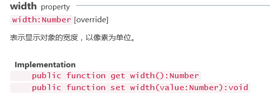
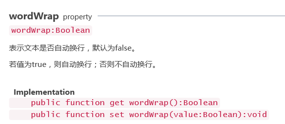

#Text Alignment-Automatic Line Breaking

As for the alignment mode, it is mainly the general horizontal alignment and vertical alignment, which can make our text center in the text area. Next, let's look at the parameters of the API, and then introduce them through the sample code. API parameters for text style in laya. display. text:

</br>

</br>

</br>

</br>

In the code that sets the font style for us, we first set a text area for this text, and then set the text in the horizontal and vertical center of the text area. Setting text alignment horizontally and vertically without setting text areas will not work.


```typescript

module laya {
	import Stage = Laya.Stage;
	import Text = Laya.Text;
	import Browser = Laya.Browser;
	import WebGL = Laya.WebGL;

export class HelloLayabox {

	constructor() {
		// 不支持WebGL时自动切换至Canvas
		Laya.init(Browser.clientWidth, Browser.clientHeight, WebGL);

		Laya.stage.alignV = Stage.ALIGN_MIDDLE;
		Laya.stage.alignH = Stage.ALIGN_CENTER;

		Laya.stage.scaleMode = "showall";
		Laya.stage.bgColor = "#232628";

        var txt:Laya.Text = new Laya.Text();
        //设置文本内容
        txt.text = "hello_world";
         //设置文本区背景
        txt.bgColor = "#c30c30";
         //设置文本的宽高
        txt.width = 400;
        txt.height = 400;
        //设置文本水平居中
        txt.align = "center";
        //设置文本垂直居中
        txt.valign = "middle";
        Laya.stage.addChild(txt);
		
	}
  }
}
new laya.HelloLayabox();
```


</br>

If other alignment modes are needed in actual coding, please refer to the align and valign values in API to find the horizontal alignment mode and vertical alignment mode suitable for the project.

If the text content exceeds the text area we set up, it will not show the content beyond the stage. At this time, we need to use automatic line breaking to display our overly long text.

API parameters:

</br>

In the above code, set the text content of TXT a little more, and then add the code of automatic line breaking.

To set the width and height of the text area, otherwise the text will be automatically wrapped according to the default text width. The code is as follows:


```typescript

module laya {
    import Stage = Laya.Stage;
    import Text = Laya.Text;
    import Browser = Laya.Browser;
    import WebGL = Laya.WebGL;

    export class HelloLayabox { 
        constructor() {
            // 不支持WebGL时自动切换至Canvas
            Laya.init(Browser.clientWidth, Browser.clientHeight, WebGL);

            Laya.stage.alignV = Stage.ALIGN_MIDDLE;
            Laya.stage.alignH = Stage.ALIGN_CENTER;

            Laya.stage.scaleMode = "showall";
            Laya.stage.bgColor = "#232628";

            var txt:Laya.Text = new Laya.Text();
            //设置文本内容
            txt.text = "Layabox是HTML5引擎技术提供商与优秀的游戏发行商，面向AS/JS/TS开发者提供HTML5开发技术方案！";
            //设置文本区背景
            txt.bgColor = "#c30c30";
            //设置文本的宽高
            txt.width = 400;
            txt.height = 400;
            //设置文本水平居中
            txt.align = "center";
            //设置文本垂直居中
            txt.valign = "middle";
            //设置自动换行
            txt.wordWrap = true;
            Laya.stage.addChild(txt);            
        }
    }
}
new laya.HelloLayabox();
```


</br>

Here you can see that the automatic line break we set has been implemented, and all the text is displayed in this text area.