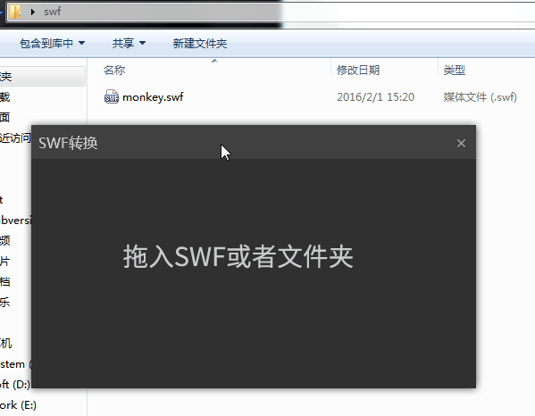

# SWF动画在LayaAir引擎中使用

###1. The Prerequisite of Using SWF Animation in LayaAir Engine

In order to support Flash Page Swimming project to be quickly ported to HTML5 project, LayaAir engine provides SWF file conversion tool, which converts native SWF file into LayaAir engine recognizable format, but conversion tool**Special content such as text, shape gradient, masking, code is not supported in SWF files**。 If the above content is included, the conversion will not achieve the effect in the original SWF or the conversion failure.


> If the developer is not familiar with Flash and SWF animation file production and export related knowledge, do not need to continue reading this article, recommend the use of LayaAirIDE animation.
>


###2. Converting SWF Animation to LayaAir Engine Recognition Format

First prepare the animation files that conform to the SWF conversion specification, and then open the design pattern of LayaAirIDE.

Menu selection`工具`>`SWF转换`You can open the SWF conversion tool panel, as shown in Figure 1.

 


(Fig. 1)

Newly opened`SWF转换`In the panel, drag in SWF animations or folders that conform to the transformation specification, as shown in Figure 2.

  


(Motion 2)

click`开始转换`As shown in Figure 3. By default, one will be generated in the same directory of swf`output`After successful conversion, a new SWF and Atlas file will be generated in the output directory, as well as a picture folder (* After checking the option to package the atlas, the picture folder will not be used, and the non-atlas mode will be used *).

   


(Figure 3)

**Tips**:

- If a complex SWF file generates multiple bitmaps, it is recommended that`开始转换`Pre-confirmation check`是否打包为图集`。

- By default, it is generated in the output directory. Developers can enter the path bar and click on it.`更改`Change the output directory.

- The new SWF generated by the transformation tool cannot be converted again.

​


###3. Using SWF animation after conversion

####3.1 Replicate converted SWF resources to projects

Before using SWF animation, we will generate the transformation tool`.swf`Format file and`图集文件`Copy to the project's resource directory (* This example is RES / SWF / directory *) in the project root directory, as shown in Figure 4.

  


(Fig. 4)

**Tips**:

##- The folder in Motion 4 does not need to be duplicated according to the operation in this example. If there is no atlas, only one SWF and one image resource folder will be generated, then the folder will need to be duplicated in the past. 需要注意的是，LayaAirIDE里不支持文件夹拖动复制，如果复制文件夹，需要打开系统的资源管理器，在系统内复制粘贴。


####3.2 Learn about the API for playing SWF animation: MovieClip

The LayaAir engine uses the converted SWF animation, which needs to be used**Class MovieClip**The API description is shown in Figure 5. API links:[https://layaair.ldc.layabox.com/api/index.html?category=Core&class=laya.ani.swf.MovieClip](https://layaair.ldc.layabox.com/api/index.html?category=Core&class=laya.ani.swf.MovieClip)

 


(Fig. 5)

####3.3 Implementing SWF animation playback with code

An example of playing SWF animation is shown in the following code:

Entry class MovieClipSample.as


```typescript

module LayaDEMO { 
{
  	import MovieClip = Laya.MovieClip;
	
	export class MovieClipSample 
	{
		
		constructor() 
		{
			//初始化舞台
			Laya.init(1334, 750);
			
			//创建一个 MovieClip 实例
			var mc:MovieClip = new MovieClip();
			
			//加载swf资源,load方法的第二个参数不设置为散图模式加载，设置为true是采用图集方式加载。
			mc.load("res/swf/monkey.swf",true);
			
			//添加到舞台
			Laya.stage.addChild(mc);

		}
	}
}
```

