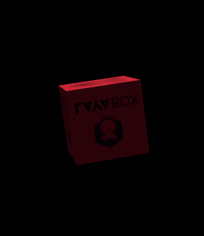
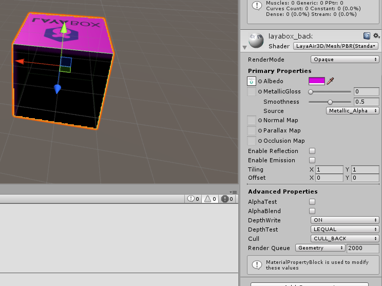
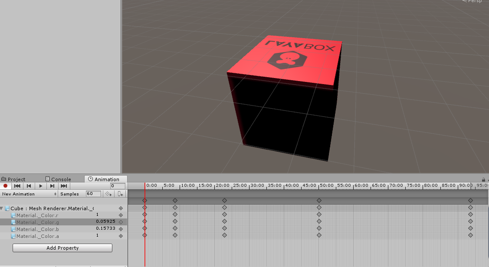
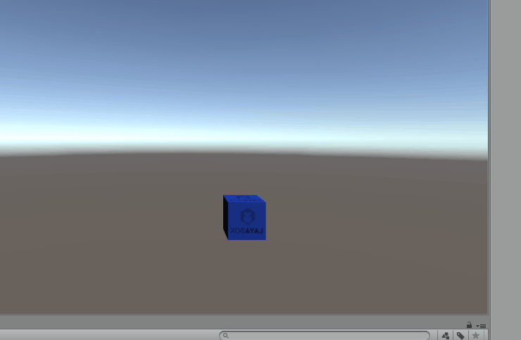

# 材质动画的使用

###### *version :2.1.0beta   Update:2019-6-13*

材质动画则是以改变材质的颜色与贴图方式进行动画。

在三维软件中，例如3ds max中虽然可以制作材质相关动画，但导出成FBX格式时，unity并不能识别，也无法导出成LayaAir 3D引擎所识别的材质动画。因此游戏模型的材质动画必须在unity中制作，并进行某些设置导出后才能为LayaAir 3D引擎使用。

下面我们就用霓虹灯材质动画（图1）效果来讲解在unity中创建动画并导出使用方法，步骤如下。

<br>(图1)

#### 修改材质类型

在Unity中拖入一个cube，然后修改材质。

<br>(图2)

#### 创建材质动画

1、修改好材质类型后，同样选择要制作动画的模型，点击菜单栏window下Animation打开动画编辑界面，快捷键Ctrl+6。

2、点击create按钮创建动画并取名，本例中取名使用的默认名字New Animation，保存后在资源管理器中会生成动画文件New Animation。

3、选择时间轴上时间，修改材质的漫反射颜色，重复操作多调整几个颜色。

4、修改动画帧的曲线变化，默认为线形滑动动画，不符合我们的动画需求，修改为恒量变化，播放查看，材质动画按需求全部完成。当然，如果需要制作流水、浮云飘动动画可以用线形变化方式。

<br>(图3)

#### 创建动画控制器

与之前的创建动画控制器相同，在资源管理器中右键创建动画控制器，取名为Cube 1，双击打开后，将上一步创建的动画文件New Animation拖拽入动画控制器中。

选择模型，将动画控制器拖拽入模型的动画组件中，点击unity运行，我们就可以看到动画按我们的需求播放了（图4）。

<br>(图4)

#### 导出并使用动画资源

在unity中编辑好动画，用LayaAir插件导出场景类型.ls资源，如果导出时没有报错，将资源拷贝到项目的资源目录下，那么在项目中可以直接用 `Scene3D.load()` 方法加载或预加载。

参考以下代码，因为变色太慢我们调整了速度，效果如（图1）。

```typescript
//加载场景
Laya.Scene3D.load("res/threeDimen/scene/materialScene/Conventional/layaScene.ls", Laya.Handler.create(this, function(scene) {
    Laya.stage.addChild(scene);
    var camera = scene.getChildByName("Main Camera") as Laya.Camera;
    camera.addComponent(CameraMoveScript);
}));

```

