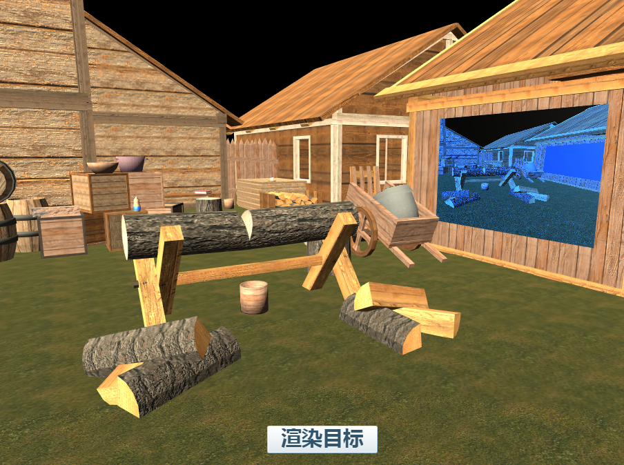

# 目标纹理的使用

###### *version :2.0.1beta   Update:2019-3-19*

​	目标纹理就是指摄像机的**RenderTarget**属性。它将摄像机的视图放置在一个纹理上，该纹理可以被应用到另一个对象。这样就可以方便地创建镜子，监控摄像机等效果了。注意的是使用了该属性的摄像机将禁用渲染到屏幕的功能。

​	这里我们使用的示例（[demo地址](https://layaair.ldc.layabox.com/demo2/?language=ch&category=3d&group=Camera&name=RenderTargetCamera)）的代码。camera为场景渲染摄像机，renderTargetCamera为开启RenderTarget属性的摄像机。

```typescript
//设置目标纹理
renderTargetCamera.renderTarget = new Laya.RenderTexture(2048, 2048);
//设置顺序
renderTargetCamera.renderingOrder = -1;
```

在LayaAir引擎中渲染顺序是越小渲染优先度越高。

```typescript
//获取场景中预先放置的屏幕
var renderTargetObj = scene.getChildAt(0).getChildByName("RenderTarget");
//在按钮点击后  将目标纹理赋值给屏幕。
this.changeActionButton.on(Laya.Event.CLICK, this, function(){
			(renderTargetObj.meshRenderer.material as BlinnPhongMaterial).albedoTexture = renderTargetCamera.renderTarget;
 });
```

<br>(图1)  按钮点击前

<br>(图2) 点击按钮后