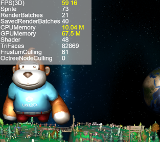

# 销毁资源并释放内存

###### *version :2.0.2beta   Update:2019-5-8*

##### 关于为什么要资源释放:

在LayaAir 3D游戏开发中，资源释放非常重要。3D资源包括了模型、贴图、材质、动画等，为了达到好的画面效果，文件会比2D大很多，而3D引擎基本所有资源都会放入GPU中进行计算渲染，因此占用很多的显存。当游戏关卡的不断加载，游戏不断深入，放入显存中的资源越来越多，如果不释放资源，那么游戏最后终将崩溃。

显存不像内存，内存有垃圾回收机制，而显存不一样，必须手动释放，因此显存的资源释放必须受到重视！

本次使用的示例为：在 **资源加载篇** 的 **资源加载** 的示例上简单修改得来。

对单个的资源销毁释放内存，需要调用该资源对象的`destroy()`方法。

> 网格示例使用的网格与单独预设加载使用的是同一个网格，所以我们在写这个示例前，先复制了LayaMonkey文件夹，命名为LayaMonkey2方便与预设加载示例区分。如果对一个还在使用的网格进行销毁，会导致报错。

```typescript
//加载Mesh
Laya.Mesh.load("res/threeDimen/skinModel/LayaMonkey2/Assets/LayaMonkey/LayaMonkey-LayaMonkey.lm", Laya.Handler.create(this, function(mesh:Laya.Mesh):void {
  	........
    //上面省略，我们再网格加载完成3秒后对该网格进行销毁
    Laya.timer.once(3000,this,function ():void
    {
        //销毁了使用了该网格的精灵
        layaMonkey.destroy();
        //对网格进行销毁
        mesh.destroy();        
    });
}));
```

**加载完成**

在资源全部加载完成之后，我们可以看到 67.26 M 的显存，10.13 M 的内存。

如果单纯的销毁使用该网格的精灵，不对网格资源本身做处理，显存是不会有减少的，网格资源还是在显存中。（开发者可以自行注释掉对网格销毁那一行代码查看效果）

<br>(图1)

**执行销毁后**

<br>(图2)

​		在执行销毁代码后，可以明显的看到，还有 67.5 M 显存，10.04 M 内存。网格模型被移出且资源已被销毁。

​		对应其他的资源类型，像Mesh,Material,Texture2D等可以使用相同的方法销毁资源。
