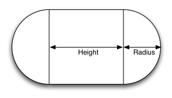
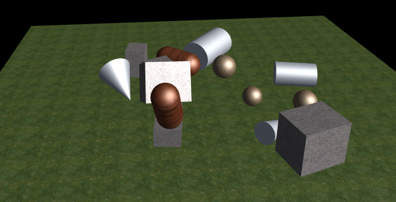
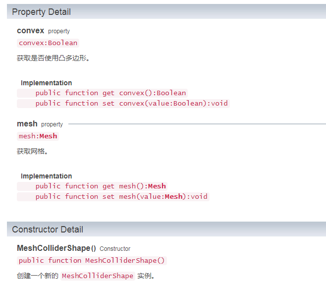
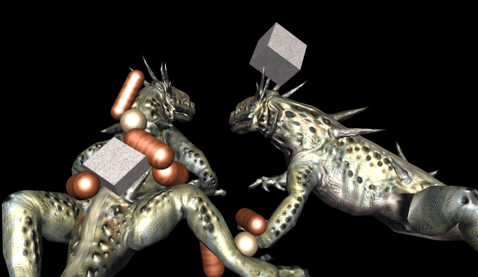
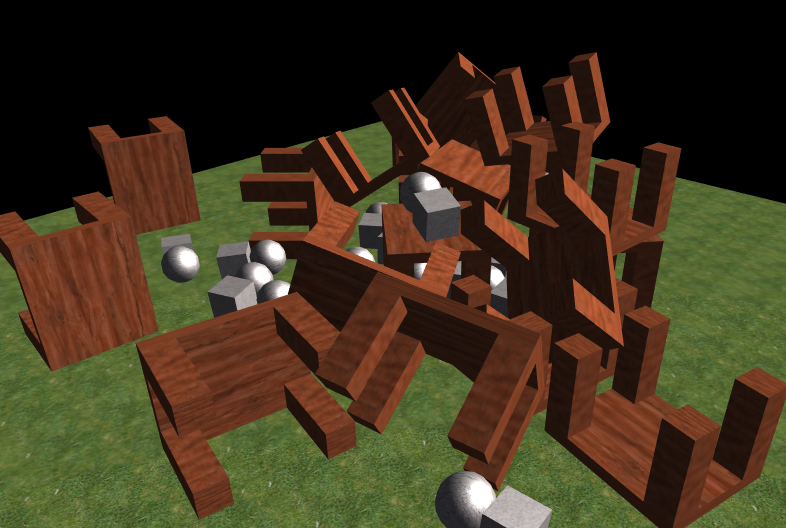

# 多种碰撞器形状

###### *version :2.1.1   Update:2019-7-19*

`ColliderShape`碰撞器形状，是刚体与碰撞器上的属性，是模型在3D世界中进行物理运算与碰撞的形状盒。ColliderShape是所有碰撞盒的父类。([API地址](https://layaair.ldc.layabox.com/api2/Chinese/index.html?category=Core&class=laya.d3.physics.shape.ColliderShape))

<br>(图1)

下面我们来介绍下目前LayaAir3D中所有支持的碰撞器形状。

#### (1) BoxColliderShape盒

盒形是一个基本的方形碰撞原型。盒子可以被调节成不同大小的长方体，用于制作墙体，门等正正方方的碰撞个体，也能替代车辆等交通工具的外壳，来计算碰撞。如果只是用于盒子或者箱子上，那就更完美了。

<br>(图2)

```typescript
//随机生成坐标值
var sX:number = Math.random() * 0.75 + 0.25;
var sY:number = Math.random() * 0.75 + 0.25;
var sZ:number = Math.random() * 0.75 + 0.25;
//创建盒型MeshSprite3D
var box = scene.addChild(new Laya.MeshSprite3D(Laya.PrimitiveMesh.createBox(sX, sY, sZ))) as Laya.MeshSprite3D;
//创建刚体碰撞器
var rigidBody:Laya.Rigidbody3D = box.addComponent(Laya.Rigidbody3D);
//创建盒子形状碰撞器
var boxShape:Laya.BoxColliderShape = new Laya.BoxColliderShape(sX, sY, sZ);
//设置盒子的碰撞形状
rigidBody.colliderShape = boxShape; 
//设置刚体的质量
rigidBody.mass = 10;
```

#### (2) SphereColliderShape球

球体是一个基本的球体形状的圆形碰撞盒。可以通过设置半径来调整球体。常用于球形物体的碰撞检测。

<br>(图3)

```typescript
//随机生成半径大小
var radius:number = Math.random() * 0.2 + 0.2;
//创建球型MeshSprite3D
var sphere = scene.addChild(new Laya.MeshSprite3D(Laya.PrimitiveMesh.createSphere(radius))) as Laya.MeshSprite3D;
//添加刚体碰撞器
var rigidBody = sphere.addComponent(Laya.Rigidbody3D);
//创建球型碰撞器
var sphereShape = new Laya.SphereColliderShape(radius);
//设置刚体碰撞器的形状
rigidBody.colliderShape = sphereShape;
//设置刚体的质量
rigidBody.mass = 10;
```

#### (3) CapsuleColliderShape胶囊

胶囊体由一个圆柱体连接两个半球体组成。常用于角色控制器，或者和其他的组合成不规则形状。

玩家可以自己调整半径和高度调整胶囊体。

<br>(图4)

<br>(图5)

```typescript
var raidius:number = Math.random() * 0.2 + 0.2;
var height:number = Math.random() * 0.5 + 0.8;
//创建胶囊MeshSprite3D
var capsule = scene.addChild(new Laya.MeshSprite3D(Laya.PrimitiveMesh.createCapsule(raidius, height))) as Laya.MeshSprite3D;
//创建刚体碰撞器
var rigidBody:Laya.Rigidbody3D = capsule.addComponent(Laya.Rigidbody3D);
//创建球型碰撞器
var sphereShape:Laya.CapsuleColliderShape = new Laya.CapsuleColliderShape(raidius, height);
//设置刚体碰撞器的形状
rigidBody.colliderShape = sphereShape;
//设置刚体碰撞器的质量
rigidBody.mass = 10;
```

#### (4) CylinderColliderShape圆柱

圆柱体常用于场景的柱子等圆柱体的物体碰撞。可以设置圆柱体的半径和高度来调整碰撞体。

<br>(图6)

```typescript
var raidius:number = Math.random() * 0.2 + 0.2;
var height:number = Math.random() * 0.5 + 0.8;
//创建圆锥MeshSprite3D
var cylinder:Laya.MeshSprite3D = new Laya.MeshSprite3D(Laya.PrimitiveMesh.createCylinder(raidius, height));
scene.addChild(cylinder);
//创建刚体碰撞器
var rigidBody:Laya.Rigidbody3D = cylinder.addComponent(Laya.Rigidbody3D);
//创建球型碰撞器
var cylinderShape:Laya.CylinderColliderShape = new Laya.CylinderColliderShape(raidius, height);
//设置刚体碰撞器的形状
rigidBody.colliderShape = cylinderShape;
//设置刚体碰撞器的质量
rigidBody.mass = 10;
```

#### (5) ConeColliderShape圆锥

圆锥体可以同过设置圆锥的高和半径来调整碰撞体。

<br>(图7)

```typescript
var raidius:number = Math.random() * 0.2 + 0.2;
var height:number = Math.random() * 0.5 + 0.8;
//创建圆锥MeshSprite3D
var cone:Laya.MeshSprite3D = new Laya.MeshSprite3D(Laya.PrimitiveMesh.createCone(raidius, height));
scene.addChild(cone);
//设置材质
cone.meshRenderer.material = mat4;
//设置位置
cone.transform.position = new Laya.Vector3(Math.random() * 4 - 2, 10, Math.random() * 4 - 2);
var rigidBody:Laya.Rigidbody3D = cone.addComponent(Laya.Rigidbody3D);
//创建球型碰撞器
var coneShape:Laya.ConeColliderShape = new Laya.ConeColliderShape(raidius, height);
//设置刚体碰撞器的形状
rigidBody.colliderShape = coneShape;
//设置刚体碰撞器的质量
rigidBody.mass = 10;	
```

> **我们把前面这5种碰撞器形状一般称之为原型。在示例（[demo地址](https://layaair.ldc.layabox.com/demo2/?language=ch&category=3d&group=Physics3D&name=PhysicsWorld_BaseCollider)）可以看到效果。**

<br>(图8)

#### (6) MeshColliderShape网格型

网格形利用一个网格资源并在其上构建的。对于复杂网状模型上的碰撞检测，它要比应用原型碰撞器精确的多。网格型与前面的原型最大的区别就是可以自定义网格来规定碰撞范围，这让网格型更为灵活。实际上前面的原型也可以说是特殊的网格型，是LayaAir3D内置的一些基础的碰撞形状。

<br>(图9)

**convex属性：2.0.1 BATE暂不支持该属性，将在今后的版本支持。**

下面的代码源自于官方示例（[demo地址](https://layaair.ldc.layabox.com/demo2/?language=ch&category=3d&group=Physics3D&name=PhysicsWorld_MeshCollider)），示例中将两个蜥蜴作为了静态碰撞器，随机掉落刚体展示效果。

```typescript
var lizard = scene.addChild(new Laya.MeshSprite3D(mesh)) as Laya.MeshSprite3D;
//给对象添加物理碰撞器组件
var lizardCollider:Laya.PhysicsCollider = lizard.addComponent(Laya.PhysicsCollider);
//实例化一个网格碰撞盒
var meshShape:Laya.MeshColliderShape = new Laya.MeshColliderShape();
//设置网格碰撞盒的网格
meshShape.mesh = mesh;
//设置碰撞盒为网格型
lizardCollider.colliderShape = meshShape;
//设置摩擦力
lizardCollider.friction = 2;
//设置弹力
lizardCollider.restitution = 0.3;
```

<br>(图10)

#### (7) CompoundColliderShape复合型

复合型是多个原型组合而成的一个碰撞器形状。当你在碰撞器上使用了一组复杂的网格，且不使用网格碰撞器时，复合型这是很好的选择。创建复合碰撞器，只需给你的复合型碰撞器对象创建子对象，然后为每个子对象添加原型碰撞器。这就允许你简单地移动、旋转或者伸缩每个子碰撞器，他们是各自独立的。

下面的代码来自于官方示例（[demo地址](https://layaair.ldc.layabox.com/demo2/?language=ch&category=3d&group=Physics3D&name=PhysicsWorld_CompoundCollider)），代码中使用使用了5个BoxColliderShape组成一张桌子。

```typescript
Laya.Mesh.load("res/threeDimen/Physics/table.lm", Laya.Handler.create(this, function(mesh:Laya.Mesh) {
    //....省略中间
    //读取导出的桌子模型
    var table = scene.addChild(new Laya.MeshSprite3D(mesh)) as Laya.MeshSprite3D;
	//给桌子加刚体并且设置刚体属性
    var rigidBody = table.addComponent(Laya.Rigidbody3D) as Laya.Rigidbody3D;
    rigidBody.mass = 10;
    rigidBody.friction = 1;
	//实例化一个组合型碰撞器形状
    var compoundShape:Laya.CompoundColliderShape = new Laya.CompoundColliderShape();
	//组合一张桌子
    
  	var boxShape:Laya.BoxColliderShape = new Laya.BoxColliderShape(0.5, 0.4, 0.045);
    //获取本地偏移
    var localOffset:Laya.Vector3 = boxShape.localOffset;
    //修改偏移
    localOffset.setValue(0, 0, 0.125);
    boxShape.localOffset = localOffset;
    //往组合碰撞器形状中添加该碰撞器形状
    compoundShape.addChildShape(boxShape);

    var boxShape1:Laya.BoxColliderShape = new Laya.BoxColliderShape(0.1, 0.1, 0.3);
    boxShape1.localOffset = new Laya.Vector3(-0.2, -0.148, -0.048);
    compoundShape.addChildShape(boxShape1);

    var boxShape2:Laya.BoxColliderShape = new Laya.BoxColliderShape(0.1, 0.1, 0.3);
    var localOffset2:Laya.Vector3 = boxShape2.localOffset;
    localOffset2.setValue(0.2, -0.148, -0.048);
    boxShape2.localOffset = localOffset2;
    compoundShape.addChildShape(boxShape2);

    var boxShape3:Laya.BoxColliderShape = new Laya.BoxColliderShape(0.1, 0.1, 0.3);
    var localOffset3:Vector3 = boxShape3.localOffset;
    localOffset3.setValue(-0.2, 0.153, -0.048);
    boxShape3.localOffset = localOffset3;
    compoundShape.addChildShape(boxShape3);

    var boxShape4:Laya.BoxColliderShape = new Laya.BoxColliderShape(0.1, 0.1, 0.3);
    var localOffset4:Laya.Vector3 = boxShape4.localOffset;
    localOffset4.setValue(0.2, 0.153, -0.048);
    boxShape4.localOffset = localOffset3;
    compoundShape.addChildShape(boxShape4);

    rigidBody.colliderShape = compoundShape;

}));

```

<br>(图11)

