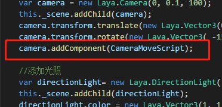
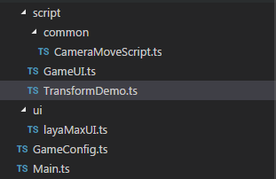

# 	关于官网下载的DEMO如何使用

​	在新的示例全部测试并且检测过之后才会发布新的官方示例。所以新文档所使用到的示例暂时无法直接在官网示例处查看。

​	为了暂时性解决该问题，官方将在使用新示例的处将源码的git地址附带上，需要开发者自行配置地址。

​	在新示例正式发布后文档会同步再更新。

此处将讲解下载到的demo如何使用(如果知道如何使用可以直接跳过该文档)。

**Tip:**建议开发者在运行下载的示例一直使用一个项目。那样就不用再多次修改资源地址。示例所使用的的资源地址根目录：[资源](<https://github.com/layabox/layaair-demo/tree/master/h5/res/threeDimen>)。

这里我们使用**图形基础篇的Transform**示例来做例子([地址](<https://github.com/layabox/layaair-demo/blob/master/h5/3d/ts/LayaAir3D_Sprite3D/TransformDemo.ts>))。

拿到代码后，打开ide创建的示例项目。我们将下载到的资源放到`bin/res`目录下。

<br>(图1)

然后在`src/script`文件夹下创建一个新文件。注意名字需要从**地址中复制**。(这里命名为TransformDemo.ts)

<br>(图2)

将复制的代码复制进去，如果是使用`git`克隆获取的文件可以直接放到该文件夹下。当然这时候会有不少报错。

先给TransformDemo设置个默认导出。

```typescript
export default class TransformDemo
    
    ///同时需要注释掉最顶层的
    // new TransformDemo();
```

改完后我们发现还有个错误

<br>(图3)

简单的处理方案是直接注释掉这行和图4这一行，就可以直接运行了。这个脚本是摄影机移动脚本，是方便开放者从各种角度观察示例。（w前进移动，s后退移动，a向左移动，d向右移动，鼠标左键按下拖动可以调整视角）。

<br>(图4)

或者我们从common文件夹下找到`CameraMoveScript.ts`拷贝到`scrpit/common`文件夹下。

<br>(图)

在这最后，我们只需要重写`Main.ts`文件就能运行示例了。因为在demo是自带各种初始化的，所以可以直接不用管之前的Main逻辑。我们来看下修改后的Main。

```typescript
import TransformDemo from "./script/TransformDemo";
class Main {
	constructor() {
		new TransformDemo();
	}

}
//激活启动类
new Main();
```

然后F5运行就能看到效果了。

<br>(图6)

**新增新的示例只需要在script文件夹下继续新增示例代码，然后使用main去调起即可。**