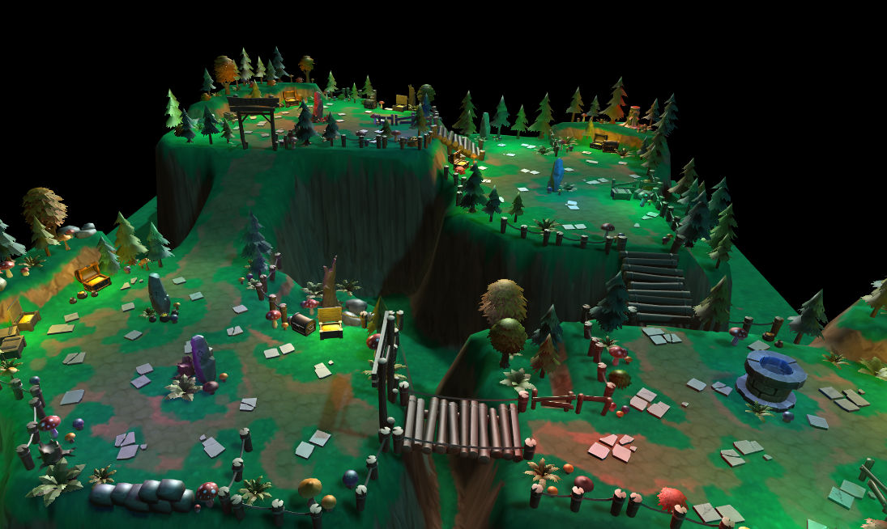
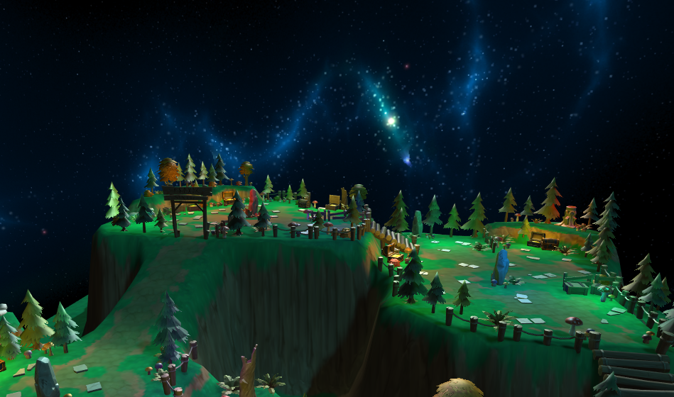
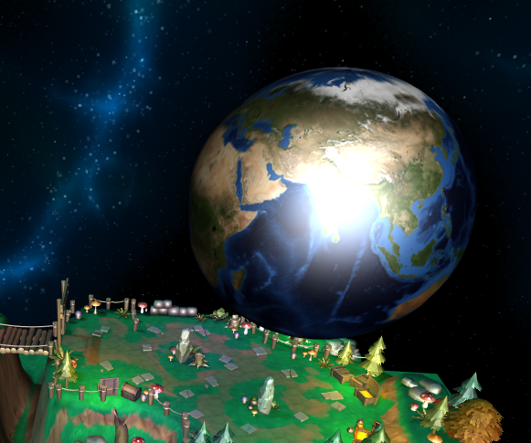
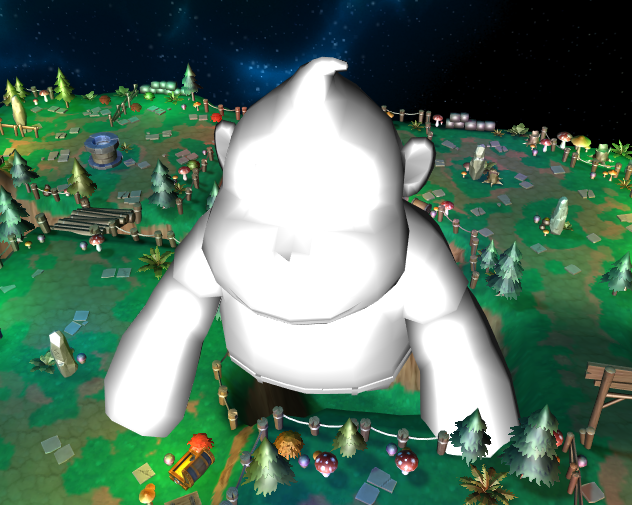
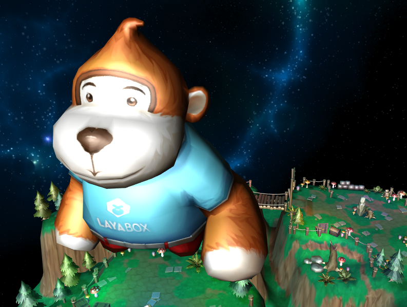
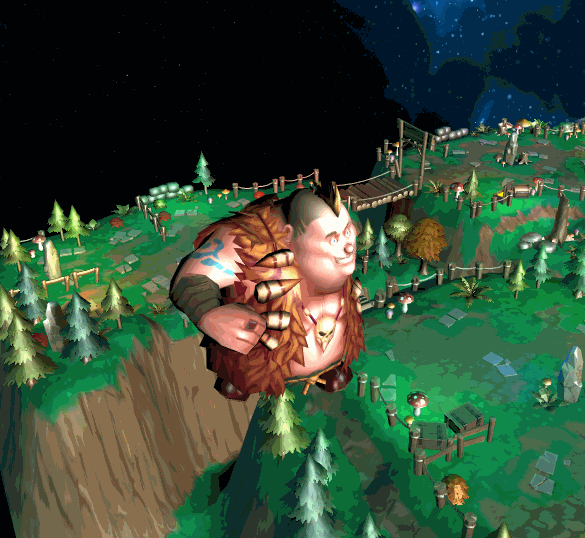

# 资源加载

###### *version :2.0.1beta   Update:2019-3-19*

讲完了资源的各种类型，我们来实际操作进行加载这些资源。本次示例地址（[demo地址](https://layaair.ldc.layabox.com/demo2/?language=ch&category=3d&group=Resource&name=LoadResourceDemo)）;

### 单个资源加载

#### 1. 场景加载

单个场景加载的时候，使用的Scene3D.load方法。

```typescript
//3d场景加载
Laya.Scene3D.load("res/TerrainScene/XunLongShi.ls",Laya.Handler.create(null,function(scene){
    //加载完成获取到了Scene3d
    Laya.stage.addChild(scene);
    //获取摄像机
    var camera = scene.getChildByName("Main Camera");
    //清除摄像机的标记
	camera.clearFlag = Laya.BaseCamera.CLEARFLAG_SKY;
    
    //添加光照
    var directionLight = scene.addChild(new Laya.DirectionLight());
    directionLight.color = new Laya.Vector3(1, 1, 1);
    directionLight.transform.rotate(new Laya.Vector3( -3.14 / 3, 0, 0));
}));
```

查看加载后的效果（图1）。

<br>(图片1)

#### 2. 材质加载

在单个材质进行加载的时候，我们使用的BaseMaterial.load方法。在这次示例里，我们加载了一个天空盒给上面的示例摄影机加上。

```typescript
//材质加载		
Laya.BaseMaterial.load("res/threeDimen/skyBox/skyBox2/skyBox2.lmat", Laya.Handler.create(null, function(mat){
    //获取相机的天空渲染器
    var skyRenderer:Laya.SkyRenderer = camera.skyRenderer;
    //创建天空盒的mesh
    skyRenderer.mesh = Laya.SkyBox.instance;
    //设置天空盒材质
    skyRenderer.material = mat;
}));
```

来看下效果（图2）。

<br>(图2)

#### 3. 纹理加载

​	加载单个纹理使用Texture2D.load方法。这里我们创建了一个正方体，并且将加载的纹理设置为他的纹理。这个操作实际上和3D简单示例的操作是相同的。

```typescript
//加载纹理
Laya.Texture2D.load("res/threeDimen/texture/earth.png", Laya.Handler.create(null, function(tex) {
    //使用纹理
    var earth1 = scene.addChild(new Laya.MeshSprite3D(PrimitiveMesh.createSphere(5, 32, 32)));
    earth1.transform.translate(new Laya.Vector3(10, 20, -8));
    var earthMat = new Laya.BlinnPhongMaterial();
    earthMat.albedoTexture = tex;
    earthMat.albedoIntensity = 1;
    earth1.meshRenderer.material = earthMat;
}));
```

效果如下（图3）:

<br>(图3)

#### 4. 网格加载

​	单个网格加载使用的 Mesh.load 方法。

```typescript
//加载Mesh
Laya.Mesh.load("res/threeDimen/skinModel/LayaMonkey/Assets/LayaMonkey/LayaMonkey-LayaMonkey.lm", Laya.Handler.create(null,function(mesh) {
    var layaMonkey = sprite3D.addChild(new Laya.MeshSprite3D(mesh));
    layaMonkey.transform.localScale = new Laya.Vector3(4, 4, 4);
    layaMonkey.transform.rotation = new Laya.Quaternion(0.7071068, 0, 0, -0.7071067);
    layaMonkey.transform.translate(new Laya.Vector3(0, 0, 7));
}));
```

加载完成后的效果（图4）：

<br>(图4)

#### 5. 预设加载

 单个预设的加载，我们使用Sprite3D.load方法。

```typescript
//加载精灵
Laya.Sprite3D.load("res/threeDimen/skinModel/LayaMonkey/LayaMonkey.lh", Laya.Handler.create(null, function(sp){
    var layaMonkey2 = scene.addChild(sp);
    layaMonkey2.transform.localScale = new Laya.Vector3(4, 4, 4);
    layaMonkey2.transform.translate(new Laya.Vector3(-10, 13, 0));
}));
```

加载完成后的效果（图5）：

<br>(图5)

#### 6. 动画加载

单个动画加载，本次示例使用的角色导出时是有动画信息的，在导出后我们删除`.lh`文件中动画相关的信息，只是演示使用。在后期使用中替换骨骼动画可以使用这种方式。

```typescript
//加载胖子精灵
Laya.Sprite3D.load("res/threeDimen/skinModel/BoneLinkScene/PangZiNoAni.lh", Laya.Handler.create(null, function(sp) {
    pangzi = scene.addChild(sp);
    pangzi.transform.localScale = new Laya.Vector3(4, 4, 4);
    pangzi.transform.translate(new Laya.Vector3(-20, 13, 0));
    //获取动画组件
    pangziAnimator = pangzi.getChildAt(0).getComponent(Laya.Animator);
    //AnimationClip的加载要放在Avatar加载完成之后
   Laya.AnimationClip.load("res/threeDimen/skinModel/BoneLinkScene/Assets/Model3D/PangZi-Take 001.lani", Laya.Handler.create(null, function(aniClip) {
        //创建动作状态
        var state1 = new Laya.AnimatorState();
        //动作名称
        state1.name = "hello";
        //动作播放起始时间
        state1.clipStart = 0 / 581;
        //动作播放结束时间
        state1.clipEnd = 581 / 581;
        //设置动作
        state1.clip = aniClip;
        //设置动作循环
        state1.clip.islooping = true;
        //为动画组件添加一个动作状态
        pangziAnimator.addState(state1);
        //播放动作
        pangziAnimator.play("hello");
    }));
}));
```

<br>(图6)

### 批量预加载资源

​	上面的例子Scene.load()方法是资源的异步加载，有时候3D的资源比较大，需要预加载来来提升首屏的体验。这时候我们可以用加载器预加载。

​	2D游戏资源我们是用**Laya.loader.load()**方法预加载，而3D资源必须用Laya.loader.create()这个方法。在加载完成后，我们就可以直接使用**Laya.loader.getRes()**这个方法来获取加载完成的资源。请参考的相关的 [API描述](https://layaair.ldc.layabox.com/api2/Chinese/index.html?category=Core&class=laya.net.LoaderManager) 。

```typescript
......
//批量预加载方式
PreloadingRes(){
    //预加载所有资源
    var resource:Array = ["res/threeDimen/scene/TerrainScene/XunLongShi.ls",
                          "res/threeDimen/skyBox/skyBox2/skyBox2.lmat",
                          "res/threeDimen/texture/earth.png",                      "res/threeDimen/skinModel/LayaMonkey/Assets/LayaMonkey/LayaMonkey-LayaMonkey.lm",
                          "res/threeDimen/skinModel/LayaMonkey/LayaMonkey.lh", 
                          "res/threeDimen/skinModel/BoneLinkScene/PangZiNoAni.lh",
                          "res/threeDimen/skinModel/BoneLinkScene/Assets/Model3D/PangZi-Take 001.lani",];
    Laya.loader.create(resource, Laya.Handler.create(this, this.onPreLoadFinish));
}

onPreLoadFinish() {
    //初始化3D场景
    _scene = Laya.stage.addChild(Laya.Loader.getRes("res/threeDimen/scene/TerrainScene/XunLongShi.ls"));
    //获取相机
    var camera = _scene.getChildByName("Main Camera");
    //设置相机清楚标记，使用天空
    camera.clearFlag = Laya.BaseCamera.CLEARFLAG_SKY;
    //调整相机的位置
    camera.transform.translate(new Laya.Vector3(0, 45, -60));
    camera.transform.rotate(new Laya.Vector3(0, 180, 0), false, false);
    //相机视角控制组件(脚本)
    camera.addComponent(CameraMoveScript);

    //添加光照
    var directionLight = _scene.addChild(new Laya.DirectionLight());
    //光照颜色
    directionLight.color = new Laya.Vector3(1, 1, 1);
    directionLight.transform.rotate(new Laya.Vector3(-3.14 / 3, 0, 0));

    //使用材质
    var skyboxMaterial = Laya.Loader.getRes("res/threeDimen/skyBox/skyBox2/skyBox2.lmat") as BaseMaterial;
    var skyRenderer = camera.skyRenderer;
    skyRenderer.mesh = Laya.SkyBox.instance;
    skyRenderer.material = skyboxMaterial;

    //关闭场景中的子节点
    (_scene.getChildByName('Scenes').getChildByName('HeightMap') as Laya.MeshSprite3D).active = false;
    (_scene.getChildByName('Scenes').getChildByName('Area') as Laya.MeshSprite3D).active = false;

    //使用纹理
    var earth1 = _scene.addChild(new Laya.MeshSprite3D(Laya.PrimitiveMesh.createSphere(5, 32, 32)));
    earth1.transform.translate(new Laya.Vector3(10, 20, -8));

    var earthMat = new Laya.BlinnPhongMaterial();
    earthMat.albedoTexture = Laya.Loader.getRes("res/threeDimen/texture/earth.png");
    earthMat.albedoIntensity = 1;
    earth1.meshRenderer.material = earthMat;

    //获取Mesh资源
    var mesh = Laya.Loader.getRes("res/threeDimen/skinModel/LayaMonkey/Assets/LayaMonkey/LayaMonkey-LayaMonkey.lm");
    //为精灵设置Mesh资源
    var layaMonkey = _scene.addChild(new Laya.MeshSprite3D(mesh));
    layaMonkey.transform.localScale = new Laya.Vector3(4, 4, 4);
    layaMonkey.transform.rotation = new Laya.Quaternion(0.7071068, 0, 0, -0.7071067);
    layaMonkey.transform.translate(new Laya.Vector3(0, 3, 7));

    //使用精灵
    var sp = Laya.Loader.getRes("res/threeDimen/skinModel/LayaMonkey/LayaMonkey.lh");
    var layaMonkey2 = _scene.addChild(sp);
    layaMonkey2.transform.localScale = new Laya.Vector3(4, 4, 4);
    layaMonkey2.transform.translate(new Laya.Vector3(-10, 13, 0));

    //使用精灵
    pangzi = Laya.Loader.getRes("res/threeDimen/skinModel/BoneLinkScene/PangZiNoAni.lh") as Sprite3D;
    pangzi = _scene.addChild(pangzi);
    pangzi.transform.localScale = new Laya.Vector3(4, 4, 4);
    pangzi.transform.translate(new Laya.Vector3(-20, 13, 0));
    //获取动画组件
    pangziAnimator = pangzi.getChildAt(0).getComponent(Laya.Animator); 

    var pangAni = Laya.Loader.getRes("res/threeDimen/skinModel/BoneLinkScene/Assets/Model3D/PangZi-Take 001.lani");
    //创建动作状态
    var state1 = new Laya.AnimatorState();
    //动作名称
    state1.name = "hello";
    //动作播放起始时间
    state1.clipStart = 0 / 581;
    //动作播放结束时间
    state1.clipEnd = 581 / 581;
    //设置动作
    state1.clip = pangAni;
    //设置动作循环
    state1.clip.islooping = true;
    //为动画组件添加一个动作状态
    pangziAnimator.addState(state1);
    //播放动作
    pangziAnimator.play("hello");
}
......
```

显示效果：

<br>(图7)

**Tips:** 在项目中，一般我们都会采用加载器的方式，可以对资源有很好的管理。