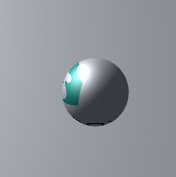

# 碰撞器与刚体

在简单入门中有涉及到添加碰撞体与刚体的操作，在本篇中会讲解具体的操作。

2.0中的3d碰撞器为PhysicsCollider。3D的刚体为Rigidbody3D。

要产生碰撞必须为游戏对象添加刚体（Rigidbody）和碰撞器，刚体可以让物体在物理影响下运动。碰撞体是物理组件的一类，它要与刚体一起添加到游戏对象上才能触发碰撞。如果两个刚体相互撞在一起，除非两个对象有碰撞体时物理引擎才会计算碰撞，在物理模拟中，没有碰撞体的刚体会彼此相互穿过。

物体发生碰撞的必要条件：两个物体都必须带有碰撞器(PhysicsCollider)，其中一个物体还必须带有Rigidbody3D刚体。

碰撞盒:colliderShape，是模型在3D世界中进行物理运算与碰撞的形状盒。

### 1.添加碰撞器与刚体

​	我们首先创建一个简单的小球，并且给小球加上碰撞器与刚体。

```javascript
//新建一个球体模型
var sphere:Laya.MeshSprite3D = this.scene.addChild(new Laya.MeshSprite3D(new SphereMesh(1))) as Laya.MeshSprite3D;
//给球体添加碰撞器
var spherePhy:Laya.PhysicsCollider = sphere.addComponent(Laya.PhysicsCollider);
//新建一个球形的碰撞盒
var sphereShape:SphereColliderShape = new Laya.SphereColliderShape(1)

/* 没有刚体时：
//给碰撞器添加碰撞盒
spherePhy.colliderShape = sphereShape;
*/
//有刚体
 //给球添加刚体
 var sphereRigid:Laya.Rigidbody3D = sphere.addComponent(Laya.Rigidbody3D);
//将碰撞盒添加到刚体上
shpereRigid.colliderShape = sphereShape;
```
不同的模型只是需要创建不同的Mesh和ColliderShape。**注意不要在同时在刚体与碰撞器上添加shape**，下图就是小球的效果了。



### 2.简单案例

  	在知道如何添加碰撞器与刚体之后，可以大胆去制作一个简单的场景去测试这部分功能。

想要碰撞与显示同步，就需要模型与碰撞盒相同。

##### 主类:

```javascript
import GameConfig from "./GameConfig";
import SceneScript from "./script/SceneScript"; 
class Main {
         constructor() {
            //初始化引擎
            Laya3D.init(0, 0);
            //适配模式
            Laya.stage.scaleMode = Laya.Stage.SCALE_FULL;
            Laya.stage.screenMode = Laya.Stage.SCREEN_NONE;
            //开启统计信息
            Laya.Stat.show();
           	Laya.loader.load("res/layabox.png",Laya.Handler.create(this,this.loadComplete));
        }        
        private loadComplete():void{
            var _scene:Laya.Scene3D = new Laya.Scene3D();
            Laya.stage.addChild(_scene);
            _scene.addComponent(SceneScript);
        }
    }

//激活启动类
new Main();
```

##### 脚本类:

```javascript

export default class SceneScript extends Laya.Script3D{
    private scene:Laya.Scene3D;
    constructor(){
        super();
    } 

    onAwake():void{
        this.scene = this.owner as Laya.Scene3D;
    }  

    onStart():void{
        var camera:Laya.Camera = (this.scene.addChild(new Laya.Camera( 0, 0.1, 100))) as Laya.Camera;

        camera.transform.translate(new Laya.Vector3(0, 5, 20));
        camera.transform.rotate(new Laya.Vector3( 0, 1, 0), true, false);
        camera.clearColor = null;
        
        var directionLight:Laya.DirectionLight = this.scene.addChild(new Laya.DirectionLight()) as Laya.DirectionLight;
        directionLight.diffuseColor = new Laya.Vector3(0.6, 0.6, 0.6);
        directionLight.transform.worldMatrix.setForward(new Laya.Vector3(1, -1, 0));


        //添加球体模型
        var sphere:Laya.MeshSprite3D = this.scene.addChild(new Laya.MeshSprite3D(new Laya.SphereMesh(1))) as Laya.MeshSprite3D;
        sphere.transform.translate(new Laya.Vector3(0,1,0));
        sphere.meshRenderer.material = new Laya.BlinnPhongMaterial();

        //添加正方体模型
        var cube:Laya.MeshSprite3D = this.scene.addChild(new Laya.MeshSprite3D(new Laya.BoxMesh(2,2,2))) as Laya.MeshSprite3D;
        cube.transform.translate(new Laya.Vector3(4,3,0));
        cube.meshRenderer.material = new Laya.BlinnPhongMaterial();

        //圆柱体模型
        var cylinder:Laya.MeshSprite3D = this.scene.addChild(new Laya.MeshSprite3D(new Laya.CylinderMesh(1,2))) as Laya.MeshSprite3D;
        cylinder.transform.translate(new Laya.Vector3(8,5,0));
        cylinder.meshRenderer.material = new Laya.BlinnPhongMaterial();
        
        //胶囊体模型
        var capsule:Laya.MeshSprite3D = this.scene.addChild(new Laya.MeshSprite3D(new Laya.CapsuleMesh(0.5,2))) as Laya.MeshSprite3D;
        capsule.transform.translate(new Laya.Vector3(-4,1,0));
        capsule.meshRenderer.material = new Laya.BlinnPhongMaterial();

        //圆锥模型
        var cone:Laya.MeshSprite3D = this.scene.addChild(new Laya.MeshSprite3D(new Laya.ConeMesh(0.5,2))) as Laya.MeshSprite3D;
        cone.transform.translate(new Laya.Vector3(-8,1,0));
        cone.meshRenderer.material = new Laya.BlinnPhongMaterial();
        //添加物理组件
        sphere.addComponent(Laya.PhysicsCollider);
        cube.addComponent(Laya.PhysicsCollider);
        cylinder.addComponent(Laya.PhysicsCollider);
        capsule.addComponent(Laya.PhysicsCollider);
        cone.addComponent(Laya.PhysicsCollider);

        var sphererigid:Laya.Rigidbody3D = sphere.addComponent(Laya.Rigidbody3D);
        var cuberigid:Laya.Rigidbody3D = cube.addComponent(Laya.Rigidbody3D);
        var cylinderrigid:Laya.Rigidbody3D = cylinder.addComponent(Laya.Rigidbody3D);
        var capsulerigid:Laya.Rigidbody3D = capsule.addComponent(Laya.Rigidbody3D);
        var conerigid:Laya.Rigidbody3D = cone.addComponent(Laya.Rigidbody3D);

        sphererigid.colliderShape = new Laya.SphereColliderShape(1);
        cuberigid.colliderShape = new Laya.BoxColliderShape(2,2,2);
        cylinderrigid.colliderShape = new Laya.CylinderColliderShape(1,2);
        capsulerigid.colliderShape = new Laya.CapsuleColliderShape(0.5,2);
        conerigid.colliderShape = new Laya.ConeColliderShape(0.5,2);
        //添加一个地板
        var floor:Laya.MeshSprite3D = this.scene.addChild(new Laya.MeshSprite3D(new Laya.PlaneMesh(100,10))) as Laya.MeshSprite3D;
        //给地板添加物理组件
        var floorCollicar:Laya.PhysicsCollider = floor.addComponent(Laya.PhysicsCollider);
        // 添加collidershape
        floorCollicar.colliderShape = new Laya.BoxColliderShape(100,0,10);
        //给地板一个角度
        floor.transform.rotate(new Laya.Vector3(0,0,0.5),false);


        //材质相关
        var material:Laya.BlinnPhongMaterial = new Laya.BlinnPhongMaterial();
        Laya.Texture2D.load("res/layabox.png", Laya.Handler.create(null, function(tex:Laya.Texture2D):void {
            material.albedoTexture = tex;
        }));
        sphere.meshRenderer.material = material;
        cube.meshRenderer.material = material;
        cylinder.meshRenderer.material = material;
        capsule.meshRenderer.material = material;
        cone.meshRenderer.material = material;
    }
    }  
```

在本次案例中只是简单的使用了5种几何体，具体效果如图:


### 3.导出的物体添加刚体或者碰撞器

**导出时如果需要带刚体，最好碰撞器**

##### 	(1)如果导出的物体带刚体与碰撞器，可以直接使用

##### 	(2)如果导出的物体不带碰撞器与刚体,需要添加物理组件

​	在这里我们使用的网格碰撞盒

```javascript
//////读取导出的lh文件
		Laya.Sprite3D.load("Conventional/shoot.lh",Laya.Handler.create(this,function(sp:Laya.Sprite3D):void{
				//获取你需要素材
                var cube:Laya.MeshSprite3D = sp.getChildAt(0) as Laya.MeshSprite3D;
                cube.transform.translate(new Laya.Vector3(0,3,0));
                this.scene.addChild(cube);
                var cubeCollider:PhysicsCollider = cube.addComponent(Laya.PhysicsCollider);
				//网格触发器
                var cubeShape:Laya.MeshColliderShape = new Laya.MeshColliderShape();
				//通过导出的网格来获取shape
                cubeShape.mesh = cube.meshFilter.sharedMesh as Laya.Mesh;
				//如果不需要刚体
				//cubeCollider.colliderShape = cubeShape;
				//需要刚体
                var cubeRigid:Laya.Rigidbody3D = cube.addComponent(Laya.Rigidbody3D);
                cubeRigid.colliderShape = cubeShape;

		}));
```

##### 	(3)如果导出的物体有碰撞器，但是有需求添加刚体

​	有两种处理方法，一是使用网格碰撞盒，二是从碰撞器上获取碰撞盒，再加给刚体。但是这两种方法都需要将碰撞器上的碰撞盒清除。第二种方法时需要注意同一个碰撞盒不能同时加在碰撞器与刚体上。

```javascript
	//方法一
      Laya.Sprite3D.load("Conventional/shoot.lh",Laya.Handler.create(this,function(sp:Laya.Sprite3D):void{
                var cube:Laya.MeshSprite3D = sp.getChildAt(0) as Laya.MeshSprite3D;
                cube.transform.translate(new Laya.Vector3(0,3,0));
                this.scene.addChild(cube);
				//移除之前的碰撞盒
                var cubeCollider:Laya.PhysicsCollider = cube.getComponent(Laya.PhysicsCollider);
                cubeCollider.colliderShape = null;
				//添加刚体与碰撞盒
                var cubeRigid:Laya.Rigidbody3D = cube.addComponent(Laya.Rigidbody3D);
                var cubeShape:Laya.MeshColliderShape = new Laya.MeshColliderShape();
                cubeShape.mesh = cube.meshFilter.sharedMesh as Laya.Mesh;
                cubeRigid.colliderShape = cubeShape;
        }));

	///方法二		
	Laya.Sprite3D.load("Conventional/shoot.lh",Laya.Handler.create(this,function(sp:Laya.Sprite3D):void{
                var cube:Laya.MeshSprite3D = sp.getChildAt(0) as Laya.MeshSprite3D;
                cube.transform.translate(new Laya.Vector3(0,3,0));
                this.scene.addChild(cube);
                var cubeCollider:Laya.PhysicsCollider = cube.getComponent(Laya.PhysicsCollider);
                var cubeRigid:Laya.Rigidbody3D = cube.addComponent(Laya.Rigidbody3D);
				//获取到之前的碰撞盒
                var cubeShape:Laya.ColliderShape = cubeCollider.colliderShape;
                cubeCollider.colliderShape = null;
                cubeRigid.colliderShape = cubeShape;
            }));
```

看下添加后的效果：


##### 