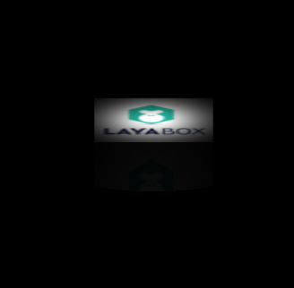
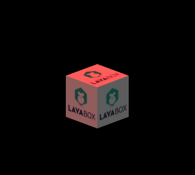
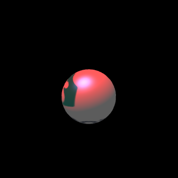
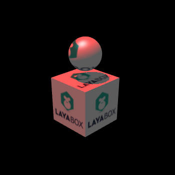

#LayaAir3D Light Source

Lighting is very important in the 3D world. Three-dimensional objects can produce three-dimensional light and shadow changes, color tone changes, projection and so on, which can be achieved by lighting settings.

##Lighting type

There are many kinds of lights. Different light sources show different effects. Different parameters can be set. In the 3D project created by IDE, we can modify the code to see different kinds of lighting effects.

###Point Light

Spotlight is a source of light that emits light in all directions, also known as omnidirectional light or spherical light. In reality, point light sources, such as bulbs and candles, can feel that light sources have properties of intensity, color and attenuation radius.


```typescript

//创建点光
var light:Laya.PointLight = scene.addChild(new Laya.PointLight()) as Laya.PointLight;
//移动灯光位置
light.transform.translate(new Laya.Vector3(-3,5,0));
//设置点光照亮范围
light.range = 6;
```


Range is the range of the point light source, which is equivalent to the illumination range of the point light. The larger the value, the larger the illumination range. Because the illumination range in Fig. 1 is small, the area not illuminated is black. In Fig. 2, the illumination range exceeds the distance between the light and the model, so it is illuminated completely.

(Fig. 1)(Fig. 2) </br>

​

###Direction Light

Parallel light is quite different from point light. It has a fixed direction, can be set by radian value, and has no attenuation and illumination range. It will illuminate all models in the whole scene. In the 3D world, it is often used to simulate sunlight in a fixed direction.


```typescript

//创建平行光
var light:Laya.DirectionLight = scene.addChild(new Laya.DirectionLight()) as Laya.DirectionLight;
//设置平行光的方向
 light.transform.worldMatrix.setForward(new Laya.Vector3(0,-1,0));
```


The direction of setforward parallel light represents the direction on the X, y and Z axes respectively. The negative number is the negative axis, the positive number is the positive axis, and the value range is - 1-0-1. If it exceeds the range, it is - 1 or 1. Beginners can set a value in this range to observe the change of direction.

###Spotlight

Focusing light refers to light emitted from a specific light source direction, such as flashlight, stage lamp, etc. The illumination area enlarges gradually according to the distance factor, and the edge of the colleague's illumination area also decreases.


```typescript

//添加聚光
var light : Laya.SpotLight = scene.addChild(new Laya.SpotLight()) as Laya.SpotLight;
//设置聚光的位置
light.transform.position = new Laya.Vector3(0,5,0);	
//设置聚光的方向
light.transform.worldMatrix.setForward(new Laya.Vector3(0.15,-1,0));
//设置聚光范围
light.range = 5;
//设置聚光值
light.spotAngle = 50;
```


The orientation of the set Forward focused light is set in the same way as that of the parallel light.

Range is the irradiation range of focused light, which is similar to point light. The difference is that focus light has direction, but point light has no direction.

SpotAngle is the focus value, the smaller the value, the stronger the light, and vice versa. Concentration value is 5 in Figure 3 and 50 in Figure 4. Developers can adjust themselves according to their needs.

(Fig. 3)(Fig. 4) </br>


##Photochromic elements

When lighting is used in the scene, all 3D models in the light range will have an impact. The lighting in the LayaAir3D engine includes the following elements, which are used to adjust the brightness and color of the scene.

###Ambient color

**Tips: After version 1.7.9 of the engine, the ambient color settings of the lights have been cancelled, and the old version can be used as usual. The environment color can be set in the material.**

The ambient color can be simply understood as the ambient color of the scene. For the models in the scene, their bright and dark sides will be affected by the environmental color at the same time. The brighter the environmental color, the higher the overall brightness of the model. Of course, environmental color is also commonly used in tone processing, which can adjust the atmosphere of red, orange, yellow, green, blue and purple through environmental tone.

The code sets the environment color as follows, which produces yellow ambient light, and the model is covered with a layer of yellow (Fig. 5).

In the previous course, we introduced that three-dimensional vectors can be used to set color values. Let's review again that three elements in vectors represent red, green and blue colors respectively. They are combined into a variety of colors. The maximum value of each color is 1, which will produce an exposure effect when exceeded.


```javascript

//设置场景的环境色为纯黄色（计算机中，红+绿=黄）
scene.ambientColor = new Laya.Vector3(1,1,0);
```


(Fig. 5) </br>


###Diffuse color

**Tips: After version 1.7.9 of the engine, the color light color attribute settings have been added, which works the same as diffuseColor.**

Also known as the light source color, is the light on the model by the brightness and color of the light surface, such as simulation candle light, the light source can be adjusted yellow, then the model by the light surface will add yellow tone.

In the following code, if we set the light source color to pure red, then the model will be affected by the part of illumination, because we set the ambient light to yellow (material ambient light or old version ambient light) before, so the receiving surface is red + yellow = orange mixed color (Figure 6).


```javascript

//设置灯光的漫反射色为纯红色
//light.diffuseColor = new Laya.Vector3(1,0,0);
//设置灯光颜色为纯红色(与diffuseColor作用相同)
light.color = new Laya.Vector3(1,0,0);
```


(图6)</br>


Turning off the ambient light, we can see the effect (Figure 7), because without the influence of the Yellow ambient color, the light-affected surface of the model will all become the light source color. Therefore, in the process of project development, we have to take into account the mixing effect of various light color attributes of lighting.

(Fig. 7) </br>


###Specular Color

**Tips: After version 1.7.9 of the engine, the highlight color settings of the lights have been cancelled, and the old version can be used as usual. The highlight color can be set in the material.**

For the model, high light will be generated in the direction of the light source and the angle is sharp and smooth. The brightness and color of high light can be adjusted by the high light color of the light. The default high light color is pure white.

There are two ways to adjust the high-light color of the model. One is to set the dimming color on the lamp, the other is to set the high-light map on the material. In most cases, the high-light color is directly adjusted on the material, which is more convenient to handle and more realistic.

Because the box model can't produce highlights, we use a smoother sphere model to observe. In Figure 8-1, the default value of the engine is pure white, so it shows except white dimming. In the following code, we set the highlight color to blue, and in Figure 8-2, we can clearly see that the sphere produces a blue highlight, because it adds to the diffuse reflection red to form purple.


```javascript

//设置高光颜色为蓝
material.specularColor = new Laya.Vector3(0.5,0.5,1);
```


(图8-1)(Fig. 8-2)</br>


###Shadow

Projection is the instant shadows produced when the model is illuminated by light, which can change with the change of light angle, light intensity and model position. Projection is one of the most important factors in the 3D world, which can produce a stronger stereo sense.

Immediate shadows are very performance-degrading and can not be used too much, especially in game scenes. There are a large number of models. Generally, we do not use instant projection, but use static light mapping.

To generate projection in a scene, we need to understand the following attributes of light:

**Shadow:**Whether to turn on the projection, Boolean value, set to true, will take effect.

**Shadow Distance:**The range of projection is the distance from the camera to the model in meters. Models larger than this range will not accept projections and generate projections, and developers can set them according to the size of the scene.

**Shadowpssmcount:**The higher the number of shadow maps produced, the finer the shadows and the greater the performance loss.

**Shadow Resolution:**The quality of projection, the shadow size in the projection range. By setting the quality of the numerical value, the larger the numerical value, the higher the projection quality and the higher the performance loss. The projection quality value is set in units of N power of 2. By default, it is 512. It can be set to 1024, 2048, etc.

**Shadow PCFType:**Shadow blur level 0-3, the greater the blur value, the softer the shadow, the better the effect, but the more performance consumption.


It is not enough to only turn on and set the attributes of the lighting, but also to modify the projection attributes on the model.

**Recive Shadow:**Whether to accept projection or not, when this attribute of the model is true, the calculated projection will be displayed on the model. In the game, we can set the ground of the scene and the castShadow attribute of the model in the movable area of the scene to true.

**CastShadow:**Whether projection occurs or not, when the model attribute is true, the light projection is calculated according to the position of the model, the shape and size of the model mesh, and the angle of the light, and then the projection is generated on the model receiving the shadow. Active game elements such as characters in the scene, NPC, etc. can open this property.

In order to understand projection well, we use parallel light in the following sample code, and create box box box model and sphere model to load into the scene. Sphere is used to generate shadows and receive projection on the box.


```typescript

// 程序入口
class LayaAir3D {
    constructor() {
        //初始化引擎
        Laya3D.init(0, 0, true);

        //适配模式
        Laya.stage.scaleMode = Laya.Stage.SCALE_FULL;
        Laya.stage.screenMode = Laya.Stage.SCREEN_NONE;

        //开启统计信息
        Laya.Stat.show();

        //添加3D场景
        var scene = Laya.stage.addChild(new Laya.Scene());
        //创建摄像机（纵横比，近距裁剪，远距裁剪）
        var camera:Laya.Camera = new Laya.Camera(0,0.1,100);
        //加载到场景
        scene.addChild(camera);
        //移动摄像机位置
        camera.transform.translate(new Laya.Vector3(0, 4, 8));
        //旋转摄像机角度
        camera.transform.rotate(new Laya.Vector3( -30, 0, 0), true, false);
        //创建方向光
        var light:Laya.DirectionLight = scene.addChild(new Laya.DirectionLight()) as Laya.DirectionLight;
        //移动灯光位置
        light.transform.translate(new Laya.Vector3(0,5,0));
        //设置灯光方向
      	light.transform.worldMatrix.setForward(new Laya.Vector3(0.3,-1,0));
        //设置灯光漫反射颜色
        light.diffuseColor = new Laya.Vector3(1, 0, 0);
        //添加灯光投影
        light.shadow=true;
        //产生投影的范围（如过小将不会产生投影）
        light.shadowDistance=45;
        //生成阴影贴图数量
        light.shadowPSSMCount = 1;
        //模糊等级,越大越高,效果更好，更耗性能
        light.shadowPCFType=1;
        //投影质量
        light.shadowResolution=2048;
        //创建盒子模型
        var box:Laya.MeshSprite3D = scene.addChild(new Laya.MeshSprite3D(new Laya.BoxMesh(1.5,1.5,1.5))) as Laya.MeshSprite3D;
        //自身y座标旋转
        box.transform.rotate(new Laya.Vector3(0,45,0),true,false);
        //接收阴影
        box.meshRender.receiveShadow=true;
        //创建球体模型
        var sphere:Laya.MeshSprite3D = scene.addChild(new Laya.MeshSprite3D(new Laya.SphereMesh())) as Laya.MeshSprite3D;
        //按父空间移动球体
        sphere.transform.translate(new Laya.Vector3(0,1.5,0),false);
        //产生阴影
        sphere.meshRender.castShadow=true;
        //创建材质
        var material:Laya.PBRStandardMaterial = new Laya.PBRStandardMaterial();
        //材质加载漫反射贴图
      	Laya.Texture2D.load("res/layabox.png",Laya.Handler.create(this,function(t:Laya.Texture2D):void{
            material.albedoTexture = t;
            //为模型赋材质（单个材质可赋给多个模型）
            sphere.meshRenderer.material = material;
            box.meshRenderer.material = material;
      	}));
    }
}
new LayaAir3D();
```


(Fig. 9)(图10)</br>


The above two pictures are the effect before and after opening projection. Note that the related attributes described above need to be set on both the lighting and the model. No shadows can be produced without any links.