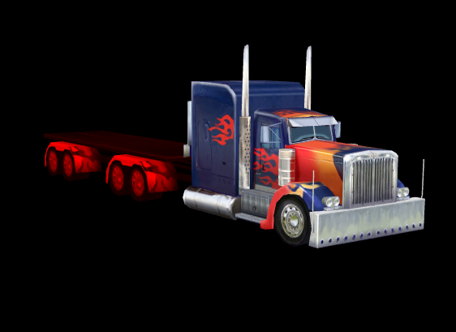
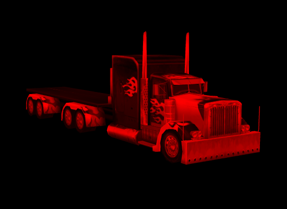

#Overview of LayaAir3D Material

###Material overview

Material quality is the material quality of an object. For example, wood, metal, glass, hair, water and so on, their roughness, gloss, reflection, transparency, color, texture and other material properties are different.

Most 3D engines have independent material classes for program code control. Material processing is also one of the most important parts of 3D production software. Game art developers often have a saying that in the production of 3D game scenes, three points look at the model, seven points depend on the material.

There are many kinds of materials, including standard materials, multi-dimensional materials, synthetic materials, double-sided materials, ray tracing materials and so on. The standard material PBRStandard Matrial is currently supported in the LayaAir3D engine.


###Creating Standard Materials

If the model in the code is not endowed with material, the texture and texture of the model can not be displayed in the 3D view, only the default is pure white.

In the code for Quick Open 3D Travel, we created a texture image using standard materials, added a texture image to the diffuse reflection map, and assigned it to the model.


```typescript

//创建材质
var material:Laya.PBRStandardMaterial = new Laya.PBRStandardMaterial();
//加载漫反射贴图
Laya.Texture2D.load("../../../../res/threeDimen/texture/earth.png", Laya.Handler.create(null, function(texture:Laya.Texture2D):void {
				//设置漫反射二维纹理贴图
				material.albedoTexture = texture;
				//为box模型赋材质
				box.meshRenderer.material = material;
			}));
```


Of course, this is only a simple use. We only use the most important diffuse mapping for the time being. In order to achieve a better artistic effect, developers need to understand the light and color of the material and the properties of the mapping.


###Material loading

In the document "Model of LayaAir3D", we introduce that the model includes two parts: model grid and material. When loading. LS and. LH data, the material corresponding to the model will be automatically loaded.

In the latest engine version, the model grid is separated from the material. Unity export plug-in tool no longer binds the material to the exported. LM model file. So if you load. LM format resources, you need to re-endow them with material to display them completely, otherwise they will only be displayed in white mode.

At this time, you can use the. lmat material file generated after export to load and create standard material and assign it to the model in a way similar to model loading.


```typescript

//异步加载材质文件创建标准材质（也可以预加载）
Laya.BlinnPhongMaterial.load("truck/Assets/Materials/t0200.lmat",Laya.Handler.create(this,function(mat):void{
  	box.meshRenderer.material = mat;
}));
```


###Getting material from the loaded model

In the above example, we created the standard material, but in the actual project application, we seldom use code to give material to the model, but directly create material in the 3D software or unit, and then export the LayaAir format through the tool and use it.

When used, the engine will automatically load materials on the model, and many times there will be more than one standard material on a model. The automatic way saves us a lot of development time. But in this case, what if we need to change and change the material? We first need to get the current material on the model.

LayaAir3D engine provides us with mesh renderer MeshRenderer class and skinned animation mesh renderer Skinned MeshRenderer class, and provides examples of them on visual models through which we can obtain the material on the model.

Tips: Mesh Sprite 3D model is Mesh Renderer, Skinned Mesh Sprite 3D model is Skinned Mesh Renderer.

There are two types of materials obtained, one is Material of its own material, if its material is modified, only its own model display changes; the other is Shared Material of shared material, because the material is relatively independent, multiple models can use the same material. If the material is shared and modified, the display of its own model will change, and other models will use this material. The qualitative part will also change. Therefore, developers need to choose according to the situation.


###Obtain and modify material


```typescript

......
//加载导出的卡车模型
Laya.Sprite3D.load("LayaScene_truck/truck.lh",Laya.Handler.create(this,function(sp:Laya.Sprite3D):void{
    var truck:Laya.Sprite3D = scene.addChild(sp)as Laya.Sprite3D;
    //获取车身模型（查看.lh文件，模型	中两个对象，车头“head”与车身"body",它们都用同一个材质）
    var meshSprite3D:Laya.MeshSprite3D = truck.getChildAt(1).getChildAt(0) as Laya.MeshSprite3D;
    //从模型上获取自身材质
	var material:Laya.BlinnPhongMaterial = meshSprite3D.meshRenderer.material as Laya.BlinnPhongMaterial;
    //修改材质的反射颜色，让模型偏红
	material.albedoColor = new Laya.Vector4(1,0,0,1); 
}));
```


Compiled and run as follows, although the body and the front model are all made of the same material, only the body's own material is modified to be red, without affecting the front (Fig. 1).

(Fig. 1) </br>


###Get and modify shared materials


```typescript

......
//加载导出的卡车模型
Laya.Sprite3D.load("LayaScene_truck/truck.lh",Laya.Handler.create(this,function(sp:Laya.Sprite3D):void{
    var truck:Laya.Sprite3D = scene.addChild(sp)as Laya.Sprite3D;
    //获取车身模型（查看.lh文件，模型	中两个对象，车头“head”与车身"body",它们都用同一个材质）
    var meshSprite3D:Laya.MeshSprite3D = truck.getChildAt(1).getChildAt(0) as Laya.MeshSprite3D;
    //从模型上获取自身材质
	var material:Laya.BlinnPhongMaterial = meshSprite3D.meshRenderer.sharedMaterial as Laya.BlinnPhongMaterial;
    //修改材质的反射颜色，让模型偏红
	material.albedoColor = new Laya.Vector4(1,0,0,1); 
}));
```


The effect of compiling and running is as follows. After modifying the shared material, because the material is used in both the front and body models, their material is changed (Figure 2).

(图2)</br>


###Get and modify the Material List

In 3D production software, there is often a model with multiple materials, which we call multi-dimensional materials. However, after loading the data exported by the tool, the engine will automatically create the material list array or sharedMaterials of the model, so when modifying the material, it can be done in a for loop or recursive way.

The following code provides a way to get and modify the material for the model or model container subobjects. We directly modify the material for all scene subobjects.


```typescript

......
......
//加载场景
Laya.Scene3D.load("LayaScene_loveScene/loveScene.ls",Laya.Handler.create(this,function(s:*):void{
	var scene:Laya.Scene3D = Laya.stage.addChild(s)as Laya.Scene3D;
    this.setModelMaterial(scene);
}))
....
/**
*修改模型材质
* @param model 场景或模型
 */		
private setModelMaterial(model):void
{
  //如果是模型网格显示对象
  if (model instanceof Laya.MeshSprite3D) 
  {
    //获取模型网格对象
    var meshSprite3D:Laya.MeshSprite3D = model as Laya.MeshSprite3D;
    for(var i :number = 0; i < meshSprite3D.meshRenderer.sharedMaterials.length;i++)
	{
		//根据下标获取模型共享材质组中的共享材质
		var material:Laya.BlinnPhongMaterial = materials.skinnedMeshRenderer.sharedMaterials[i] as             Laya.BlinnPhongMaterial;
		material.albedoColor = new Laya.Vector4(0,0,1,1)
	}
  }
  //如果是蒙皮模型网格显示对象
  if (model instanceof Laya.SkinnedMeshSprite3D) 
  {
    //获取蒙皮模型网格显示对象
    var skinnedMeshSprite3D:Laya.SkinnedMeshSprite3D = model as Laya.SkinnedMeshSprite3D;
	for(var i :number = 0; i < skinnedMeshSprite3D.skinnedMeshRenderer.materials.length;i++)
    {
      //根据下标获取模型共享材质组中的共享材质
      var material:Laya.BlinnPhongMaterial = materials.meshRenderer.sharedMaterials[i] as Laya.BlinnPhongMaterial;
      material.albedoColor = new Laya.Vector4(0,0,1,1)
    }
  }
  //递归方法获取子对象
	for (var i:number = 0; i < model._children.length; i++)
 	{
    	this.setModelMaterial(model._children[i]);
    }
}
```


After compiling and running, the effect is as follows (Figure 3). All the model materials in the scene are added a layer of blue.

(图3)</br>