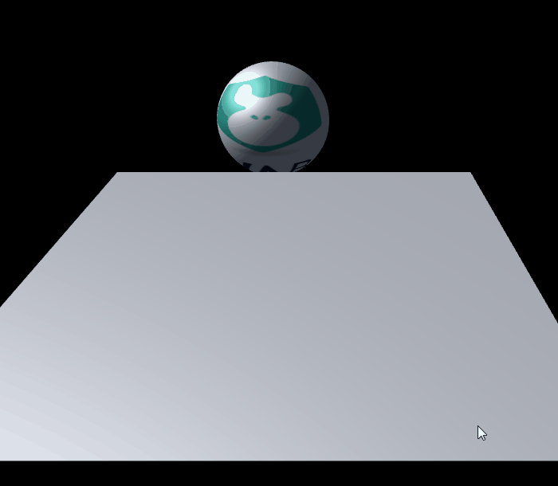

# 触发器与碰撞器过滤器

### 1.触发器

​       触发器的碰撞范围和碰撞器是一样的，但是它可以穿透，可以作为触发机关，当碰撞发生时，只会触发onTriggerEnter方法，并不会产生物理碰撞的效果。

​	添加碰撞或者触发器可以在脚本中监听到碰撞或者触发事件，用户需要重写Script3D中的方法。

##### 触发器f写方法

```typescript
		/**
         * 当其他碰撞器进入绑定物体碰撞器时触发（子弹进入物品时）
         * 注：如相对移动速度过快，可能直接越过
         */
        override public function onTriggerEnter(other:PhysicsComponent):void{
        }

        /**
         * 当其他碰撞器进入绑定物体碰撞器后逐帧触发（子弹在物品内时）
         * 注：如相对移动速度过快，可能直接越过
         */
        override public function onTriggerStay(other:PhysicsComponent):void{
        }

        /**
         * 当其他碰撞器退出绑定物体碰撞器时逐帧触发（子弹穿出物品时）
         * 注：如相对移动速度过快，可能直接越过
         */
        override public function onTriggerExit(other:PhysicsComponent):void{
        }
```

##### 碰撞器

```typescript
		/**
         * 与触发器相同
         */
        override public function onCollisionEnter(collision:Collision):void{
        }
        override public function onCollisionStay(collision:Collision):void{
        }
        override public function onCollisionExit(collision:Collision):void{
        }
```

​	碰撞器与触发器都是分为`Enter`，`stay`，`Exit`三个方法。

​	但是在LayaAir2.0中，碰撞器与触发器所接收到的碰撞事件不同。触发器接收到的是与他碰撞的另一个碰撞组件信息。而碰撞器接收到的事件是一个物理碰撞信息。

​	**本次使用的示例代码,在第一篇的基础上修改。**新增一个BallScript类，主类没有修改

##### SceneScript类

​	**对SceneScript类有部分修改。**

```typescript
import { BallScript } from "./BallScript";
export default  class SceneScript extends Laya.Script3D{
    private scene:Laya.Scene3D;
        constructor(){
            super();
        }

        onAwake(){
            this.scene = this.owner as Laya.Scene3D;
        }
    
        onStart(){
            var camera:Laya.Camera = this.scene.addChild(new Laya.Camera( 0, 0.1, 100)) as Laya.Camera;

            camera.transform.translate(new Laya.Vector3(1, 6, 10));
            camera.transform.rotate(new Laya.Vector3( -30, 0, 0), true, false);
            camera.clearColor = null;
            
			var directionLight:Laya.DirectionLight = this.scene.addChild(new Laya.DirectionLight()) as Laya.DirectionLight;
            directionLight.diffuseColor = new Laya.Vector3(0.6, 0.6, 0.6);
            directionLight.transform.worldMatrix.setForward(new Laya.Vector3(1, -1, 0));


            //添加自定义模型
            var sphere:Laya.MeshSprite3D = this.scene.addChild(new Laya.MeshSprite3D(new Laya.SphereMesh(1,100,100))) as Laya.MeshSprite3D;
            sphere.transform.rotate(new Laya.Vector3(0,90,0),false,false);
			sphere.transform.translate(new Laya.Vector3(0,3,0));
            var material:Laya.BlinnPhongMaterial = new Laya.BlinnPhongMaterial();
            Laya.Texture2D.load("res/layabox.png", Laya.Handler.create(null, function(tex:Laya.Texture2D):void {
                material.albedoTexture = tex;
            }));
            sphere.meshRenderer.material = material;
            
			//添加物理组件
			sphere.addComponent(Laya.PhysicsCollider);
			//给球添加刚体
			var rigid:Laya.Rigidbody3D = sphere.addComponent(Laya.Rigidbody3D);
			//有刚体的shape要加在刚体上
			rigid.colliderShape = new Laya.SphereColliderShape(1);
            //添加一个重量
            rigid.mass = 10;
            //给球添加弹力
            rigid.restitution = 1;
            // 给球添加滚动摩擦力
            rigid.rollingFriction = 0.5;
            //给球添加脚本
            sphere.addComponent(BallScript);
            //给球一个名字 方便识别
            sphere.name = "本体球";

			//添加一个地板
			var floor:Laya.MeshSprite3D = this.scene.addChild(new Laya.MeshSprite3D(new Laya.PlaneMesh(10,10))) as Laya.MeshSprite3D;
			//给地板添加物理组件
            var floorCollicar:Laya.PhysicsCollider = floor.addComponent(Laya.PhysicsCollider);
			// 添加collidershape
			floorCollicar.colliderShape = new Laya.BoxColliderShape(10,0,10);
            //监听一次舞台mousedown事件
            Laya.stage.once(Laya.Event.MOUSE_DOWN,this,this.cloneBall,[sphere]);
        }
        /**
         * 点击克隆球体
         */
         cloneBall(sphere){
                //一秒之后复制一个球
                 var cloneSphere:Laya.MeshSprite3D  = Laya.Sprite3D.instantiate(sphere) as Laya.MeshSprite3D;
                //获取母体球的脚本
                var sphereScript = sphere.getComponent(BallScript);
                //销毁掉之前加上去的脚本
                sphereScript.destroy();
                //设置位置偏移
                 cloneSphere.transform.translate(new Laya.Vector3(1,4,0));
                //添加到场景
                this.scene.addChild(cloneSphere);
                //获取克隆球的刚体
                var rigid:Laya.Rigidbody3D = cloneSphere.getComponent(Laya.Rigidbody3D);
                //设置为触发器
                rigid.isTrigger = true;
                //给个名字方便识别
                cloneSphere.name = "克隆球";
        }
    }  

```

##### BallScript类

```typescript
export class BallScript extends Laya.Script3D{
    constructor(){
        super();
    }

     /**
      * 当其他碰撞器进入绑定物体碰撞器时触发（子弹进入物品时）
      * 注：如相对移动速度过快，可能直接越过
      */
     onTriggerEnter(other):void{
         console.log("触发器enter" + this.owner.name);
     }

     /**
      * 当其他碰撞器进入绑定物体碰撞器后逐帧触发（子弹在物品内时）
      * 注：如相对移动速度过快，可能直接越过
      */
     onTriggerStay(other):void{
         console.log("触发器stay" + this.owner.name );
     }

     /**
      * 当其他碰撞器退出绑定物体碰撞器时逐帧触发（子弹穿出物品时）
      * 注：如相对移动速度过快，可能直接越过
      */
     onTriggerExit(other):void{
         console.log("触发器exit" + this.owner.name);
     }

     /**
      * 与触发器相同
      */
     onCollisionEnter(collision):void{
         console.log("碰撞器enter" + this.owner.name);
     }
     onCollisionStay(collision):void{
         console.log("碰撞器stay" + this.owner.name );
     }
     onCollisionExit(collision):void{
         console.log("碰撞器exit" + this.owner.name);
     }

     onDisable():void{
         console.log("脚本已被移除");
     }
 }   
```
看下效果：


同时在控制台确认输出


### 2.碰撞器过滤器

​	在实际的开发中，不可能所有的物体都要和任何其他物体参与碰撞，比如主角自己发射的子弹和自己就不允许碰撞，或者子弹对于队友，这就需要用过滤器，来设置哪些组可以碰撞，哪些组不可以碰撞，下面看代码示例

```typescript
......
//给球一个名字 方便识别
sphere.name = "本体球";
//给本体球添加碰撞组
rigid.collisionGroup = Laya.Physics3DUtils.COLLISIONFILTERGROUP_CUSTOMFILTER2;
......
//给地板添加可以碰撞的组
floorCollicar.canCollideWith = Laya.Physics3DUtils.COLLISIONFILTERGROUP_CUSTOMFILTER2;
.....

//cloneBall方法内     
//给个名字方便识别
cloneSphere.name = "克隆球";
//给克隆球添加碰撞组
rigid.collisionGroup = Laya.Physics3DUtils.COLLISIONFILTERGROUP_CUSTOMFILTER1;
......
```


​	在实际开发中，还有需求，如：可以与除一组外其他的组发生碰撞。这时就需要通过 **取反** 运算来设置可以碰撞的组。

下面给一段比较简单的代码段，还是基于上文的项目。

```typescript
......
//给球一个名字 方便识别
sphere.name = "本体球";
//给本体球添加碰撞组
rigid.collisionGroup = Laya.Physics3DUtils.COLLISIONFILTERGROUP_CUSTOMFILTER2;
......
//给地板添加可以碰撞的组
floorCollicar.collisionGroup = Laya.Physics3DUtils.COLLISIONFILTERGROUP_CUSTOMFILTER2;
.....

//cloneBall方法内     
//给个名字方便识别
cloneSphere.name = "克隆球";
//给克隆球添加碰撞组
        rigid.canCollideWith = Laya.Physics3DUtils.COLLISIONFILTERGROUP_ALLFILTER^ Laya.Physics3DUtils.COLLISIONFILTERGROUP_CUSTOMFILTER1;

......
```



​	**如果还需要在去掉一个碰撞组,需要继续取反**

```typescript
	rigid.canCollideWith = Laya.Physics3DUtils.COLLISIONFILTERGROUP_ALLFILTER ^  Laya.Physics3DUtils.COLLISIONFILTERGROUP_CUSTOMFILTER1 ^ Laya.Physics3DUtils.COLLISIONFILTERGROUP_CUSTOMFILTER2;
```

​	