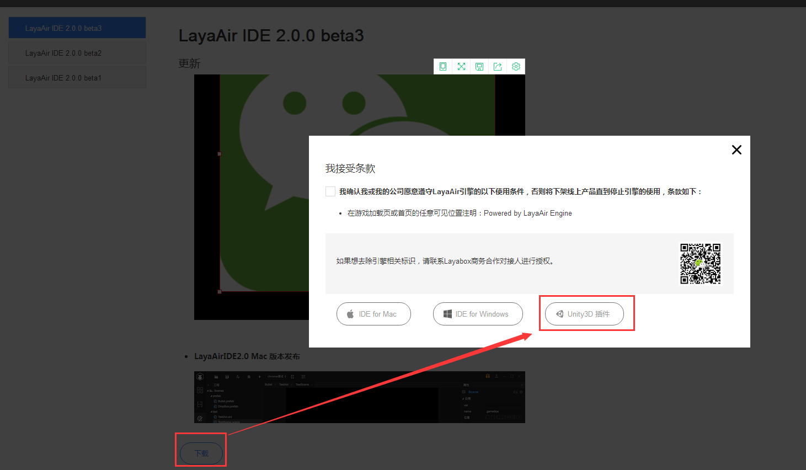
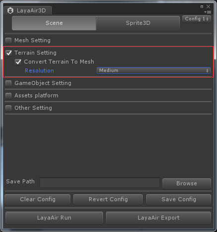
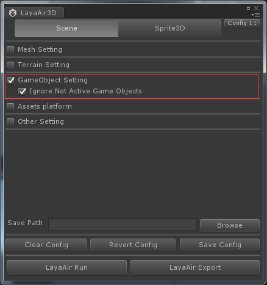

## Unity插件使用

>###Important tips:

###LayaAir 1.x version of the engine, adapted to Unity 5.6.x. So please download the version of Unity 5.6.x. For other versions, there may be some incompatibilities.


###Download the LayaAir3D export tool

Download address https://ldc2.layabox.com/layadownload/?Type=layaairide-LayaAir%20IDE%202.0.0%20beta3

Or under ide menu - - - tools - - - 3D conversion tools (Figure 1).

After downloading, we can see two tools. One is the fbxtools tool for converting the FBX format. At present, this tool will not be maintained and updated. It is recommended that developers use another unit export plug-in tool, which is more convenient for developers to build the game world and export it.

<br>（图1）


###Install export plug-in

Start unity, create a new project, and import the resources and materials required by the game, mapping, etc. Project name can be named according to their own needs. CTRL + s saves our scenario, and here we save the name truck.

Right-click on the resource management interface to import the LayaAir3D conversion tool. The plug-in version will be updated with the addition of LayaAir engine functionality, but the import method is completely consistent.

When the import tool is successful, a folder named LayaPlugin will appear in the resource management interface, and the export plug-in menu LayaPlugin will appear in the unit menu bar. As shown in Figure 2:

<br> (Figure 2)

​

###Export resource settings

We create a car model in Unity, and then we export it with the LayaAir plug-in. Click on the menu bar Laya Plugin and the Export Settings panel will appear. Here we will explain in detail.

<br> (Figure 3)


####Export resource categories

**Scene category**It refers to the whole scene, whether the model, material, texture, animation, or illumination mapping in the scene are all exported. It is mainly used for scene production. The file extension is. ls, which needs to be loaded with Scene class or its inheritance class.

**Sprite3D Category**Less illumination mapping than the scene, often used for individual resource export of characters or game items, file extension is. lh, to be loaded with Spite3D.

Their loading will be introduced in the "3D Technical Document - LayaAir3D Model Chapter".

####Mesh Setting

There are two messages (Figure 4) after checking out the grid data. They can compress the size of the grid LM file. It is suggested that if tangent (no normal mapping) and vertex color are not used in the project, both checking can save about 20% of the model resource size.

Ignore Vertices Tangent ignores vertex tangent information
Ignore Vertices Color ignores vertex color information

<br> (Figure 4)

####Terrain Setting

Unity Geotype Export Settings (Figure 5)

Convert Terrain to Mesh
If there is a terrain in the scene, the terrain is transformed into a grid model.
Unty's terrain making is very convenient. It can use brush to draw terrain height, such as mountains, rivers, etc. It also supports brush to draw many detail maps for several kinds of maps. The LayaAir export plug-in converts the terrain into Mesh for developers to use. The difference is that the material is different from the ordinary material, including detailed maps.

Resolution
Generally speaking, the default Medium is medium. The following is the optimization level, which is equal to the accuracy of the area divided by 4.
Very Height has the highest area number after optimization
Height's optimized area number is relatively high
Medium
Low
Very Low has the lowest surface number after optimization

<br> (Fig. 5)


####GameObject setting

Game Item Node Settings (Figure 6)

Ignore null game objects
When exporting, null nodes are ignored, and nodes not supported by LayaAir engine are recorded as null nodes, such as lighting nodes, which can reduce the number of wizards.
Note: Camera export is supported in version 1.5.0, so ignoring empty nodes will not affect camera export.

Ignore Not Active Game Objects
The unactivated nodes in the unit scenario are ignored when exporting.

Optimize Game Objects
When exporting, the tree structure is flattened from the first level node in the unit scene, and all useless nodes are deleted, which can minimize the number of wizards.

Batch Make The First Level Game Objects
Batch export (sprite3d must be selected) Batch export scenario for all level 1 nodes.


 <br> (Fig. 6)


####Other Setting

Other settings (Figure 7)

Cover Original Export Files
Overwrite the original export file when exporting

Customize Export Root Directory Name
Custom export folder name, default folder name is "layaScene + scene name".

Automatically Save The Configuration
Save the current configuration automatically when exporting


 <br> (Figure 7)


####Export settings

File path saved by Borower
Clear Config clears the current configuration
Revert Config reads saved configuration from configuration table
Save Config saves the current configuration. After saving, the previous configuration will be used directly after the next opening, which is convenient for developers to operate.
LayaAir Run clicks to run the scenario directly using the LayaAir engine.
LayaAirRun Instructions for Use:
1. Node environment must be installed, express expansion module (tool built-in express, if it can not be used properly, please install it yourself);
2. Make sure there is a camera in the scene, adjust its position and angle by itself, and eventually layaAir will run in accordance with Unity's results.
LayaAir Export exports the current resource, and clicks to export the data for the current scenario or model to the specified path.


 <br> (Figure 8)


###A Brief Introduction to Exported Resources

After configuring the output scenario settings, click the Laya Export button to generate the default LayaScene_truck folder (Figure 10).


 <br> (Figure 9)

See the file resources in the figure above. After exporting, the data resources of. ls,. Lm,. Lmat, and mapping png, TGA resources are generated.

LS is a scene file, which is generated when selecting and exporting Scene class. It contains all kinds of data needed by the scene, such as model, illumination map, location, etc. It needs to be loaded by Scene class.

The. LH is a model file, which is generated when the Sprite3D category is selected and exported. It lacks the information of the illumination mapping file, and the others are the same as. ls.

LM is a model data file, which is equivalent to the conversion of FBX format. It can be loaded by the MeshSprite3D class.

Lmat is a material data file, which is the material information set for the model in unit. When loading. LS or. LH files, it automatically loads. lmat to produce material. Lmat can also manually modify some of these properties.

Lani is an animation data file (the model in Fig. 9 has no animation, so it was not generated at the time of export). If there is animation on the model, the animation configuration file will be generated after export, which contains the information of skeleton or frame animation.

Their specific usage will be described in detail in the subsequent course documentation.


###Simple loading example

We copied all the contents of the LayaScene_truck folder to bin/h5/under the project's root directory.

Tips: This chapter only introduces simple loading applications, which will generate various formats after export. Their detailed description will be introduced in "Scene of LayaAir3D Scene" and "Model of LayaAir3D" in the 3D technical document.

The load scenario. LS sample code is as follows.


```typescript


class LayaAir3D
{
      constructor() 
      {
        //初始化引擎
        Laya3D.init(0, 0,true);
        Laya.stage.scaleMode = Laya.Stage.SCALE_FULL;
        Laya.stage.screenMode = Laya.Stage.SCREEN_NONE;
        Laya.Stat.show();

        //添加3D场景
     	Laya.Scene3D.load("LayaScene_truck/truck.ls",Laya.Handler.create(this,function(s:Laya.Scene3D):void{
           	var scene = s;
        	Laya.stage.addChild(scene);
          	//创建摄像机(横纵比，近距裁剪，远距裁剪)
            var camera= new Laya.Camera( 0, 0.1, 1000);
            //加载到场景
            scene.addChild(camera);
            //移动摄像机位置
            camera.transform.position=new Laya.Vector3(-8, 4, 15);
            //旋转摄像机角度
            camera.transform.rotate(new Laya.Vector3( -8, -25, 0), true, false);
     	}));
	}		
}
new LayaAir3D();
```


Compiling and running the simple code above, we found that the scene was loaded successfully, and the model in the scene was also displayed on the 3D view (Figure 10).


 <br>（图10）


